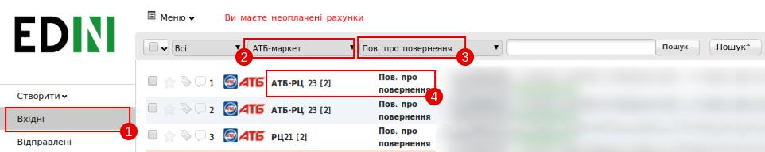
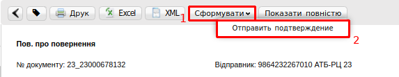
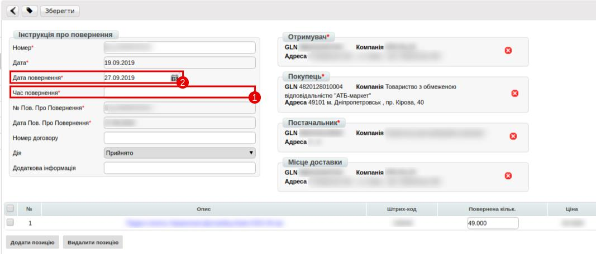
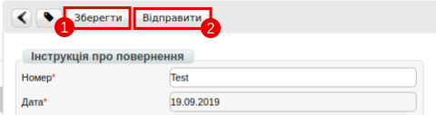

##################################################################################
Інструкція з формування "Інструкції про повернення" (RETINS) для мережі АТБ
##################################################################################

.. contents:: Зміст:
   :depth: 3

---------

Вступ
====================================

Документ Інструкція про повернення (RETINS) відправляється у відповідь на Повідомлення про повернення (RETANN) і використовуватися для підтвердження або редагування дати та часу прибуття постачальника.

1 Пошук документу
=============================

Необхідно у папці «Вхідні»(1) відфільтрувати документи за мережею та типом. Потрібно обрати мережу «АТБ-маркет»(2) та тип документу «Пов. Про повернення»(3) і відкрити необхідне повідомленння(4).

2 Формування інструкції
==============================

Знаходячись у відкритому документі, необхідно натиснути кнопку «Сформувати»(1) і обрати «Відправити підтвердження»(2) 

3 Заповнення полів
==============================================================

Поля **Номер**, **Дата**, **Дата повернення**, **№ Пов. про повернення**, **Дата Пов. про повернення**, **Отримувач**, **Покупець**, **Постачальник** і **Місце доставки** заповнюються автоматично із документа-підстави.

Заповнити необхідно поле **Час повернення** (1), при необхідності скорегуваті данні в полі **Дата повернення** (2)

4 Відправка документу
==============================================================

Після заповнення необхідної інформації необхідно натиснут кнопку «Зберегти»(1), після натиснути «Відправити»(2)

.. include:: kontakti.rst
