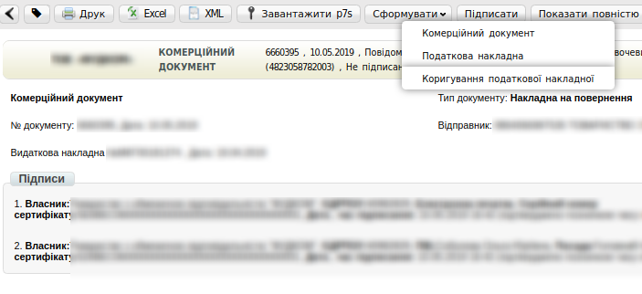
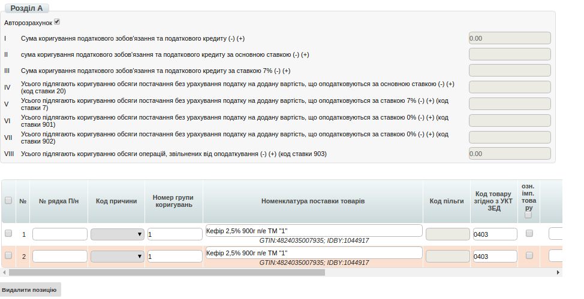
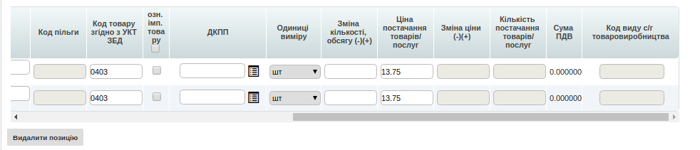
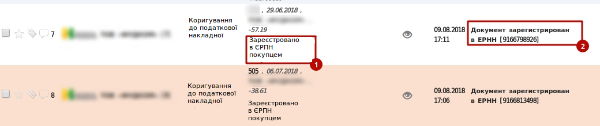
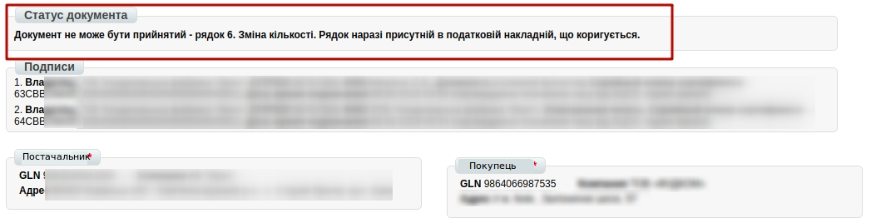

Формування Коригувальної ПН на підставі Накладної на повернення
############################################################################

.. role:: red

.. contents:: Зміст:
   :depth: 6

---------

Початкові налаштування
====================================

Для початку роботи з електронною податковою накладною необхідно:

1.1. Підготувати діючий електронний цифровий підпис особи (осіб), за допомогою якого буде здійснюватися підписання електронної податкової накладної (declar).

1.2. Якщо ключі не на зовнішніх носіях (диск, флеш-накопичувач), потрібно знати шлях до ключів в файловій системі.

1.3. Зайти на портал: http://edo.edi-n.com і ввести логін і пароль.

.. image:: pics_Korrektirovochnoj_NN_na_osnovanii_Vozvratnoj/formirovanie_Korrektirovochnoj_NN_01.png
   :align: center

1.4. Перед початком роботи з Коригувальною податковою накладною необхідно одноразово заповнити всі реквізити, які будуть відображатися в податковій з боку постачальника.

.. image:: pics_Korrektirovochnoj_NN_na_osnovanii_Vozvratnoj/formirovanie_Korrektirovochnoj_NN_02.png
   :align: center

1.5. Перейти в розділ «**Налаштування**» (в правому верхньому куті):

.. image:: pics_Korrektirovochnoj_NN_na_osnovanii_Vozvratnoj/formirovanie_Korrektirovochnoj_NN_03.png
   :align: center

1.6. Перейти в закладку "**Мої компанії**" і вибрати GLN, з якого відбуватиметься відправка накладних:

.. image:: pics_Korrektirovochnoj_NN_na_osnovanii_Vozvratnoj/formirovanie_Korrektirovochnoj_NN_04.png
   :align: center

**Необхідно вказати**:

- Код ЄДРПОУ
- Код ІПН
- Правильну назву компанії
- № свідоцтва платника ПДВ
- Вулицю і будинок (юр. адреса)
- Індекс (юр. адреса)
- Місто (юр. Адреса)
- Країну (вибирайте зі списку Україну)
- Область (вибирайте зі списку)
- ДПІ (вибирайте зі списку податкову, в яку подаєте звітність)
- Менеджер (можна вказати «-»)
- Бухгалтер (П.І.Б. головного бухгалтера)
- Директор (П.І.Б. директора)
- Посада (посада директора: генеральний, виконавчий, директор)
- Підписант (П.І.Б. та ІПН підписувача)
- Телефон
- Форма власності (юр. чи фіз. особа)

.. image:: pics_Korrektirovochnoj_NN_na_osnovanii_Vozvratnoj/formirovanie_Korrektirovochnoj_NN_05.png
   :align: center

Після заповнення натисніть кнопку «**Зберегти**».

Формування документа "Коригування до Податкової накладної (DECLAR_J12)"
====================================================================================

Даний документ формується на підставі **Комерційного документа (СOMDOC) “Накладна на повернення”**.

Для зручності пошуку виберіть в першому фільтрі - **Всі** документи, у другому - **торгівельну мережу**, в третьому - тип документа **Комерційний документ**, і в четвертому - **Накладна на повернення**.

.. image:: pics_Korrektirovochnoj_NN_na_osnovanii_Vozvratnoj/formirovanie_Korrektirovochnoj_NN_06.png
   :align: center

*Перед відправкою коригування необхідно підписати і відправити Комерційний документ "Накладна на повернення".*

Для того, що б сформувати документ “**Коригування до Податкової накладної**”, необхідно зайти в **Комерційний документ** “**Накладна на повернення**”.

Далі необхідно натиснути на кнопку **Сформувати** —> **Коригування податкової накладної**.

Заповнення документа "Коригування до Податкової накладної (DECLAR_J12)"
========================================================================

Всі необхідні поля для заповнення позначені червоними зірочками :red:`*`.

.. image:: pics_Korrektirovochnoj_NN_na_osnovanii_Vozvratnoj/formirovanie_Korrektirovochnoj_NN_08.png
   :align: center

В випадаючому списку **Причина коригування*** обов'язково необхідно вибрати відповідний параметр.

.. image:: pics_Korrektirovochnoj_NN_na_osnovanii_Vozvratnoj/formirovanie_Korrektirovochnoj_NN_09.png
   :align: center

**Розділ А** розраховується автоматично за умови наявності відповідної галочки в чекбоксі.

Нижче ви можете побачити перелік товарних позицій, які переносяться з документа “**Накладна на повернення**”.

Всі інші поля ви заповнюєте самостійно згідно чинного податкового законодавства України.

Після внесення всіх даних необхідно натиснути кнопку «**Зберегти**». Якщо частина необхідних реквізитів не заповнена, з'являться підказки, які поля потрібно заповнити.

.. image:: pics_Korrektirovochnoj_NN_na_osnovanii_Vozvratnoj/formirovanie_Korrektirovochnoj_NN_12.png
   :align: center

Після збереження податкової накладної для нанесення підписів необхідно натиснути кнопку «**Підписати**».

.. image:: pics_Korrektirovochnoj_NN_na_osnovanii_Vozvratnoj/formirovanie_Korrektirovochnoj_NN_13.png
   :align: center

Після натискання кнопки "**Надіслати**" накладна відправляється на реєстрацію до Єдиного реєстру податкових накладних.

.. image:: pics_Korrektirovochnoj_NN_na_osnovanii_Vozvratnoj/formirovanie_Korrektirovochnoj_NN_14.png
   :align: center

Отримання статусу про реєстрацію
=======================================================================

Залежно від того, чи була зареєстрована накладна чи ні, вам обов'язково надійде відповідний статус:

1. **Зареєстровано в ЄРПН**

Свідчить про те, що Коригувальна податкова накладна була успішно зареєстрована в ЄРПН вашим контрагентом.

2. **Помилка при реєстрації в ЄРПН**

Свідчить про те, що Коригувальна податкова накладна була відхилена вашим контрагентом.

.. image:: pics_Korrektirovochnoj_NN_na_osnovanii_Vozvratnoj/formirovanie_Korrektirovochnoj_NN_16.png
   :align: center

Також помилку реєстрації (квитанцію) можна переглянути, зайшовши в документ.

3. **Відправлений на перевірку в торговельну мережу**

Документ перевіряється на стороні торгової мережі перед відправкою на реєстрацію.

.. include:: kontakti.rst
