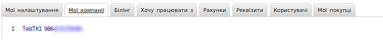
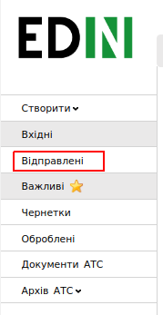
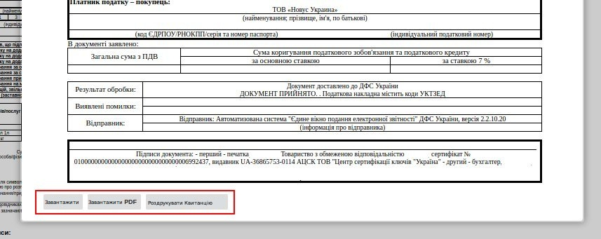
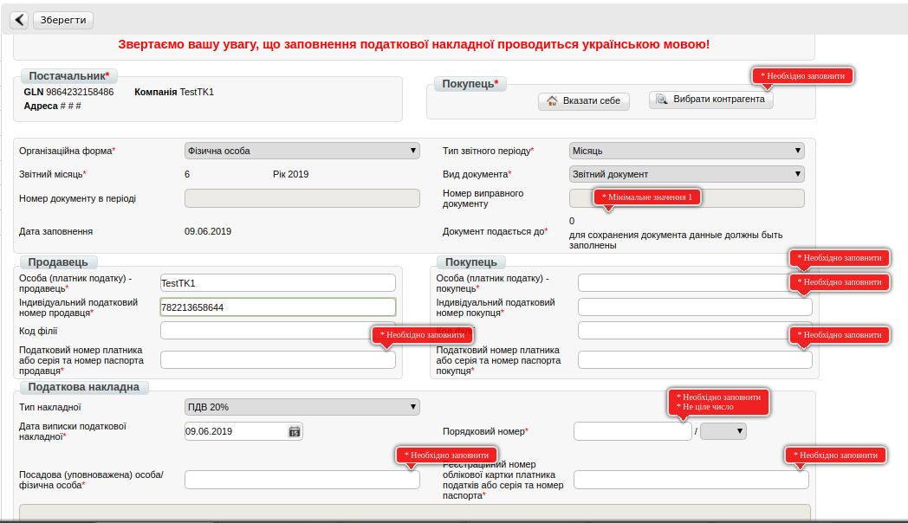
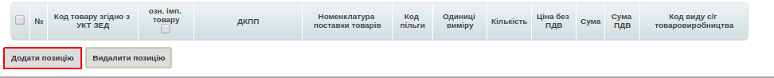
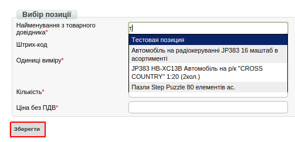
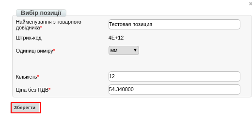

Формування Податкової Накладний на підставі Прибуткової накладної (COMDOC_007)
###############################################################################

.. role:: red

.. contents:: Зміст:
   :depth: 6

---------

Початкові налаштування
====================================

Для початку роботи з електронною податковою накладною необхідно:

1.1. Підготувати діючий електронний цифровий підпис особи (осіб), за допомогою якого буде здійснюватися підписання електронної податкової накладної (declar).

1.2. Якщо ключі не на зовнішніх носіях (диск, флеш-накопичувач), потрібно знати шлях до ключів в файловій системі.

1.3. Зайти на портал: http://edo.edi-n.com і ввести логін і пароль:

.. image:: pics_formirovanie_Nalogovoj_Nakladnoj_na_osnovanii_Prihodnoj_nakladnoj/formirovanie_NN_01.png
   :align: center

1.4. Перед початком роботи з податковою накладною необхідно одноразово заповнити всі реквізити, які будуть відображатися в податковій з боку постачальника.

.. image:: pics_formirovanie_Nalogovoj_Nakladnoj_na_osnovanii_Prihodnoj_nakladnoj/formirovanie_NN_02.png
   :align: center

1.5. Перейти в розділ «**Налаштування**» (в правому верхньому куті):

.. image:: pics_formirovanie_Nalogovoj_Nakladnoj_na_osnovanii_Prihodnoj_nakladnoj/formirovanie_NN_03.png
   :align: center

1.6. Перейти в закладку "**Мої компанії**" і вибрати GLN, з якого відбуватиметься відправка накладних:

.. important:: **Увага!** Зверніть увагу, що реквізити заповнюються українською мовою і повинні відповідати інформації в реєстраційних документах компанії.

.. image:: pics_formirovanie_Nalogovoj_Nakladnoj_na_osnovanii_Prihodnoj_nakladnoj/formirovanie_NN_05.png
   :align: center

**Необхідно вказати**:

- Код ЄДРПОУ
- Код ІПН
- Правильну назву компанії
- № свідоцтва платника ПДВ
- Вулицю і будинок (юр. адреса)
- Індекс (юр. адреса)
- Місто (юр. Адреса)
- Країну (вибирайте зі списку Україну)
- Область (вибирайте зі списку)
- ДПІ (вибирайте зі списку податкову, в яку подаєте звітність)
- Менеджер (можна вказати «-»)
- Бухгалтер (П.І.Б. головного бухгалтера)
- Директор (П.І.Б. директора)
- Посада (посада директора: генеральний, виконавчий, директор)
- Підписант (П.І.Б. та ІПН підписувача)
- Телефон
- Форма власності (юр. чи фіз. особа)

Після заповнення натисніть кнопку «**Зберегти**».

Формування Податкової накладної
====================================

Перед створенням Податкової накладної рекомендується перевірити товарний довідник, тому що інформація по позиціях підтягується саме з нього. Він знаходиться в правому верхньому кутку:

.. image:: pics_formirovanie_Nalogovoj_Nakladnoj_na_osnovanii_Prihodnoj_nakladnoj/formirovanie_NN_06.png
   :align: center

2.1. Перейдіть в пункт меню «**Відправлені**»:

.. image:: pics_formirovanie_Nalogovoj_Nakladnoj_na_osnovanii_Prihodnoj_nakladnoj/formirovanie_NN_07.png
   :align: center

2.2. Виберіть *підписаний і вже відправлений* «Комерційний документ» **Прибуткова накладна**, на підставі якого будете формувати і відправляти електронну Податкову накладну.

.. image:: pics_formirovanie_Nalogovoj_Nakladnoj_na_osnovanii_Prihodnoj_nakladnoj/formirovanie_NN_08.png
   :align: center

2.3. Далі в відритому «**Комерційному документі**» необхідно натиснути на кнопку **Сформувати** —> **Податкова накладна**.

.. image:: pics_formirovanie_Nalogovoj_Nakladnoj_na_osnovanii_Prihodnoj_nakladnoj/formirovanie_NN_09.png
   :align: center

2.4. Всі необхідні поля для заповнення позначені червоними зірочками :red:`*`. Також важливо попозиційно вносити код УКТ ЗЕД:

.. image:: pics_formirovanie_Nalogovoj_Nakladnoj_na_osnovanii_Prihodnoj_nakladnoj/formirovanie_NN_10.png
   :align: center

2.5. Після внесення всіх даних необхідно натиснути кнопку «**Зберегти**». Якщо частина необхідних реквізитів не заповнена, з'являться підказки, які поля потрібно заповнити.

.. image:: pics_formirovanie_Nalogovoj_Nakladnoj_na_osnovanii_Prihodnoj_nakladnoj/formirovanie_NN_11.png
   :align: center

2.6. Після збереження податкової накладної для нанесення підписів необхідно натиснути кнопку «**Підписати**».

.. image:: pics_formirovanie_Nalogovoj_Nakladnoj_na_osnovanii_Prihodnoj_nakladnoj/formirovanie_NN_12.png
   :align: center

2.7. Після натискання кнопки "**Відправити**" ЕПН відправляється на реєстрацію до Єдиного реєстру податкових накладних.

.. image:: pics_formirovanie_Nalogovoj_Nakladnoj_na_osnovanii_Prihodnoj_nakladnoj/formirovanie_NN_13.png
   :align: center

Отримання квитанції про реєстрацію
====================================

3.1. Після відправки податкової накладної необхідно дочекатися отримання Квитанції №1 з ЄРПН. 
Існує два статуси: "**Зареєстровано в ЄРПН і відправлено покупцеві**" и "**Помилка при реєстрації в ЄРПН**".

3.2. Для прочитання квитанції необхідно увійти в папку «**Відправлені**», зайти у відповідний документ «**Податкова накладна**".

3.3. Натиснути кнопку «**Зчитати**» під написом «Квитанція №1».

.. image:: pics_formirovanie_Nalogovoj_Nakladnoj_na_osnovanii_Prihodnoj_nakladnoj/formirovanie_NN_15.png
   :align: center

3.4. Після розшифровки текст квитанції стане доступний для читання. Її можна вивантажити в форматі **.rpl** (можливе завантаження в M.E.Doc), **.pdf**, а також роздрукувати.

Створення **Податкової накладної** при відсутності **Комерційного документа**
=====================================================================================================

Для формування документа необхідно натиснути "**Створити**" і вибрати "**Податкова накладна**":

.. image:: pics_formirovanie_Nalogovoj_Nakladnoj_na_osnovanii_Prihodnoj_nakladnoj/formirovanie_NN_17.png
   :align: center

Далі буде відображена форма для заповнення. При натисканні кнопки "**Зберегти**" сповіщення вкажуть на необхідні поля для заповнення.

Щоб вибрати покупця, натисніть на "**Вибрати контрагента**" - "**Пошук контрагента**" і введіть в поле GLN (наприклад, "9863577638028") і натисніть "**Знайти**",
а потім "**Вибрати**":

.. image:: pics_formirovanie_Nalogovoj_Nakladnoj_na_osnovanii_Prihodnoj_nakladnoj/formirovanie_NN_19.png
   :align: center

Після внесення всіх реквізитів, натиснувши кнопку "**Зберегти**", з'явиться можливість додати товарні позиції. Внизу сторінки кнопка "**Додати позицію**".

Після натискання цієї кнопки відобразиться вікно з можливістю внесення інформації по товару:

.. image:: pics_formirovanie_Nalogovoj_Nakladnoj_na_osnovanii_Prihodnoj_nakladnoj/formirovanie_NN_21.png
   :align: center

Так, як попередньо дані за товарними позиціями заповнені в Вашому товарному довіднику, достатньо в поле "**Найменування з товарного довідника**" почати писати назву або штрих-код і з випадаючого списку вибрати потрібну позицію:

Після внесення інформації натисніть "Зберегти".

Після додавання всіх товарних позицій використовуйте кнопки "**Зберегти**", "**Підписати**", "**Надіслати**".

.. include:: kontakti.rst
