Формування Комерційного документа "Видаткова накладна" (COMDOC_006)
###########################################################################

.. role:: red

.. contents:: Зміст:
   :depth: 6

---------

Вступ
====================================

Дана інструкція описує порядок формування, підписання та відправки Комерційного документа "Видаткова накладна".

.. important:: **Увага!** Для коректного формування документа **Видаткова накладна (Comdoc)**, необхідно заповнити Товарний довідник. Ви можете переглянути `Інструкцію щодо заповнення довідника <https://wiki.edi-n.com/uk/latest/general/Zapolnenie_Tovarnogo_spravochnika.html>`_.

Видаткова накладна (Comdoc)
============================================

Перед початком роботи з "Видатковою накладною" необхідно заповнити всі реквізити, які будуть відображатися в документі з боку постачальника.

Далі, перейдіть в розділ "**Налаштування**" (у правому верхньому куті):

.. image:: pics_formirovanie_Rashodnoj_nakladnoj/formirovanie_Rashodnoj_nakladnoj_01.png
   :align: center

Натисніть на закладку "**Мої компанії**" і виберіть GLN, з якого буде відбуватись відправка документів.

.. image:: pics_formirovanie_Rashodnoj_nakladnoj/formirovanie_Rashodnoj_nakladnoj_02.png
   :align: center

У вікні з'явиться **Форма** для заповнення необхідних реквізитів документа. Всі поля, позначені червоною зірочкою :red:`*` є обов'язковими для заповнення.

.. important:: **Увага!** Зверніть увагу, що реквізити заповнюються українською мовою і повинні відповідати інформації в реєстраційних документах компанії.

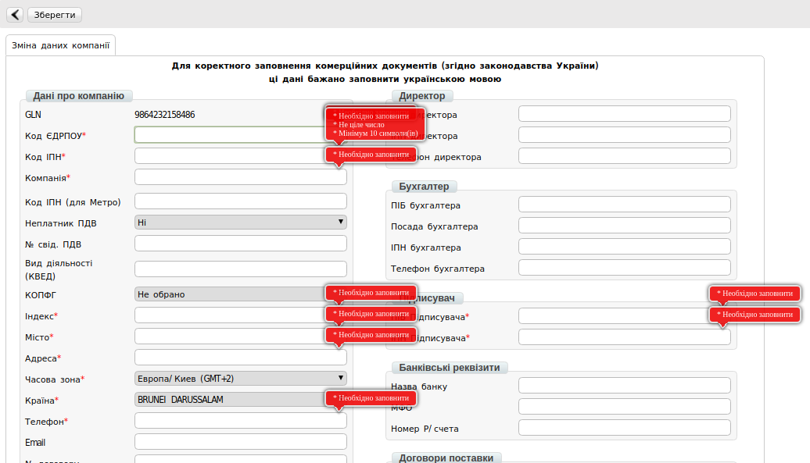

Формування документа Видаткова накладна
====================================================

Створити видаткову накладну можливо трьома способами:

1. На підставі Замовлення (ORDERS)
2. На підставі Повідомлення про відвантаження (DESADV)
3. На підставі Повідомлення про прийом (RECADV)

***Рекомендується формувати документ "Видаткова накладна" (COMDOC) на підставі "Повідомлення про відвантаження" (DESADV).***

Нижче наведено приклад формування Витратною накладної на підставі відправленого документа, Повідомлення про відвантаження (DESADV).

Для формування документа Видаткова накладна, необхідно перейти в розділ “**Відправлені**”.

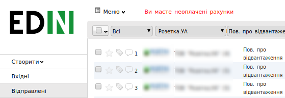

Відкрити документ "**Повідомлення про відвантаження**" і натиснути кнопку "**Сформувати**", потім вибрати зі списку документ “**Видаткова накладна**”

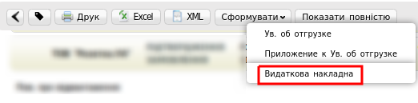

Заповнення документа Видаткова накладна
====================================================

У відкритому документі, необхідно заповнити обов'язкові дані, позначені червоною зірочкою :red:`*` , в кожному з блоків.

Перший блок містить інформацію про номер Комерційного документа, дату його складання і деталі договору.

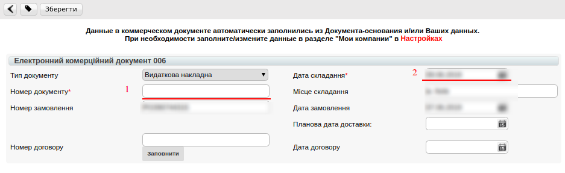

Другий блок містить інформацію про: тип документа, який свідчить про співпрацю (договір); дату складання; його номер.

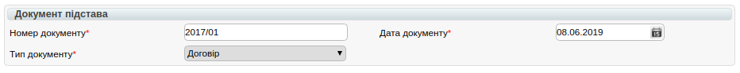

Третій блок містить інформацію про одержувача Комерційного документа, дані заповнюються автоматично з документа підстави.

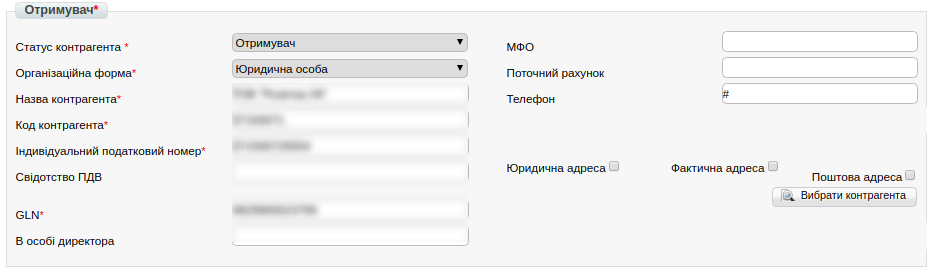

Четвертий блок містить інформацію про відправника Комерційного документа, дані заповнюються автоматично на підставі даних компанії в налаштуваннях.

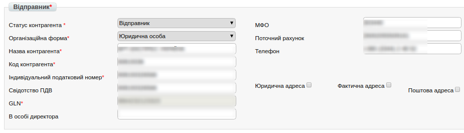

Дев'ятий блок містить інформацію про товарні позиції, які поставляються.

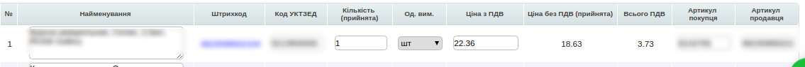

**Даний блок містить такі колонки:**

* **Найменування** – дані заповнюються автоматично з документа підстави
* **Штрихкод** - дані заповнюються автоматично з документа підстави
* **Код УКТЗЕД** - дані заповнюються автоматично з товарного довідника
* **Кількість** - дані заповнюються автоматично з документа підстави
* **Од. Вим.** - дані заповнюються автоматично з товарного довідника
* **Ціна без ПДВ** - дані заповнюються автоматично з документа підстави
* **Ціна з ПДВ** - дані заповнюються автоматично з документа підстави
* **Артикул покупця** - дані заповнюються автоматично з документа підстави
* **Артикул продавця**- дані заповнюються автоматично з товарного довідника

Після внесення всіх даних в документ, переконайтеся в їх коректності та натисніть кнопку “**Зберегти**”.

.. image:: pics_formirovanie_Rashodnoj_nakladnoj/formirovanie_Rashodnoj_nakladnoj_11.png
   :align: center

Підписання документа Видаткова Накладна
====================================================

Після Збереження документа, його необхідно підписати Електронно-Цифровим підписом (ЕЦП).

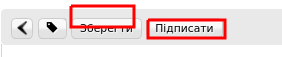

Для первинного налаштування ЕЦП, дочекайтесь завантаження сторінки, а потім натисніть кнопку “**Зчитати ключ**”.

.. image:: pics_formirovanie_Rashodnoj_nakladnoj/formirovanie_Rashodnoj_nakladnoj_13.png
   :align: center

Потім, в блоці налаштування ЕЦП, натисніть на зображення ключа і виберіть з каталогу, де зберігаються Ваші секретні ключі, відповідний файл.

.. image:: pics_formirovanie_Rashodnoj_nakladnoj/formirovanie_Rashodnoj_nakladnoj_14.png
   :align: center

Види файлів електронно-цифрового підпису
====================================================

Якщо Ви використовуєте ключі від **АЦСК "Україна"**, файли підписів секретних ключів мають розширення **.ZS2** і наступні значення в іменах файлів:

* Директор «DS»
* Бухгалтер «BS»
* Співробітник «SS»
* Печатка «S»
* Шифрування «C»
* Універсальний ключ печатки і шифрування «U»

.. image:: pics_formirovanie_Rashodnoj_nakladnoj/formirovanie_Rashodnoj_nakladnoj_15.png
   :align: center

Якщо Ви використовуєте ключі від **АЦСК “ПриватБанк”**, файли підписів секрентних ключів мають розширення **.jks**:

.. image:: pics_formirovanie_Rashodnoj_nakladnoj/formirovanie_Rashodnoj_nakladnoj_16.png
   :align: center

Якщо Ви використовуєте ключі від будь-яких інших **АЦСК**, файли підписів секрентних ключів мають найменування **Key-6.dat**:

.. image:: pics_formirovanie_Rashodnoj_nakladnoj/formirovanie_Rashodnoj_nakladnoj_17.png
   :align: center

Після вибору секретних ключів, введіть паролі під кожним з них, а потім натисніть кнопку “**Зчитати ключі**”

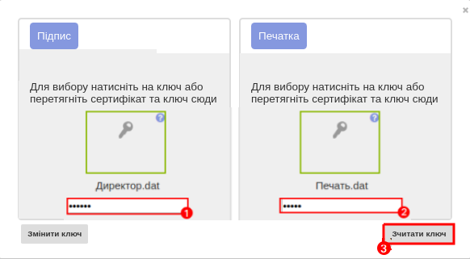

При коректному зчитуванні ключів, в блоці “**ЕЦП**” з’явиться інформація про власників ключів. Після перевірки інформації натисніть кнопку “**Підписати**”.

.. image:: pics_formirovanie_Rashodnoj_nakladnoj/formirovanie_Rashodnoj_nakladnoj_19.png
   :align: center

Після підписання натисніть на кнопку “**Відправити**”.

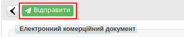

Статуси відправлених документів
====================================================

Після відправки відповідних документів, торговельна мережа обробляє їх і присвоює їм статуси.
Статуси відображаються в розділі "Відправлені", навпроти кожного документа.

.. image:: pics_formirovanie_Rashodnoj_nakladnoj/formirovanie_Rashodnoj_nakladnoj_21.png
   :align: center

Якщо документ коректний, навпроти нього, буде зображений статус у вигляді іконки |иконка-инфо| (знак інфо).

Якщо в документі були допущені помилки, навпроти нього буде зображений статус у вигляді іконки |иконка-статус-1| (знак оклику).

Детальну інформацію про статус документа, можна дізнатися, клікнувши на іконку, після чого, з'явиться інформаційне вікно з текстом статусу.

Приклад коректного статусу:

.. image:: pics_formirovanie_Rashodnoj_nakladnoj/formirovanie_Rashodnoj_nakladnoj_22.png
   :align: center

Приклад некоректного статусу:

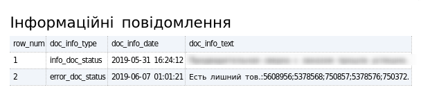

Отримавши такий статус, необхідно виправити помилки, зазначені в повідомленні і відправити документ повторно.

.. |иконка-инфо| image:: pics_formirovanie_Rashodnoj_nakladnoj/formirovanie_Rashodnoj_nakladnoj_icon_1.png
.. |иконка-статус-1| image:: pics_formirovanie_Rashodnoj_nakladnoj/formirovanie_Rashodnoj_nakladnoj_icon_2.png

.. include:: kontakti.rst
