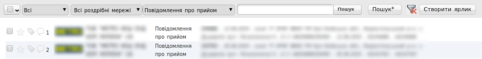
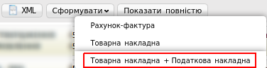
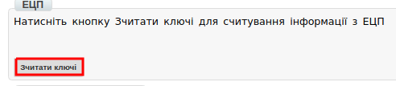
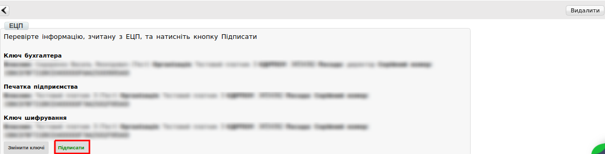
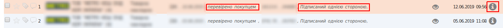
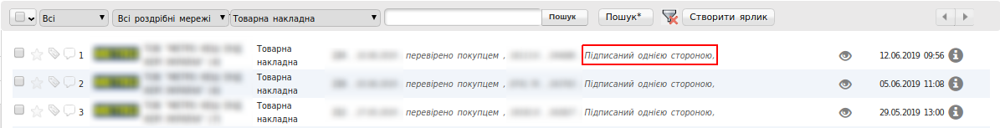

Формування Товарної і Податкової Накладних
###############################################################################

.. role:: red

.. contents:: Зміст:
   :depth: 6

---------

Вступ
====================================

Дана інструкція описує порядок формування Товарної накладної і Податкової накладної на web-платформі.

.. important:: **Увага!**  Для коректного формування документів **ТН** и **ПН**, необхідно заповнити Товарний довідник. Ви можете подивитися `Інструкцію щодо заповнення довідника <https://wiki.edi-n.com/uk/latest/general/Zapolnenie_Tovarnogo_spravochnika.html>`_.

.. note:: **Увага!** Завершеним ланцюжком документообігу з мережею, є відправлена Товарна накладна, з коректним статусом, плюс створена на підставі Товарної накладної і зареєстрована Податкова накладна.

Товарна накладна
====================================

Перед початком роботи з Товарною накладною и Податковою накладною необхідно заповнити всі реквізити компанії, ПІБ підписанта, а також дані ДПІ, в яку будуть відправлятися Податкові Накладні.

Заповнення реквізитів компанії
----------------------------------------------------

Далі, перейдіть в розділ "**Налаштування**" (у правому верхньому куті):

.. image:: pics_formirovanie_Tovarnoj_i_Nalogovoj_nakladnoj/formirovanie_Tovarnoj_i_Nalogovoj_nakladnoj_01.png
   :align: center

Натисніть на закладку "**Мої компанії**" і виберыть GLN, з якого відбуватиметься відправка документів.

.. image:: pics_formirovanie_Tovarnoj_i_Nalogovoj_nakladnoj/formirovanie_Tovarnoj_i_Nalogovoj_nakladnoj_02.png
   :align: center

У формі заповніть поля обов'язкові для заповнення (відзначені червоною зірочкою :red:`*` ).

.. important:: **Зверніть увагу!** Реквізити заповнюються українською мовою і повинні відповідати інформації в реєстраційних документах компанії.

.. image:: pics_formirovanie_Tovarnoj_i_Nalogovoj_nakladnoj/formirovanie_Tovarnoj_i_Nalogovoj_nakladnoj_03.png
   :align: center

Методи створення Товарної накладної
----------------------------------------------------

Створити Товарну накладну можливо трьома способами:

1. Через меню «Створити» вибрати Товарну накладну
2. На підставі Замовлення (ORDER)
3. На підставі Повідомлення про прийом (RECADV)

*Рекомендується формувати комплект документів **Товарна накладна + Податкова накладна**, на підставі **Повідомлення про прийом** (RECADV).*

Нижче наведено приклад формування **Товарної накладної** на підставі **Повідомлення про прийом** (RECADV).

Для формирования документа комплекта документов, необходимо перейти в раздел “**Входящие**”.

Для зручності, відфільтруйте документи за «**прочитаними**», виберіть потрібну мережу і вкажіть тип документа «**Повідомлення про прийом**».

Відкрити документ "**Повідомлення про прийом**" і натиснути кнопку "**Сформувати**", потім вибрати зі списку документ "**Товарна накладна + Податкова накладна**".

Заповнення документа Товарна накладна
----------------------------------------------------

Першим сформованим документом буде Товарна накладна. У відкритому документі, необхідно заповнити обов'язкові дані, позначені червоною зірочкою :red:`*`, в кожному з блоків.

.. image:: pics_formirovanie_Tovarnoj_i_Nalogovoj_nakladnoj/formirovanie_Tovarnoj_i_Nalogovoj_nakladnoj_06.png
   :align: center

При перевірці внесених даних за товарними позиціями необхідно впевнитись, що обов'язково заповнене поле **код УКТ ЗЕД**. 
У разі, якщо поле не заповнено або заповнено некоректно, при збереженні документа буде виведено повідомлення, як на зображенні нижче:

.. image:: pics_formirovanie_Tovarnoj_i_Nalogovoj_nakladnoj/formirovanie_Tovarnoj_i_Nalogovoj_nakladnoj_07.png
   :align: center

Для того, щоб поле з кодом **УКТ ЗЕД** за товарними позиціями при формуванні документа Товарна Накладна заповнювалось автоматично, необхідно перевірити коректність заповнення даних в Товарному довіднику.

.. image:: pics_formirovanie_Tovarnoj_i_Nalogovoj_nakladnoj/formirovanie_Tovarnoj_i_Nalogovoj_nakladnoj_08.png
   :align: center

Підписання документа Товарна Накладна
----------------------------------------------------

Після збереження документа, його необхідно підписати Електронно-Цифровим підписом (ЕЦП).

.. image:: pics_formirovanie_Tovarnoj_i_Nalogovoj_nakladnoj/formirovanie_Tovarnoj_i_Nalogovoj_nakladnoj_09.png
   :align: center

Для первинного налаштування ЕЦП, дочекайтеся завантаження сторінки, а потім натисніть кнопку "**Зчитати ключі**".

Потім, в блоці налаштування ЕЦП, натисніть на зображення ключа і виберіть з каталогу, де зберігаються Ваші секретні ключі, відповідний файл.

.. image:: pics_formirovanie_Tovarnoj_i_Nalogovoj_nakladnoj/formirovanie_Tovarnoj_i_Nalogovoj_nakladnoj_11.png
   :align: center

Види файлів електронно-цифрового підпису
----------------------------------------------------

Якщо Ви використовуєте ключі від **АЦСК "Україна"**, файли підписів секретних ключів мають розширення **.ZS2** і наступні значення в іменах файлів:

* Директор «DS»
* Бухгалтер «BS»
* Співробітник «SS»
* Печатка «S»
* Шифрування «C»
* Універсальний ключ печатки і шифрування «U»

.. image:: pics_formirovanie_Tovarnoj_i_Nalogovoj_nakladnoj/formirovanie_Tovarnoj_i_Nalogovoj_nakladnoj_12.png
   :align: center

Якщо Ви використовуєте ключі від **АЦСК “ПриватБанк”**, файли підписів секрентних ключів мають розширення **.jks**:

.. image:: pics_formirovanie_Tovarnoj_i_Nalogovoj_nakladnoj/formirovanie_Tovarnoj_i_Nalogovoj_nakladnoj_13.png
   :align: center

Якщо Ви використовуєте ключі від будь-яких інших **АЦСК**, файли підписів секрентних ключів мають найменування **Key-6.dat**:

.. image:: pics_formirovanie_Tovarnoj_i_Nalogovoj_nakladnoj/formirovanie_Tovarnoj_i_Nalogovoj_nakladnoj_14.png
   :align: center

Після вибору секретних ключів, введіть паролі під кожним з них, а потім натисніть кнопку “**Зчитати ключі**”

.. image:: pics_formirovanie_Tovarnoj_i_Nalogovoj_nakladnoj/formirovanie_Tovarnoj_i_Nalogovoj_nakladnoj_15.png
   :align: center

При коректному зчитуванні ключів, в блоці “**ЕЦП**” з’явиться інформація про власників ключів. Після перевірки інформації натисніть кнопку “**Підписати**”.

Після підписання натисніть на кнопку “**Відправити**”.

Статуси по Товарній накладній
----------------------------------------------------

Після відправки відповідних документів, торговельна мережа обробляє їх і надає їм статуси. Статуси відображаються в розділі "**Відправлені**", навпроти кожного документа.

- «**Документ переданий партнеру**» - товарна накладна коректна.
- «**Документ переданий на ящик партнера**» - товарна накладна коректна.
- «**Правильний канал не знайдено. Немає з'єднання з партнером**» - в товарній накладній зазначений некоректний GLN одержувача і покупця.
- «**Помилка конвертації на вихідний формат**» - є помилка у формі заповнення товарної накладної. Деякі поля були не заповнені або заповнені некоректно.

У разі виникнення подібної помилки прохання звертатися за адресою ел. пошти support@edi-n.com

Приклад коректного статусу:

.. image:: pics_formirovanie_Tovarnoj_i_Nalogovoj_nakladnoj/formirovanie_Tovarnoj_i_Nalogovoj_nakladnoj_18.png
   :align: center

Приклад некоректного статусу:

.. image:: pics_formirovanie_Tovarnoj_i_Nalogovoj_nakladnoj/formirovanie_Tovarnoj_i_Nalogovoj_nakladnoj_19.png
   :align: center

Податкова накладна
====================================

Після формування і відправки **Товарної накладної**, форма **Податкової накладної** відкриється автоматично.

Дані в документі будуть заповнені автоматично на підставі **Товарної накладної**. У **Податковій накладній** необхідно заповнити порядковий номер.

.. image:: pics_formirovanie_Tovarnoj_i_Nalogovoj_nakladnoj/formirovanie_Tovarnoj_i_Nalogovoj_nakladnoj_20.png
   :align: center

Після заповнення всіх даних, документ необхідно зберегти, підписати ЕЦП та відправити аналогічно Товарній накладній.

Документ буде доставлений на сервер ЄРПН і перевірений органом Державної Податкової Інспекції.

.. image:: pics_formirovanie_Tovarnoj_i_Nalogovoj_nakladnoj/formirovanie_Tovarnoj_i_Nalogovoj_nakladnoj_21.png
   :align: center

Статус реєстрації Податкової накладної
----------------------------------------------------

Після перевірки документа органом Державної Податкової Інспекції, йому буде присвоєно статус.

На коректний документ надійде статус «**Зареєстровано в ЄРПН і відправлено покупцеві**».

На некоректний документ надійде статус «**Помилка при реєстрації в ЄРПН**».

.. image:: pics_formirovanie_Tovarnoj_i_Nalogovoj_nakladnoj/formirovanie_Tovarnoj_i_Nalogovoj_nakladnoj_22.png
   :align: center

Щоб перевірити причину відмови в реєстрації Податкової накладної, необхідно зайти в відправлений документ і розшифрувати **Квитанцію №1** відправлену органом ДПІ.

Для цього дочекайтеся завантаження даних в блоці «**Квитанція №1**» і натисніть кнопку «**Зчитати**».

.. image:: pics_formirovanie_Tovarnoj_i_Nalogovoj_nakladnoj/formirovanie_Tovarnoj_i_Nalogovoj_nakladnoj_23.png
   :align: center

Якщо раніше, ключі ЕЦП не були налаштовані, для розшифровки квитанції необхідно налаштувати ключ "**Шифрування**».

Розшифрований документ можливо зберегти у форматі **.PDF**, завантажити в форматі **.RPL** або відобразити на платформі. Текст причини відмови в реєстрації Податкової накладної вказано в блоці «**Виявлені помилки**».

.. image:: pics_formirovanie_Tovarnoj_i_Nalogovoj_nakladnoj/formirovanie_Tovarnoj_i_Nalogovoj_nakladnoj_24.png
   :align: center

Після аналізу помилок, сформуйте документ повторно і відправте ще раз.

Формування Товарної і Податкової накладної, через функціонал «Створити документ»
===================================================================================

У разі, якщо від торгової мережі відсутній документ «**Повідомлення про прийом**», Товарну накладну необхідно сформувати самостійно через меню «**Створити**».

.. image:: pics_formirovanie_Tovarnoj_i_Nalogovoj_nakladnoj/formirovanie_Tovarnoj_i_Nalogovoj_nakladnoj_25.png
   :align: center

Додавання товарних позицій
-------------------------------------------

З випадаючого списку, виберіть документ «**Товарна накладна**». В сформованому документі всі реквізити необхідно ввести вручну, на підставі паперових документів.

Після внесення реквізитів в документ, потрібно ввести товарні позиції. Для цього натисніть кнопку «**Додати позицію**».

.. image:: pics_formirovanie_Tovarnoj_i_Nalogovoj_nakladnoj/formirovanie_Tovarnoj_i_Nalogovoj_nakladnoj_26.png
   :align: center

У формі, що з'явилася, заповніть всі обов'язкові поля, позначені червоною зірочкою :red:`*`. Після внесення даних збережіть зміни.

.. image:: pics_formirovanie_Tovarnoj_i_Nalogovoj_nakladnoj/formirovanie_Tovarnoj_i_Nalogovoj_nakladnoj_27.png
   :align: center

Зверніть увагу, що для того, щоб поле «**код УКТ ЗЕД**» при виборі товарної позиції заповнювалось автоматично, дані необхідно заповнити в Товарному довіднику.

Після додавання всіх товарних позицій, документ необхідно зберегти, підписати ЕЦП та відправити в торговельну мережу.

Ця процедура, аналогічна пункту *"Підписання документа Товарна Накладна"* даної інструкції.

Формування Податкової накладної
----------------------------------------------------

Перейдіть в розділ «**Відправлені**», знайдіть і відкрийте раніше відправлену "Товарну накладну"..

У відкритому документі натисніть кнопку «Сформувати», потім виберіть зі списку документ «**Податкова накладна**».

Дані в документі будуть заповнені автоматично на підставі "Товарної накладної". У "Податковій накладній" необхідно заповнити порядковий номер.

Після додавання всіх товарних позицій, документ необхідно зберегти, підписати ЕЦП та відправити в торговельну мережу.

Ця процедура, аналогічна пункту *"Підписання документа Товарна Накладна"* даної інструкції.

.. include:: kontakti.rst
