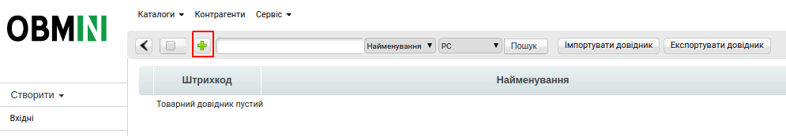
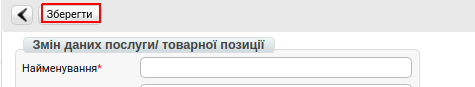
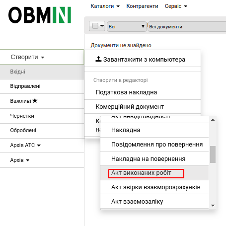
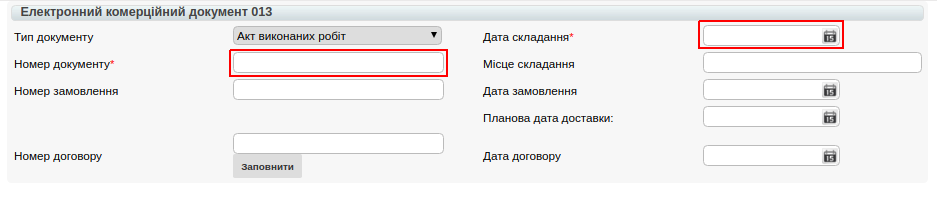
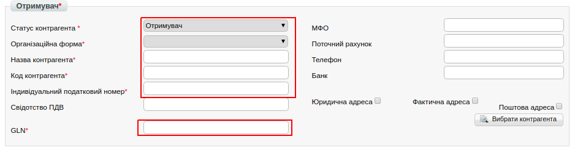
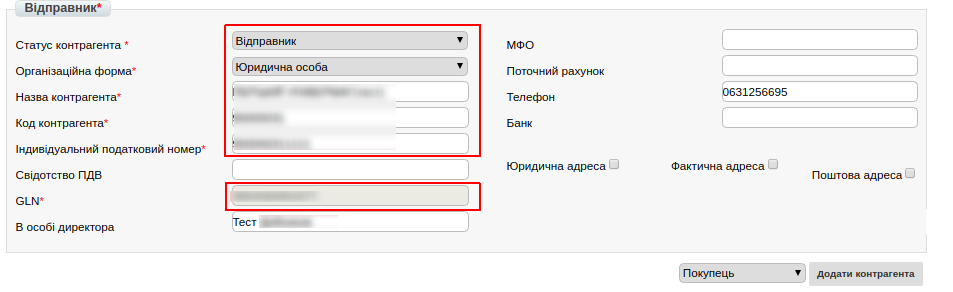
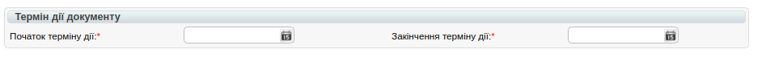
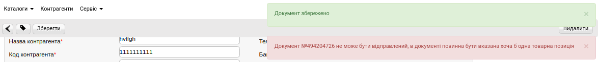
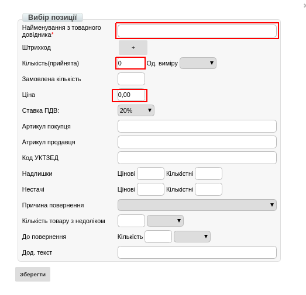
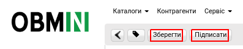

Формування документа «Акт виконаних робіт» на платформі OBMIN
#############################################################################################

.. contents:: Зміст:
   :depth: 6

---------

Вступ
=======================

Дана інструкція описує порядок формування та відправки документа «**Акт виконаних робіт**» (COMDOC).

В першу чергу необхідно заповнити Товарний довідник на платформі OBMIN, в даному довіднику вкажіть перелік товарів і послуг, переданих в акті.

Заповнити Товарний Довідник на Web-платформі можна кількома способами:

**Вручну на платформі, Через шаблон .CSV, Через шаблон .XLS**.

Заповнення Товарного довідника вручну
==============================================

Для переходу до заповнення Товарного довідника, необхідно перейти в розділ «**Меню**»-> «**Двідники**»-> «**Довідник послуг/товарів**»

.. image:: pics_formirovanie_dokumenta_Akt_vypolnennyh_rabot_na_platforme_OBMIN/formirovanie_Akt_01.png
   :align: center

Для того щоб додати товарну позицію або послугу, натисніть на кнопку «**+**».

Після натискання якої у Вас відкриється форма «**Зміни даних товарної позиції**».

.. sidebar:: Обов'язкові поля

    .. image:: pics_formirovanie_dokumenta_Akt_vypolnennyh_rabot_na_platforme_OBMIN/formirovanie_Akt_03.png
    
**Обов'язкові для заповнення поля**:

#. **Найменування*** - вкажіть найменування товарної позиції або послуги.
#. **Штрихкод*** - вкажіть штрихкод позиції, якщо штрихкода немає, вкажіть (1000000000000).
#. **Ціна*** - вкажіть ціну без ПДВ.
#. **Од.вим*** - зі списку виберіть одиницю.
#. **ПДВ*** - вкажіть ставку ПДВ.
#. **РМ** - вкажіть, до яких торговельних мереж буде відноситись даний товар. За замовчуванням стоїть значення "Всі".

Позиція з позначкою **РМ** може бути додана тільки в разі, якщо ця товарна позиція вже існує в загальному довіднику і Ви хочете відзначити цей товар або послугу для певної мережі. Якщо з мережами не співпрацюєте, не заповнюйте дане поле.

Після заповнення обов'язкових полів, натисніть «**Зберегти**» для внесення змін за товарною позицією.

Позиція буде збережена та відображатиметься в загальному довіднику.

Формування Акту виконаних робіт
==============================================

Щоб сформувати «**Акт виконаних робіт**» (COMDOC) необхідно скористатися функціоналом створення документа.

Для цього, натисніть кнопку «**Создать**» і виберіть зі списку пункт Комерційний документ «**Акт виконаних робіт**». Після чого відкриється форма для заповнення даних.

У відкритій формі, всі поля позначені червоною зірочкою *** обов'язкові для заповнення**.

1. **№ документа*** - довільний номер, який присвоюється документу.
2. **Дата складання*** - вказується поточна дата.

.. image:: pics_formirovanie_dokumenta_Akt_vypolnennyh_rabot_na_platforme_OBMIN/formirovanie_Akt_07.png
   :align: center

**У Документі-підставі**: 

1. **Номер документа*** - номер договору з Вашим контрагентом.
2. **Тип документа*** - вибираєте з випадаючого списку «Договір».
3. **Дата документа*** - вказується дата укладення Договору.

**Одержувач**:

1. **Статус контрагента*** - вибираєте з випадаючого списку Вашого контрагента, він є Одержувачем, Покупцем або Замовником, і т. д. в залежності від наданих Вам або Вами послуг.
2. **Організаційна форма*** - Юридична або Фізична особа.
3. **Назва контрагента*** - вказуєте назву контрагента.
4. **Код контрагента*** - ЄДРПОУ
5. **Індивідуальний податковий номер*** - ІПН одержувача, якщо одержувач не є платником ПДВ вказуєте 12-ти значний номер (100000000000).
6. ** GLN *** - 13-ти значний Global Location Number контрагента, підтягується автоматично.

**Відправник** - **дані заповнюються автоматично з картки контрагента**.

**Термін дії документа**:

#. **Початок терміну дії*** - дата початку дії договору з контрагентом.
#. **Закінчення терміну дії*** - дата закінчення договору з контрагентом.

Після заповнення всіх обов'язкових полів, натискаєте кнопку **Зберегти**, і система запропонує додати товар або послугу, яку Ви надаєте Вашому контрагенту.

Для коректного заповнення позицій, необхідно заповнити Товарний довідник.
Інстркцію щодо заповнення довідника ви можете знайти `за посиланням <https://wiki.edi-n.com/uk/latest/general/Zapolnenie_Tovarnogo_spravochnika.html>`_.

.. image:: pics_formirovanie_dokumenta_Akt_vypolnennyh_rabot_na_platforme_OBMIN/formirovanie_Akt_12.png
   :align: center

#. **Найменування з товарного довідника** - вводите назву товарної позиції або послуги.
#. **Кількість (прийнята)** - кількість товару.
#. **Ціна** - ціна товару або послуги.

Після заповнення таблиці, натискаєте **Зберегти** -> **Підписати** -> **Надіслати**.

Налаштування ЕЦП
=============================================

Перед початком роботи необхідно налаштувати підпис, яким Ви будете підписувати документи. Щоб перейти до Налаштування ЕЦП, зайдіть в Налаштування, натисніть на "шестерню" у верхньому правому куті. Відкриється Провідник, де необхідно буде вказати каталог з секретними ключами і вибрати ключі.

.. image:: pics_formirovanie_dokumenta_Akt_vypolnennyh_rabot_na_platforme_OBMIN/formirovanie_Akt_15.png
   :align: center

Якщо ключі отримані в **АЦСК ІДД (ДФС)**, тоді необхідно вибирати: ключі **key-6.dat**

Якщо ви використовуєте для підписання ключі АЦСК «Україна», тоді види ключів наступні:

- Ключ директора: ЄДРПОУ_ІНН підписанта_D1111111.ZS2
- Ключ бухгалтера: ЄДРПОУ_ІНН підписанта _B1111111.ZS2
- Ключ печатки: ЄДРПОУ_S1111111.ZS2 (ЄДРПОУ _U1111111.ZS2)
- Ключ шифрування: ЄДРПОУ_С1111111.ZS2 (ЄДРПОУ _U1111111.ZS2)

Після того, як ключ обраний, з'являється вікно, в якому необхідно ввести пароль і натиснути кнопку: **Зчитати**.

.. image:: pics_formirovanie_dokumenta_Akt_vypolnennyh_rabot_na_platforme_OBMIN/formirovanie_Akt_16.png
   :align: center

Коли ключі зчитані, у вікні ЕЦП можна буде побачити інформацію про ЕЦП:

.. image:: pics_formirovanie_dokumenta_Akt_vypolnennyh_rabot_na_platforme_OBMIN/formirovanie_Akt_17.png
   :align: center

Далі відкриється вікно, в якому необхідно відмітити чекером типи ключів, якими буде підписаний документ. Потім встановлюємо послідовність підпису, наприклад:

- директор - 1
- печатка - 2

.. image:: pics_formirovanie_dokumenta_Akt_vypolnennyh_rabot_na_platforme_OBMIN/formirovanie_Akt_18.png
   :align: center

І натискаємо кнопку **Підписати**. Після процесу підписання необхідно натиснути кнопку **Надіслати**.

.. image:: pics_formirovanie_dokumenta_Akt_vypolnennyh_rabot_na_platforme_OBMIN/formirovanie_Akt_19.png
   :align: center

.. include:: kontakti.rst
