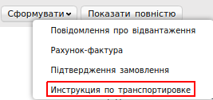

#############################################################################################################
Формування документа «Інструкція з транспортування» (IFTMIN) на платформі
#############################################################################################################

.. contents:: Зміст:
   :depth: 6

---------

Вступ
====================================

Дана інструкція описує порядок формування та відправки документа «**Інструкція з транспортування**» (IFTMIN).

Формування документа «Інструкція з транспортування» (IFTMIN)
=====================================================================

Створення документа відбувається на підставі «**Замовлення**».

Перейдіть в розділ «**Вхідні**», для зручності пошуку виберіть в фільтрі необхідну мережу і тип документа «**Замовлення**».

.. image:: pics_formirovanie_dokumenta_Instrukcija_po_transportirovke_IFTMIN_na_platforme/formirovanie_dokumenta_Instrukcija_po_transportirovke_IFTMIN_na_platforme_01.png
   :align: center

У відкритому документі, натисніть кнопку «**Сформувати**» і виберіть зі списку документ «**Інструкція з транспортування**».

   
У вікні з'явиться **Форма** для заповнення необхідних реквізитів документа. Всі поля, позначені червоною зірочкою ***** обов'язкові для заповнення.

Заповнення документа (IFTMIN)
========================================================

#. **Номер** документа повинен бути наступного формату **X_Y**, де:

- **Х - це порядковий номер машини, на поставку**
- **Y - це загальна кількість машин, на поставку**

Важливо, для кожної машини на поставку в один день повинен бути індивідуальний номер машини. Дві машини з однаковим номером машини будуть групуватися в одну.

Мінімальна к-ть 1, Максимальна - 99.
Х повинен бути менше або рівним Y. *Наприклад: 2_5*

2. **Дата** - фактична дата відправки поставки
#. **Номер замовлення** - підтягується автоматично із замовлення
#. **Фактична кількість палет** - кількість палет, що відвантажується в вантажний транспорт
#. **Максимальна кількість палет** - максимальна місткість палет (вантажний транспорт)
#. **Вантажопідйомність** - маса вантажу, на перевезення якого розрахований транспортний засіб

.. image:: pics_formirovanie_dokumenta_Instrukcija_po_transportirovke_IFTMIN_na_platforme/formirovanie_dokumenta_Instrukcija_po_transportirovke_IFTMIN_na_platforme_03.png
   :align: center
   
После внесения всех данных в документе, нажмите кнопку «**Сохранить**», затем «**Отправить**».

Відправлений документ автоматично потрапляє в папку «**Відправлені**» і буде знаходиться в ланцюжку документів разом із **Замовленням** і **Підтвердженням замовлення**.

.. include:: kontakti.rst
