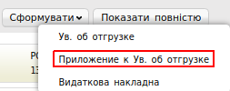
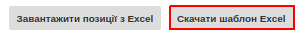

##########################################################################################################################
Формування документа «Додаток до повідомлення про відвантаження» (QUOTES) на платформі
##########################################################################################################################

.. contents:: Зміст:
   :depth: 6

---------

Вступ
====================================

Дана інструкція описує порядок формування та відправки документа «Додаток до повідомлення про відвантаження» (QUOTES).

Формування документа «Додаток до повідомлення про відвантаження» (QUOTES)
=================================================================================

Формування документа відбувається на підставі «**Повідомлення про відвантаження**».

Перейдіть в розділ «**Відправлені**», для зручності пошуку виберіть в фільтрі необхідну мережу і тип документа «**Повідомлення про відвантаження**».

.. image:: pics_formirovanie_dokumenta_Prilozhenie_k_uvedomleniju_ob_otgruzke_QUOTES_na_platforme/01.png
   :align: center

У відкритому документі, натисніть кнопку «**Сформувати**» і виберіть зі списку документ «**Додаток до повідомлення про відвантаження**».

У вікні з'явиться Форма c даними, які переносяться з відповідного **Повідомлення про відвантаження**. Всі поля, позначені червоною зірочкою ***** обов'язкові для заповнення.

.. image:: pics_formirovanie_dokumenta_Prilozhenie_k_uvedomleniju_ob_otgruzke_QUOTES_na_platforme/03.png
   :align: center

#. **Номер документа** - переноситься з відповідного **Повідомлення про відвантаження**.
#. **Дата документа** - переноситься з відповідного **Повідомлення про відвантаження**.

Нижче на сторінці сформованого документа знаходиться перелік товарних позицій, які були замовлені, і їх кількість.

Додавання серійних номерів до товарних позицій
======================================================

Внесити дані можливо декількома способами: вручну, або через шаблон .xls. Нижче описані приклади обох способів.

Додавання номерів вручну
---------------------------

Якщо за товарною позицією буде відвантажено кількість в розмірі однієї одиниці товару, то вам необхідно заповнити поле в колонці «**Серійний номер**».

Якщо за товарною позицією буде відвантажено кілька одиниць товару, то вам необхідно натиснути на кнопку **«+» зеленого кольору**, і у вікні, заповнити всі поля.

.. image:: pics_formirovanie_dokumenta_Prilozhenie_k_uvedomleniju_ob_otgruzke_QUOTES_na_platforme/04.png
   :align: center

Після внесення даних необхідно натиснути кнопку «**Зберегти**»

.. image:: pics_formirovanie_dokumenta_Prilozhenie_k_uvedomleniju_ob_otgruzke_QUOTES_na_platforme/05.png
   :align: center

Додавання номерів через шаблон .xls
------------------------------------

Для завантаження серійних номерів через шаблон, натисніть на кнопку «**Скачати шаблон Excel**». Після чого почнеться скачування файлу.

Відкрийте порожній файл Excel, після чого натисканням на кнопку «**Файл**» -> «**Відкрити**» відкрийте завантажений шаблон.

.. image:: pics_formirovanie_dokumenta_Prilozhenie_k_uvedomleniju_ob_otgruzke_QUOTES_na_platforme/07.png
   :align: center

У відкритому файлі заповніть колонку «**Серійный номер**», після заповнення шаблону, збережіть його на робочий стіл.

Для завантаження шаблону, поверніться в документ, і натисніть на кнопку «Завантажити позиції з Excel».

.. image:: pics_formirovanie_dokumenta_Prilozhenie_k_uvedomleniju_ob_otgruzke_QUOTES_na_platforme/08.png
   :align: center

Потім виберіть створений документ, який ви зберегли і завантажте.

.. image:: pics_formirovanie_dokumenta_Prilozhenie_k_uvedomleniju_ob_otgruzke_QUOTES_na_platforme/09.png
   :align: center

Для збереження документа натискаємо на кнопку «**Зберегти**», а потім - «**Відправити**».

.. include:: kontakti.rst
