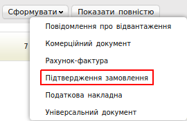
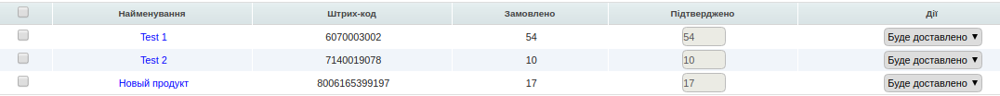
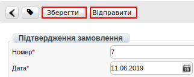

##############################################################################################
Формування та відправка документа «Підтвердження замовлення» (ORDRSP) на платформі
##############################################################################################

.. contents:: Зміст:
   :depth: 6

---------

Вступ
====================================

Дана інструкція описує порядок формування та відправки документа «**Підтвердження замовлення**» (**ORDRSP**).

Підтвердження замовлення
=================================

Для того, щоб сформувати документ «**Підтвердження замовлення**» (**ORDRSP**), перейдіть в розділ «**Вхідні**», для зручності виберіть фільтр по типу документа «**Замовлення**» і відкрийте його.

.. image:: pics_formirovanie_otpravka_dokumenta_Podtverzhdenie_zakaza_ORDRSP_na_web/formirovanie_ORDRSP_01.png
   :align: center

У вікні з'явиться **Форма** для заповнення необхідних реквізитів документа. Всі поля, позначені червоною зірочкою :red:`*` є обов'язковими для заповнення.

.. image:: pics_formirovanie_otpravka_dokumenta_Podtverzhdenie_zakaza_ORDRSP_na_web/formirovanie_ORDRSP_03.png
   :align: center

1. **Номер** - може співпадати з номером Замовлення
2. **Дата** - дата підтвердження, автоматично вказується поточна дата
3. **Дата Замовлення** - автоматично переноситься з Замовлення
4. **Підтверджена дата поставки** - переноситься из Замовлення (якщо з мережею погоджене перенесення - змініть її)
5. **Дії** - вибирається з наступних: **Буде доставлено, Зміни кількості, або Відмовлено**

Нижче на сторінці створеного документа знаходиться перелік товарних позицій, які були замовлені, і їх кількість:

Система автоматично в колонку «**Підтверджено**» підставляє значення аналогічне замовленому, а в колонку «**Дії**» статус «**Буде доставлено**».

Редагування товарних позицій
================================================

За потреби є можливість змінити кількість підтвердженного товару в колонці «**Дії**» (через «**Зміна кількості**»).

.. important:: **Увага!** Кількість підтвердженних товарных позиций не може перевищувати кількість зазначену в замовленні!

Якщо якась із позицій відсутня і поставлятися не буде, в колонці «**Дії**», виберіть пункт «**Відмовлено**», значення в колонці «**Кількість**» автоматично буде змінена на 0.

.. image:: pics_formirovanie_otpravka_dokumenta_Podtverzhdenie_zakaza_ORDRSP_na_web/formirovanie_ORDRSP_05.png
   :align: center

Після внесення всіх даних в документі, натисніть кнопку «**Зберегти**», потім «**Відправити**».

Відправлений документ автоматично потрапляє в папку «**Відправлені**» і буде знаходиться в ланцюжку документів разом із **Замовленням**.

.. include:: kontakti.rst
