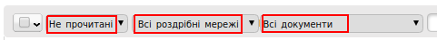
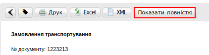
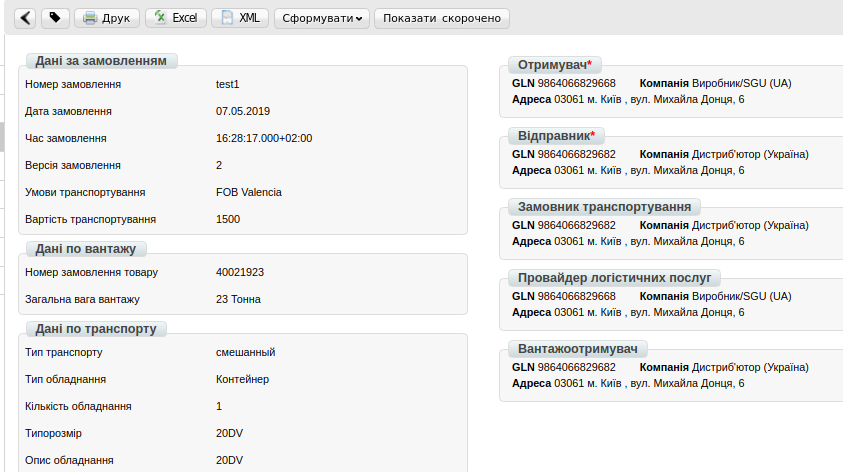
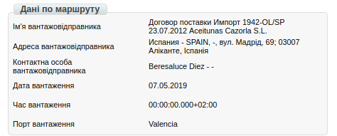
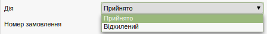
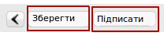
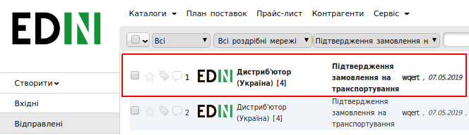
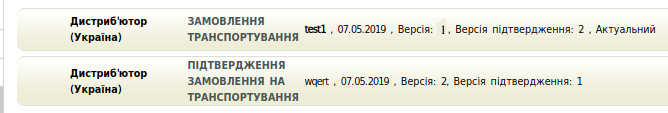

Формування та відправка документа «Підтвердження замовлення транспортування» (IFTMBC) на платформі
######################################################################################################

.. role:: red

.. contents:: Зміст:
   :depth: 6

---------

Вступ
========================================================================

Дана інструкція описує порядок формування та відправки документа «Підтвердження замовлення транспортування» (IFTMBС) на WEB платформі.

Фільтри
========================================================================

Перейдіть в розділ **«Вхідні»**, в цій папці є можливість використовувати фільтр для швидкого відображення документів по статусу, роздрібної мережі і типам документів. Для цього потрібно скористатися полями, які відображені вище над документами.

За замовчуванням нові вхідні документи мають статус **«Непрочитані»**, після відкриття документів статус змінюється на **«Прочитані»**.

Формування документа «Підтвердження замовлення транспортування» (IFTMBС)
================================================================================

Створення документа відбувається на підставі вхідного документа **«Замовлення транспортування»**. Для зручності пошуку, виберіть потрібний фільтр і відкрийте вхідний документ.

.. image:: pic_formirovanie_otpravka_dokumenta_Podtverzhdenie_zakaza_transportirovki_IFTMBC/formirovanie_IFTMBC_02.png
   :align: center

Відкритий документ містить коротку інформацію, яка містить наступні дані: № документа, GLN і найменування відправника, місце доставки і місце вивантаження.

Для відображення більш детальної інформації, натисніть кнопку **«Показати повністю»**:

Відкритий документ містить детальну інформацію за Замовленням, дані по вантажу і транспорту, а також дані по маршруту.

У правому блоці, міститься інформація про реквізити контрагентів, їх найменування, адреси і GLN номери.

Для створення документа **IFTMBC**, у відкритому документі натисніть кнопку **«Сформувати»** і виберіть зі списку документ **«Підтвердження замовлення транспортування»**.

.. image:: pic_formirovanie_otpravka_dokumenta_Podtverzhdenie_zakaza_transportirovki_IFTMBC/formirovanie_IFTMBC_06.png
   :align: center

Заповнення документа «Підтвердження замовлення транспортування» (IFTMBС)
========================================================================

Заповнення документа «Підтвердження замовлення транспортування» передбачає два способи:

- хронологія подій поставки заповнюється в одному документі
- хронологія подій поставки заповнюється в окремому документі

Нижче описані обидва способи.

У відкритому документі, перший блок містить поля позначені червоною зірочкою :red:`*` (ці дані автоматично підтягуються з документа-підстави) і є обов'язковими до заповнення.

**Номер підтвердження замовлення**: довільний номер, який присвоюється документу, за замовчуванням підтягується з документа підстави.

**Дата підтвердження замовлення**: дата, якою постачальник логістичних послуг підтверджує готовність виконання замовлення.

**Час підтвердження замовлення**: час, яким постачальник логістичних послуг підтверджує готовність виконання замовлення. Вказується в форматі hh: mm

**Дія**: відмова або прийняття постачальника логістичних послуг виконати замовлення.

.. image:: pic_formirovanie_otpravka_dokumenta_Podtverzhdenie_zakaza_transportirovki_IFTMBC/formirovanie_IFTMBC_07.png
   :align: center

У разі відмови постачальника виконати умови замовлення, в колонці «Дія», необхідно вибрати пункт **«Відхилений»**.

Другий блок містить інформацію про тип транспортуємого об'єкта, його розмір, номер, короткий опис, а також інформацію про транспортний засіб, номер причепа і дані водія.

.. image:: pic_formirovanie_otpravka_dokumenta_Podtverzhdenie_zakaza_transportirovki_IFTMBC/formirovanie_IFTMBC_09.png
   :align: center

Кількість рядків у другому блоці, як і колонки «Типорозмір» і «Опис» автоматично формуються на підставі документа «Замовлення транспортування» з блоку «Дані по транспорту». Решта колонок заповнюються вручну.

Додавання подій
====================================

Третій блок містить інформацію про події поставки. Для того, щоб створити подію поставки, натисніть на кнопку **«Додати позицію»**.

Події поставки в табличній частині містять наступні колонки:

**Тип події** - необхідно вибрати зі списку.

**Транспорт / судно** - необхідно вибрати зі списку.

**Назва транспорту / судна** - заповнюється вручну.

**Назва місця / порту** - заповнюється вручну.

**Дата події** - необхідно вказати дату в календарі.

**Час події** - заповнюється вручну.

**Додаткова інформація** - заповнюється вручну.

Для вибору події, натисніть на порожній рядок в колонці **«Тип події»** і виберіть зі списку потрібний пункт.

.. image:: pic_formirovanie_otpravka_dokumenta_Podtverzhdenie_zakaza_transportirovki_IFTMBC/formirovanie_IFTMBC_11.png
   :align: center

Аналогічним способом слід заповнити колонки **«Транспорт / судно»** і **«Дата події»**.

.. image:: pic_formirovanie_otpravka_dokumenta_Podtverzhdenie_zakaza_transportirovki_IFTMBC/formirovanie_IFTMBC_12.png
   :align: center

Для того, щоб видалити подію, необхідно натиснути на червону кнопку з хрестиком.

Відправка документа
===================================================

Після внесення в документ всіх даних, необхідно спочатку натиснути кнопку **«Зберегти»**, **«Підписати»** а потім - **«Надіслати»**.

Даний документ буде відображатися в папці **«Відправлені»**.

У разі, якщо інформація заповнюється даними, де хронологія подій поставки заповнюється в одному документі, блок подій буде виглядати наступним чином:

.. image:: pic_formirovanie_otpravka_dokumenta_Podtverzhdenie_zakaza_transportirovki_IFTMBC/formirovanie_IFTMBC_15.png
   :align: center

У разі, якщо інформація заповнюється даними, де хронологія подій поставки заповнюється в окремому документі або документ відправляється в момент події (наприклад, навантаження вантажу), то кожному відправленому документу буде присвоєна наступна версія і замовник послуги обробляє останню версію документа.

По отриманню всієї необхідної інформації, замовник транспортування відправляє квитанцію про закриття замовлення.

По отриманню файла статус документа «**замовлення транспортування**» змінюється на «**транспортування закрите**».

.. important:: **Увага!** Після отримання статусу «**транспортування закрите**» над документами **«Замовлення транспортування»** і **«Підтвердження замовлення на транспортування»** не можна проводити ніяких дій.

.. include:: kontakti.rst
