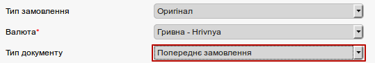
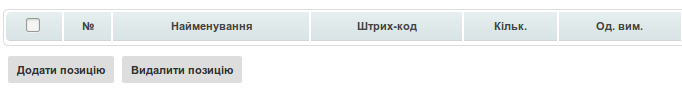
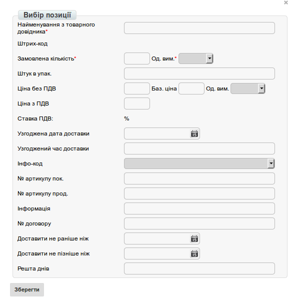
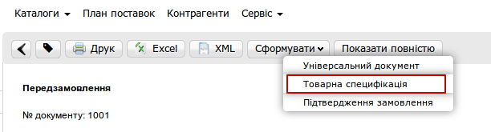
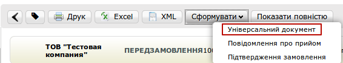

Інструкція по роботі з документами на web-платформі для Modern-Expo
###############################################################################

.. role:: red

.. contents:: Зміст:
   :depth: 6

---------

1 Вступ
====================================
Дана інструкція описує порядок ведення повного документообігу з мережею Modern Expo.

2 Формування Попереднього Замовлення
====================================

Для того, щоб сформувати документ "Попереднє Замовлення", перейдіть в розділ Створити - Замовлення. У створеному документі вкажіть Тип документа - Попереднє Замовлення.

.. image:: pics_modern_expo_instruction/modern_expo_instruction_01.png
   :align: center

У відкритій формі, все поля позначені червоною зірочкою :red:`*` обов'язкові для заповнення.

1. **Номер замовлення** — указується номер документа.
2. **Дата замовлення** - дата замовлення, автоматично вказана поточна дата.
3. **Дата доставки** — необхідно вказати бажану дату доставки товару.
4. **№ договору** — договір-підстава. 
5. **Валюта** — валюта, в которой будет воспроизведен расчет.
6. **Отримувач** — інформація, хто є одержувачем документа.
7. **Покупець** — інформація, хто є покупцем товару.
8. **Місце доставки** — інформація, куди необхідно доставити товар.
9. **Постачальник** — вибрати контрагента, хто є постачальником.

Після того, як всі обов'язкові поля заповнені, необхідно Зберегти документ.

.. image:: pics_modern_expo_instruction/modern_expo_instruction_03.png
   :align: center

Після збереження документа, з'являється можливість знизу документа додати товарні позиції.

Натисніть кнопку **"Додати позицію"**. Відкриється вікно **"Вибір позиції"**, який доступний з товарного довідника (необхідно, що б він був заповнений). Для документа можливо додавати необмежену кількість товарних позицій.

Також є можливість завантажити дані по товарних позиціях з шаблону. Для цього необхідно завантажити шаблон, його заповнити і завантажити в систему.

.. image:: pics_modern_expo_instruction/modern_expo_instruction_06.png
   :align: center

Обов'язковими полями в шаблоні є поля, виділені зеленим кольором, як на прикладі нижче.

.. image:: pics_modern_expo_instruction/modern_expo_instruction_07.png
   :align: center

Після того, як всі дані в документ внесені, його необхідно **Зберегти**. Після збереження з'явиться кнопка **Надіслати**, при натисканні на яку виконується відправка замовлення контрагенту.

Після того, як документ буде відправлений, він буде оброблений постачальником. У відповідь на нього постачальник сформує документ:
- Підтвердження замовлення - ordrsp,
- Повідомлення про відвантаження - desadv.
Всі отримані документи на платформі будуть відображатися в одному ланцюжку, як на зображенні нижче.

.. image:: pics_modern_expo_instruction/modern_expo_instruction_08.png
   :align: center

Необхідно створити, підписати і відправити Постачальнику **Товарну специфікацію**.

3 Товарна специфікація
====================================
Наступним етапом є створення і відправка комерційного документа Товарна специфікація, для створення якого необхідно зайти в раніше відправлений документ «Підтвердження замовлення». У відкритому документі натисніть «Сформувати» - «Товарна специфікація»

У створеному документі «Товарна специфікація» основні дані підтягнуться з документа підстави. Обов'язкові для заповнення поля будуть відмічені червоною зірочкою :red:`*`.

.. image:: pics_modern_expo_instruction/modern_expo_instruction_10.png
   :align: center

Після заповнення всіх обов'язкових полів натисніть «Зберегти».

.. admonition:: Зверніть увагу!

   Якщо якесь обов'язкове поле буде незаповнене, то біля цього поля відобразиться повідомлення.

.. image:: pics_modern_expo_instruction/modern_expo_instruction_11.png
   :align: center

Заповніть дане поле, після чого натисніть повторно «Зберегти». Так як даний документ є юридично значимим перед його відправкою на нього необхідно накласти електронно цифровий підпис. Ознайомитися з інструкцією щодо підписання документа Ви можете за `посиланням <https://wiki.edi-n.com/uk/latest/general/Podpisanie_dokumentov_-CP_na_web-platofrme_EDIN.html>`__ . Далі даний документ "Товарна специфікація" зі свого боку повинен підписати Ваш контрагент-Постачальник.

Після цього на підставі документа "Повідомлення про відвантаження" (desadv) необхідно сформувати документ "Повідомлення про прийом" (recadv). 

4 Повідомлення про прийом (recadv)
====================================
Для формування "Повідомлення про прийом" (recadv) необхідно відкрити документ-підставу "Повідомлення про відвантаження" (desadv) і натиснути кнопку ** Сформувати ** - "Повідомлення про прийом".

.. image:: pics_modern_expo_instruction/modern_expo_instruction_12.png
   :align: center

Якщо товар був прийнятий не в повному обсязі, Ви формуєте комерційний документ «Акт про виявлені недоліки» (документ формується на підставі Повідомлення про прийом). Для цього треба зайти в відправлений документ, натиснути Сформувати - Акт про виявлені недоліки. Після заповнення його обов'язково необхідно підписати ЕЦП та відправити на підпис Постачальнику. Завершальним етапом в електронний документообіг є формування і відправка Постачальником документа Товарна накладна.

.. important:: **Увага!** При необхідності Ви можете передати Постачальнику документ з вкладенням. Для цього треба зайти в відправлений раніше документ і натиснути сформувати - Універсальний документ.

Заповніть обов'язкові поля, відзначені червоною зірочкою :red:`*`.

.. image:: pics_modern_expo_instruction/modern_expo_instruction_14.png
   :align: center

Після чого завантажте необхідний файл і виконайте відправку документа. Даний документ можна відправити непідписаним або з накладеними ЕЦП.

.. image:: pics_modern_expo_instruction/modern_expo_instruction_15.png
   :align: center

.. include:: kontakti.rst
