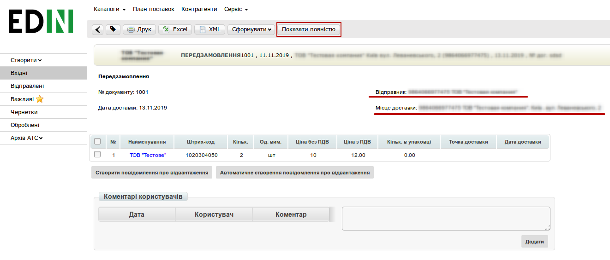
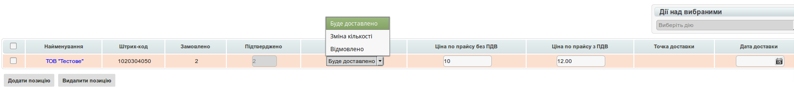
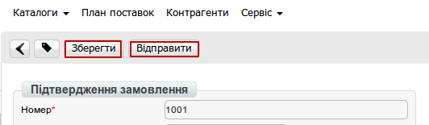
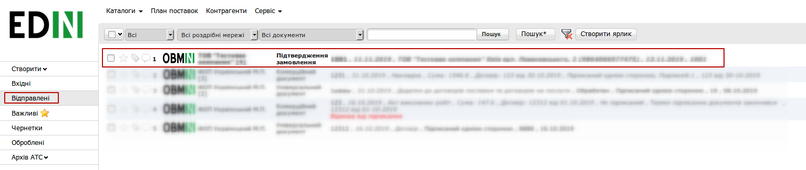
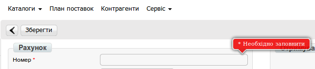
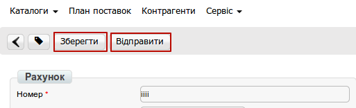
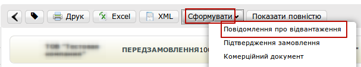
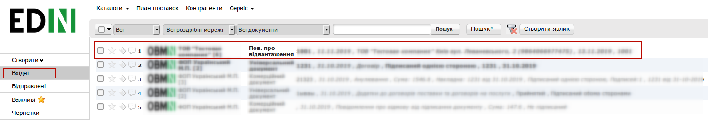
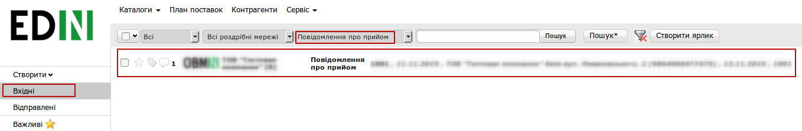
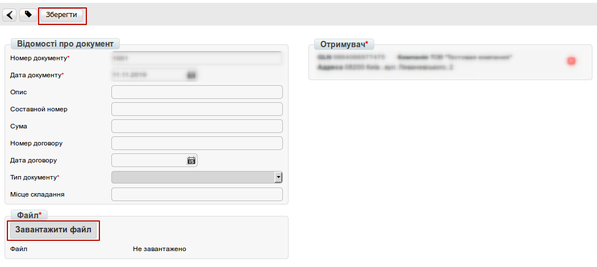

Інструкція по роботі з документами на web-платформі для Постачальника Modern-Expo
#####################################################################################

.. role:: red

.. contents:: Зміст:
   :depth: 6

---------

1 Вступ
====================================
Дана інструкція описує порядок ведення повного документообігу з мережею Modern Expo.

2 Вхід на платформу
====================================
Для входу на web-платформу перейдіть за посиланням https://edo.edi-n.com/ введіть Ваш Логін і Пароль, після чого натисніть **Вхід**.

.. image:: pics_modern_expo_postavschuk_instruction/modern_expo_postavschuk_instruction_01.png
   :align: center

3 Фільтри
====================================
Після входу на платформу перейдіть в розділ «Вхідні», в цій папці є можливість використовувати фільтр для швидкого відображення документів по статусу і типу документа (для цього потрібно скористатися полями, які відображені вище над документами). За замовчуванням нові вхідні документи мають статус «Непрочитані», після відкриття документів статус змінюється на «Прочитані». Першим документом від клієнта Modern-Expo є **«Попереднє Замовлення»**. Для вибору нового вхідного документа виберіть у фільтрах: **«Непрочитані»** - Документ **«Замовлення»** - Тип документа **«Попереднє Замовлення»**. 

.. image:: pics_modern_expo_postavschuk_instruction/modern_expo_postavschuk_instruction_02.png
   :align: center

Після чого відкрийте вхідний документ. У відкритому вигляді у Вас буде відображатися скорочений вигляд документа, в якому Ви зможете переглянути продукцію яку замовляють, хто відправник документа і місце доставки. При необхідності натисніть «Показати повністю», що б переглянути повнішу інформацію по документу.

4 Підтвердження замовлення (Ordrsp)
====================================
Для підтвердження вхідного документа натисніть вгорі «Сформувати» - «Підтвердження замовлення».

.. image:: pics_modern_expo_postavschuk_instruction/modern_expo_postavschuk_instruction_04.png
   :align: center

У Вас створиться новий документ «Підтвердження замовлення» (Ordrsp). В даний документ у Вас перенесуться основні дані. Вам необхідно буде вказати чи буде у Вас доставка в повному обсязі чи будуть зміни:
#. **Буде доставлено** — дана товарна позиція буде доставлена в повному обсязі
#. **Зміна кількості** — дана товарна позиція буде доставлена не в повному обсязі
#. **Відмовлено** — дана товарна позиція доставлена не буде

.. important:: Підтвердження замовлення є "ціновим" документом (ціни по товарах в документі є обов'язковими для заповнення)

Після чого натисніть «Зберегти» і «Надіслати»

Відправлені документи будуть знаходитись у вкладці «Надіслані», де Ви їх зможете переглянути:

5 Отримання "Товарной спецификации"
====================================
ТМ Modern-Expo формує і відправляє підписаний ЕЦП комерційний документ "Товарна специфікація". Так як даний документ є юридично значимим перед його відправкою на нього необхідно накласти електронно цифровий підпис.

6 Рахунок на оплату (invoice)
====================================
Наступним документом є **Рахунок на оплату** (invoice). Для його створення зайдіть в вхідний документ Товарна специфікація. Документ знаходиться у вкладці "Вхідні".

.. image:: pics_modern_expo_postavschuk_instruction/modern_expo_postavschuk_instruction_08.png
   :align: center

У відкритому документі натисніть «Сформувати» -«Рахунок-фактура».

.. image:: pics_modern_expo_postavschuk_instruction/modern_expo_postavschuk_instruction_09.png
   :align: center

Документ створюється попередньо заповненим з документа "Товарна специфікація". Обов'язкові для заповнення поля будуть підсвічені червоними зірочками :red:`*`. Якщо якесь обов'язкове поле буде незаповнено, то біля цього поля відобразиться повідомлення. 

Після заповнення всіх обов'язкових полів натисніть «Зберегти» і «Надіслати».

7 Повідомлення про відвантаження (Desadv)
========================================================================
Наступним документом в документообігу є **"Повідомлення про відвантаження"** (Desadv). Даний документ відправляється в момент відправки машини з товаром контрагенту. Для його формування зайдіть в раніше відправлений документ **Підтвердження замовлення** (Ordrsp). Документ знаходиться у Вас у вкладці **Відправлені**, Ви можете відфільтрувати документ використовуючи фільтри.

.. image:: pics_modern_expo_postavschuk_instruction/modern_expo_postavschuk_instruction_12.png
   :align: center

У відкритому документі натисніть «Сформувати» - «Повідомлення про відвантаження» 

У створений документ перенесуться основні дані з документа-підстави. Обов'язкові для заповнення поля будуть підсвічені червоною зірочкою :red:`*`. Після заповнення документа натисніть «Зберегти» і «Надіслати». Після прийому товару контрагент Modern-Expo відправить Вам **"Повідомлення про прийом"** (Recadv). Документ буде у Вас відображатися у вкладці «Вхідні».

Якщо приймання була з якоїсь причини не виконано в повному обсязі Вам також поступить комерційний документ «Акт про виявлені недоліки». Документ буде у Вас відображатися у «Вхідних».

.. important:: **Увага!** «Акт про виявлені недоліки» є юридично значимим документом. Даний документ Вам необхідно буде підписати електронно цифровим підписом.

.. image:: pics_modern_expo_postavschuk_instruction/modern_expo_postavschuk_instruction_15.png
   :align: center

8 Товарна накладна
====================================
Останнім документом, що закриває ланцюжок документів є **Товарна накладна**. Для створення документа зайдіть в отримане раніше "Повідомлення про прийом".

Відкрийте документ і натисніть «Сформувати» - «Товарна накладна»:

.. image:: pics_modern_expo_postavschuk_instruction/modern_expo_postavschuk_instruction_17.png
   :align: center

Документ створюється попередньо заповненим з документа-підстави. Всі обов'язкові для заповнення поля підсвічуються червоною зірочкою :red:`*`. Якщо якесь обов'язкове поле буде незаповнено, то біля цього поля відобразиться повідомлення. Після заповнення документа натисніть «Зберегти». Так як документ є юридично значимим перед відправкою на нього необхідно накласти Електронно цифровий підпис (ЕЦП). Після підписання документа натисніть кнопку «Відправити».

9 Універсальний документ
====================================

.. important:: **Увага!** При необхідності з документом відправити додаткове вкладення, наприклад обґрунтування ціни, специфікацію товару і т.д. Зайдіть в будь-який відправлений раніше документ, натисніть «Сформувати» - «Універсальний документ».

.. image:: pics_modern_expo_postavschuk_instruction/modern_expo_postavschuk_instruction_18.png
   :align: center

У Вас створиться документ, в який необхідно вкласти необхідний документ, після чого натисніть «Зберегти». Для завантаження файлу натисніть кнопку «Завантажити файл» і вкажіть до нього шлях на Вашому комп'ютері.

На документ можна спочатку накласти ЕЦП (для цього натисніть кнопку «Підписати») або відправити не підписаним (для цього просто натисніть кнопку «Відправити»).

.. image:: pics_modern_expo_postavschuk_instruction/modern_expo_postavschuk_instruction_20.png
   :align: center

.. include:: kontakti.rst
