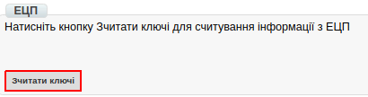
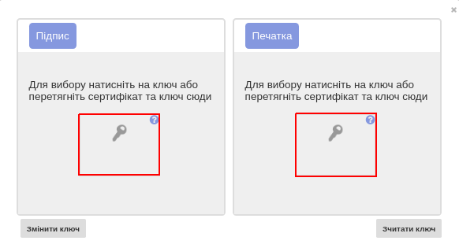

Загальна інструкція по роботі з Комерційним документом COMDOC
########################################################################

.. role:: red

.. contents:: Зміст:
   :depth: 6

---------

Вступ
====================================

Дана інструкція описує порядок підписання комерційного документа, який складається з перерахованих нижче етапів.

Прийняття комерційного документа
=========================================

Щоб прийняти комерційний документ необхідно перейти в розділ «**Вхідні**». Для зручності пошуку, відфільтруйте документи по «Прочитаним», виберіть необхідну мережу, тип «Комерційний документ» і вкажіть потрібний підтип документа.

.. image:: pics_rabotа_s_Kommercheskim_dokumentom_COMDOC/rabotа_s_COMDOC_1.png
   :align: center

Документи, що вимагають підписання, будуть виділені повідомленням червоного кольору: :red:`«Документ потребує підписання»`

.. image:: pics_rabotа_s_Kommercheskim_dokumentom_COMDOC/rabotа_s_COMDOC_2.png
   :align: center

Непрочитані документи не підсвічуються, їх необхідно відкрити або відзначити, як прочитані.

Підписання комерційного документа
=========================================

Відкрийте потрібний документ і натисніть кнопку «**Підписати**» на верхній панелі інструментів.

.. image:: pics_rabotа_s_Kommercheskim_dokumentom_COMDOC/rabotа_s_COMDOC_3.png
   :align: center

Для первинного налаштування ЕЦП, дочекайтеся завантаження сторінки, а потім натисніть кнопку “**Зчитати ключі**”.

Потім, в блоці налаштування ЕЦП, натисніть на зображення ключа і виберіть з каталогу, де зберігаються Ваші секретні ключі, відповідний файл.

Види файлів електронно-цифрового підпису
=========================================

Якщо Ви використовуєте ключі від **АЦСК "Україна"**, файли підписів секретних ключів мають розширення **.ZS2** і наступні значення в іменах файлів:

* Директор «DS»
* Бухгалтер «BS»
* Співробітник «SS»
* Печатка «S»
* Шифрування «C»
* Універсальний ключ печатки і шифрування «U»

.. image:: pics_rabotа_s_Kommercheskim_dokumentom_COMDOC/rabotа_s_COMDOC_6.png
   :align: center

Якщо Ви використовуєте ключі від **АЦСК “ПриватБанк”**, файли підписів секрентних ключів мають розширення **.jks**

.. image:: pics_rabotа_s_Kommercheskim_dokumentom_COMDOC/rabotа_s_COMDOC_7.png
   :align: center

Якщо Ви використовуєте ключі від будь-яких інших **АЦСК**, файли підписів секрентних ключів мають найменування **Key-6.dat**

.. image:: pics_rabotа_s_Kommercheskim_dokumentom_COMDOC/rabotа_s_COMDOC_8.png
   :align: center

Після вибору секретних ключів, введіть паролі під кожним з них, а потім натисніть кнопку “**Зчитати ключі**”

.. image:: pics_rabotа_s_Kommercheskim_dokumentom_COMDOC/rabotа_s_COMDOC_9.png
   :align: center

При коректному зчитуванні ключів, в блоці “**ЕЦП**” з’явиться інформація про власників ключів. Після перевірки інформації натисніть кнопку “**Підписати**”.

.. image:: pics_rabotа_s_Kommercheskim_dokumentom_COMDOC/rabotа_s_COMDOC_10.png
   :align: center

Після підписання натисніть на кнопку “**Відправити**”.

.. image:: pics_rabotа_s_Kommercheskim_dokumentom_COMDOC/rabotа_s_COMDOC_11.png
   :align: center

.. include:: kontakti.rst
