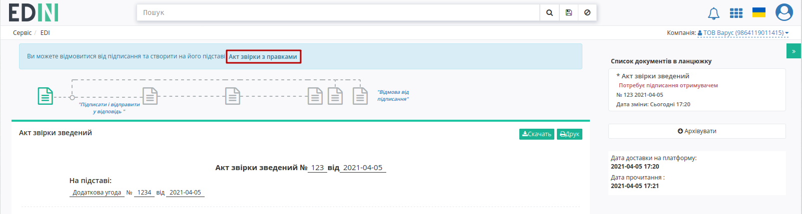
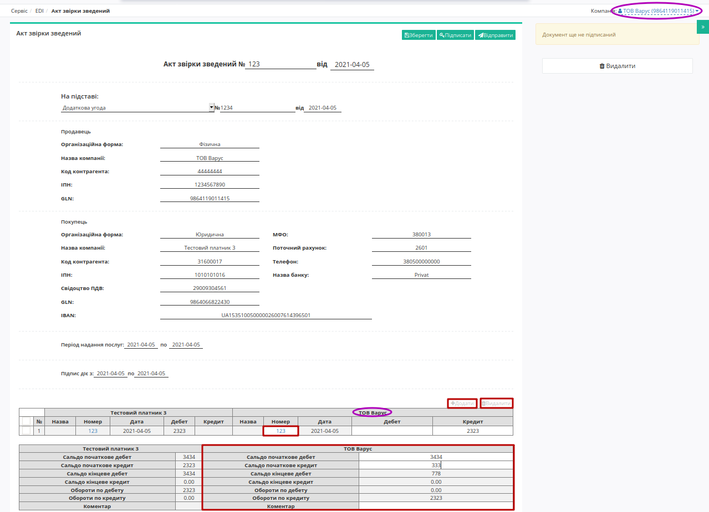
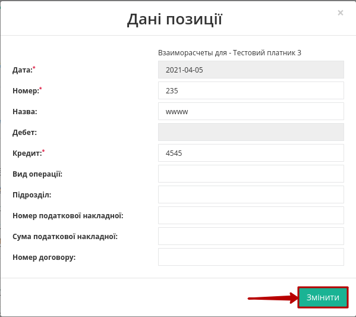
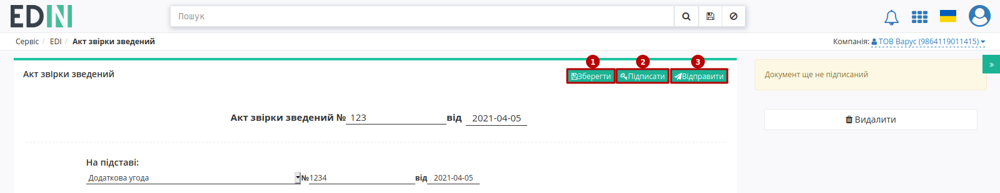
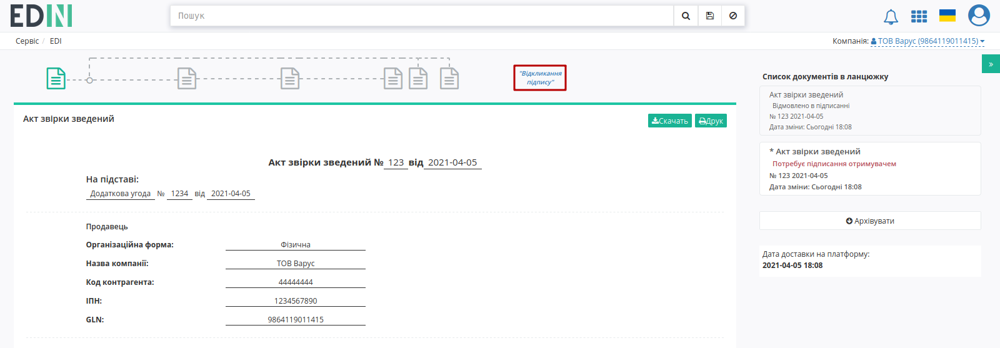
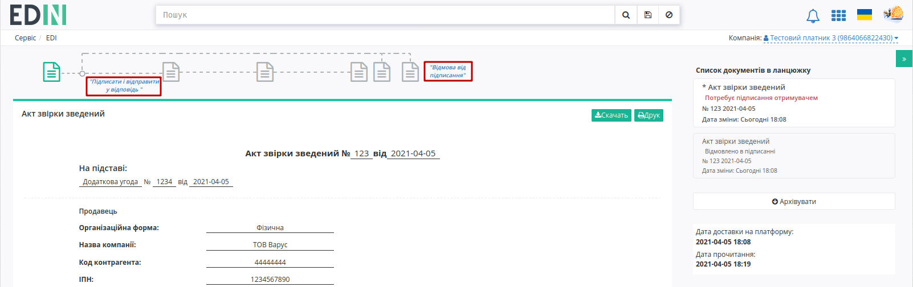

Робота з "Актом звірки зведеним" та "Актом звірки з правками" (COMDOC_029)
####################################################################################################################

.. role:: red

.. role:: green

.. contents:: Зміст:
   :depth: 3

---------

2.1 Створення "Акта звірки з правками" (редагований COMDOC_029)
---------------------------------------------------------------------------------------

У випадку незгоди з табличними даними "Акта звірки зведеного" (COMDOC_029) Отримувач може відмовитися від підписання, сформувавши на підставі вхідного документа **"Акт звірки з правками"** (редагований COMDOC_029):

В формі нового документа поля заповнюються даними з документа-підстави, до редагування доступні лише дані табличної частини (редагувати/додати/видалити позицію) своєї компанії:

Після того, як всі зміни будуть внесені потрібно **"Зберегти"** (1), **"Підписати"** (2) та **"Відправити"** (3) документ:

При цьому новий надісланий документ додається в ланцюжок (в ланцюжку може бути лише один "Акт звірки з правками" (редагований COMDOC_029)), статус документа-підстави змінюється на **"Відмовлено в підписанні"**. У **Відправника** "Акта звірки з правками" (редагованого COMDOC_029) є можливість **"Відкликати підпис"** (`детальніше <https://wiki.edin.ua/uk/latest/retail_2.0/System_Pysk_work_with_COMDOC_013_COMDOC_029.html#signature-revocation>`_):

.. image:: pics_System_Pysk_work_with_COMDOC_013_COMDOC_029/System_Pysk_work_with_COMDOC_013_COMDOC_029_10.png
   :align: center

**Отримувач** може **"Підписати і відправити у відповідь"** чи **"Відмовитись від підписання"**:

Підписання / відмова є завершальною дією в схемі документообігу цими актами. 