Робота з "Актом звірки зведеним" та "Актом звірки з правками" (COMDOC_029)
####################################################################################################################

.. сюда закину немного картинок для текста

.. |drop_pass| image:: signing/drop_pass.png

.. |del_key| image:: signing/del_key2.png

.. role:: red

.. role:: green

.. contents:: Зміст:
   :depth: 3

---------

**Вступ**
==============================

Дана інструкція описує порядок формування "Акта звірки зведеного" та "Акта звірки з правками" (COMDOC_029).

Обмін документами відбувається між двома контрагентами. Ініціатором документообігу може виступати будь-яка сторона. В схемі контрагенти пронумеровані для зручності в порядку від ініціатора документообігу. 

Загальна схема документообігу:

.. uml::
   :scale: 100 %
   :align: center

   @startuml

   Контрагент1 -> Контрагент2: Акт звірки зведений (COMDOC_029)

   == У випадку незгоди Контрагента2 ==

   Контрагент1 <- Контрагент2: Акт звірки з правками (COMDOC_029)

   @enduml

Обидва документа перед відправкою підписуються ЕЦП і потребують підписання чи відмови у відповідь для завершення документообігу.

1 Створення, підписання та відправка "Акта звірки зведеного" (COMDOC_029)
==========================================================================================

При натисканні на кнопку **"Створити"** відкривається вікно з вибором документа для створення (потрібно обрати "Акт звірки зведений"):

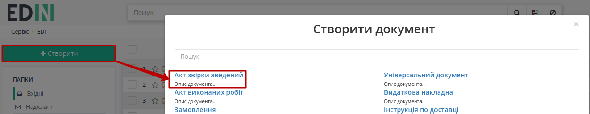

Відкривається форма документа, де обов'язкові до заповнення поля відмічені червоною зірочкою :red:`*`:

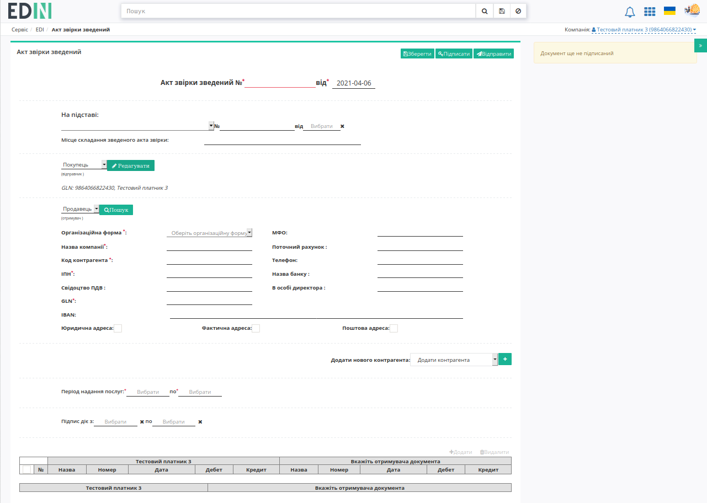

Можливо скористатись пошуком та вибрати свого контрагента (при цьому дані зареєстрованого на платформі контрагента заповняться автоматично):

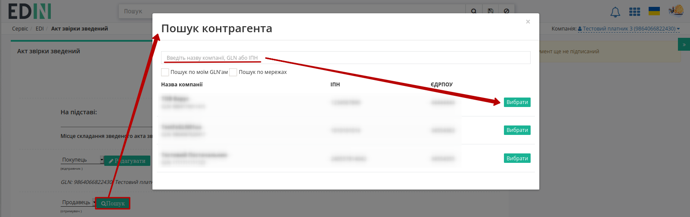

Для заповнення табличної частини потрібно натиснути **"+Додати"** (таблиця частково заповнюється для обох контрагентів одночасно):

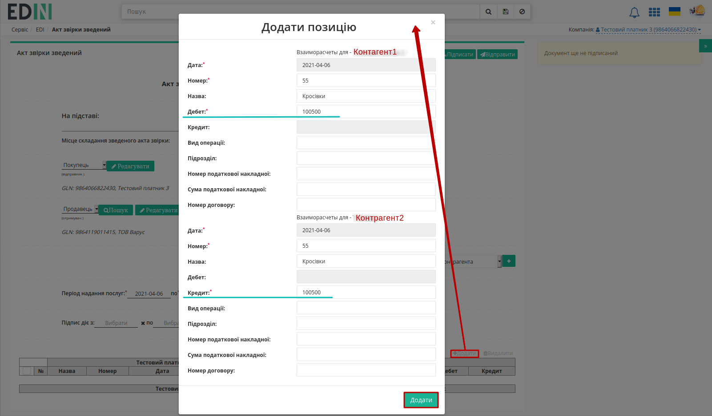

По всім доданим позиціям також потрібно вказати початкові сальдо дебета/кредита (розрахунок інших значень відбувається автоматично):

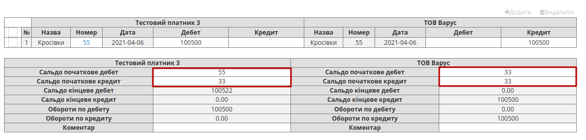

Після того, як всі зміни будуть внесені потрібно **"Зберегти"** (1), **"Підписати"** (2) та **"Відправити"** (3) документ:

.. image:: pics_Create_and_send_reconciliation_act_COMDOC_029/Create_and_send_reconciliation_act_COMDOC_029_09.png
   :align: center

.. _sign:

1.1 Підписання та відправка документа
-----------------------------------------------------

Після ініціалізації бібліотеки підписання, система надасть можливість додати ключ для підписання. При :underline:`першому` підписанні у модальному вікні потрібно обрати файл чи токен (1), ввести пароль (2) та натиснути **"Считати"** (3) ключ для підписання:

.. image:: signing/file1n.png
   :align: center

.. image:: signing/file2n.png
   :align: center

При успішному додаванні ключа автоматично відобразиться особа, від імені якої буде здійснено підписання. У користувача може бути додано кілька ключів - для вибору потрібного для здійснення операції підписання потрібно проставити відмітку (4) лівою кнопкою миші і натиснути "Підписати" (5):

.. image:: signing/file3n.png
   :align: center

.. important::
   Якщо підписання цим ключем вже було здійснено або знайдена невідповідність даних ЄДРПОУ/ІПН (перевірка), то підписання блокується, а користувачу виводиться відповідне повідомлення:

.. image:: signing/wrong_key.png
   :align: center

Додатково в вікні підписання можливо натиснути **"Детальніше"** для того, щоб переглянути інформацію про підписанта, обрати за необхідності посаду, скинути пароль активного ключа (|drop_pass|) чи видалити помилкові (|del_key|).

При подальшій роботі з раніше доданим ключем/-ами потрібно вводити лише пароль для обраного ключа:

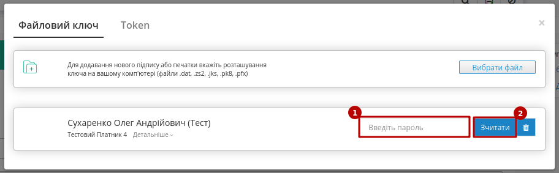

Після підписання інформація щодо підписанта відображається в блоці "Дані про підписантів". Для відправки документа необхідно натинути на кнопку **"Відправити"**. Після відправки документа контрагенту він відображається в журналі вихідних документів і має статус **"Потребує підписання отримувачем"**.

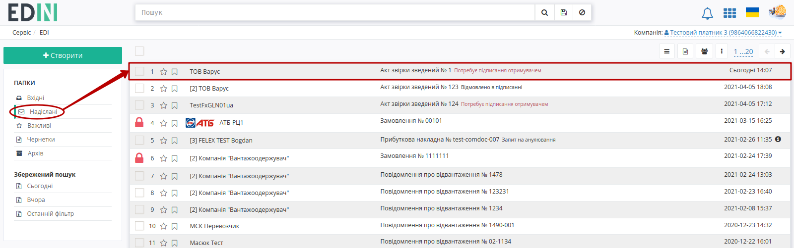

У **Відправника** "Акта звірки зведеного" (COMDOC_029) є можливість **"Відкликати підпис"** (`детальніше <https://wiki.edin.ua/uk/latest/retail_2.0/Create_and_send_reconciliation_act_COMDOC_029.html#signature-revocation>`_):

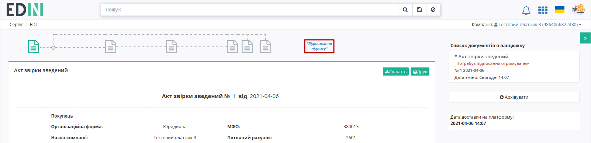

**Отримувач** може **"Підписати і відправити у відповідь"** чи **"Відмовитись від підписання"**:

.. image:: pics_Create_and_send_reconciliation_act_COMDOC_029/Create_and_send_reconciliation_act_COMDOC_029_12.png
   :align: center

Підписання / відмова є завершальною дією в схемі документообігу цими актами.

2 Створення "Акта звірки з правками" (редагований COMDOC_029)
==========================================================================================

У випадку незгоди з табличними даними "Акта звірки зведеного" (COMDOC_029) Отримувач може відмовитися від підписання, сформувавши на підставі вхідного документа **"Акт звірки з правками"** (редагований COMDOC_029):

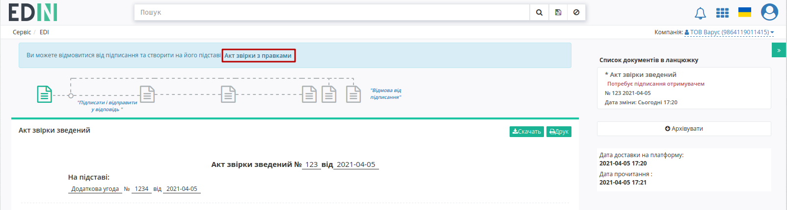

В формі нового документа поля заповнюються даними з документа-підстави, до редагування доступні лише дані табличної частини (редагувати/додати/видалити позицію) своєї компанії:

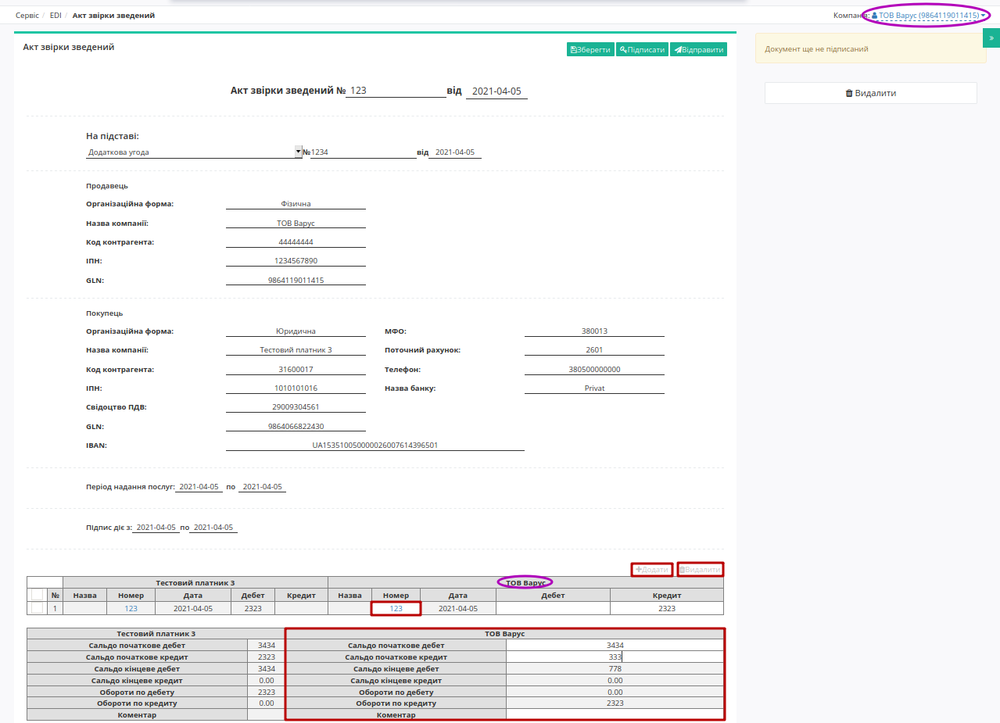

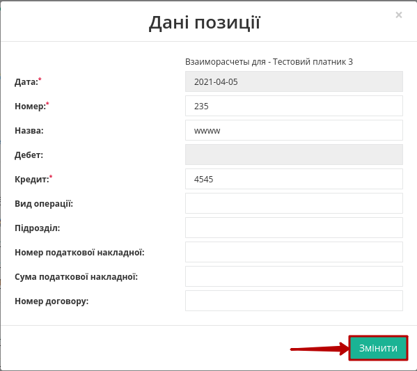

Після того, як всі зміни будуть внесені потрібно **"Зберегти"** (1), **"Підписати"** (2) та **"Відправити"** (3) документ:

.. image:: pics_Create_and_send_reconciliation_act_COMDOC_029/Create_and_send_reconciliation_act_COMDOC_029_09.png
   :align: center

.. hint::
    Процес підписання документів не відрізняється і описаний в `розділі вище <https://wiki.edin.ua/uk/latest/retail_2.0/Create_and_send_reconciliation_act_COMDOC_029.html#sign>`__ .

При цьому новий надісланий документ додається в ланцюжок (в ланцюжку може бути лише один "Акт звірки з правками" (редагований COMDOC_029)), статус документа-підстави змінюється на **"Відмовлено в підписанні"**. У **Відправника** "Акта звірки з правками" (редагованого COMDOC_029) є можливість **"Відкликати підпис"** (`детальніше <https://wiki.edin.ua/uk/latest/retail_2.0/Create_and_send_reconciliation_act_COMDOC_029.html#signature-revocation>`_):

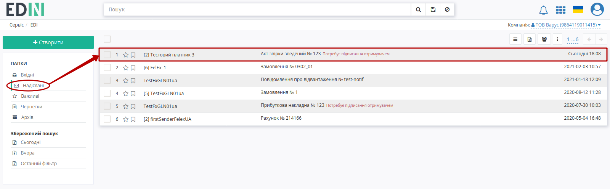

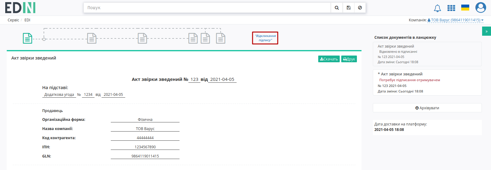

**Отримувач** може **"Підписати і відправити у відповідь"** чи **"Відмовитись від підписання"**:

.. image:: pics_Create_and_send_reconciliation_act_COMDOC_029/Create_and_send_reconciliation_act_COMDOC_029_12.png
   :align: center

Підписання / відмова є завершальною дією в схемі документообігу цими актами. 

.. _revoke:

3 Відкликання підпису комерційних документів (COMDOC)
=========================================================================================================================

.. include:: /_constant/comdoc_revoke/comdoc_revoke.rst
   :start-after: .. початок блоку для Comdoc_Revoke
   :end-before: .. кінець блоку для Comdoc_Revoke

---------------------------------

.. include:: kontakti.rst