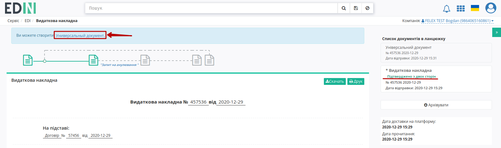
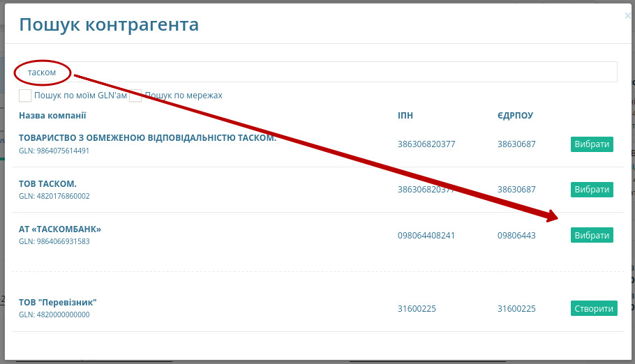
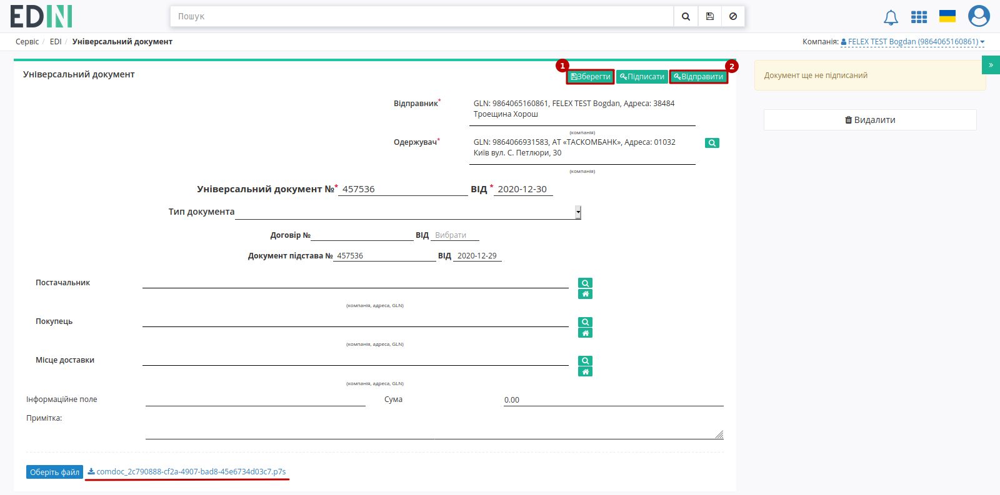
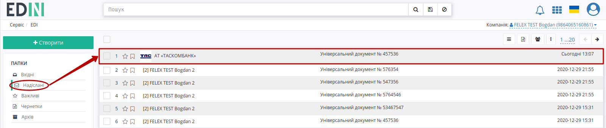

Інструкція для роботи з факторингом
####################################################################################################################

.. role:: red

.. role:: green

.. contents:: Зміст:
   :depth: 3

---------

**1 Формування та відправка "Універсального документа" для сторони-Фактора**
===========================================================================================

Для входу на web платформу EDIN 2.0 необхідно перейти за посиланням: https://edo-v2.edin.ua/.

Для роботи по факторингу на платформі необхідно створити "Універсальний документ" (`CONDRA <https://wiki.edin.ua/uk/latest/XML/XML-structure.html#condra>`__) на основі одного з документ-підстав:

* "Видаткової накладної" (`COMDOC_006 <https://wiki.edin.ua/uk/latest/XML/XML-structure.html#comdoc-006>`__);
* "Прибуткової накладної" (`COMDOC_007 <https://wiki.edin.ua/uk/latest/XML/XML-structure.html#comdoc-007>`__);
* "Товарної накладної" (`COMDOC_027 <https://wiki.edin.ua/uk/latest/XML/XML-structure.html#comdoc-027>`__);
* "Товарної накладної (Метро)" (`DOCUMENTINVOICE <https://wiki.edin.ua/uk/latest/XML/XML-structure.html#documentinvoice>`__);
* "Коригування до товарної накладної (Метро)" (`DOCCORINVOICE <https://wiki.edin.ua/uk/latest/XML/XML-structure.html#doccorinvoice>`__).

.. important::
    Документ-підстава повинен знаходитись в статусі :green:`"Підтверджено з двох сторін"`!

    .. image:: pics_Factoring_instruction_EDIN_2_0/Factoring_instruction_EDIN_2_0_01.png
       :align: center

Потрібно відкрити підписаний з двох сторін документ (наприклад, "Видаткову накладну") та натиснути кнопку створення "Універсального документу":

Далі в вікні "Пошуку контрагента" знайти та **"Вибрати"** сторону, що виступає в ролі Фактора: 

Після чого відкриється автоматично створена чернетка "Універсального документа", що містить у вкладеннях підписаний документ-підставу в форматі p7s. Документ, за потреби, можливо відредагувати, "Зберегти" (1) та "Відправити" (2) не підписуючи:

Документ відправляється і відображається в "Надісланих":

.. hint::
    Також можливо масово створювати та відправляти "Універсальні документи" Фактору (детальніше в `розділі інструкції масових операцій з документами <https://wiki.edin.ua/uk/latest/general_2_0/massovi_operacii_EDIN_2.0.html#>`__)

**2 Відповідь сторони-Фактора**
===========================================================================================

Сторона, що виступає Фактором (банк) розглядає документи і якщо накладна на фінансування з будь-яких причин не приймається, то Фактор лише в цьому випадку відправляє Постачальнику у відповідь до "Універсального документа" статус **не прийнято/відхилено** разом з причиною (в комментарях).

Відсутність будь-яких статусів говорить про розглядання чи прийняття накладної на фінансування. Найближчим часом по всіх прийнятих накладних Фактор відправляє "Універсальний документ" (`CONDRA <https://wiki.edin.ua/uk/latest/XML/XML-structure.html#condra>`__) з вкладеним "Реєстром документів" (:download:`приклад<pics_Factoring_instruction_EDIN_2_0/Factoring_instruction_EDIN_2_0_06.png>`), що містить список прийнятих до фінансування накладних.

