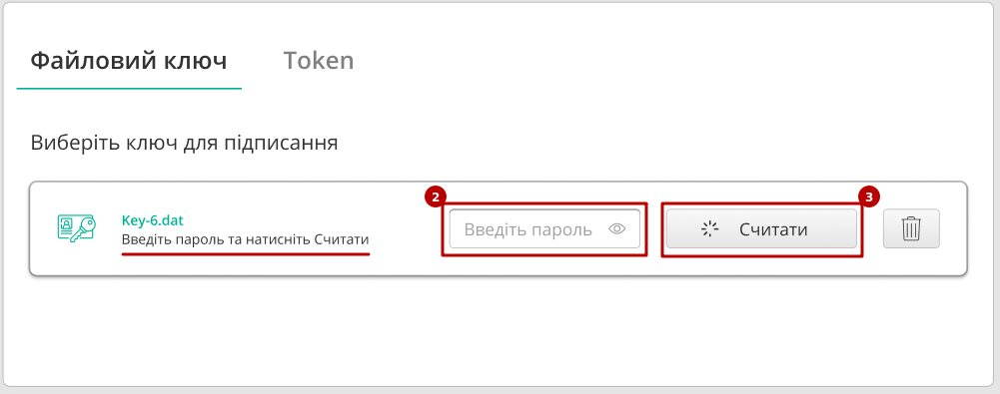
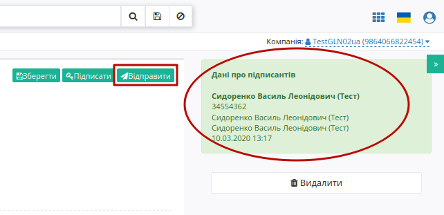

Формування Податкової Накладної на підставі Прибуткової накладної (COMDOC_007)
###############################################################################

.. сюда закину немного картинок для текста

.. |drop_pass| image:: pics_instruktsiyi_po_dodavannyu_klyuchiv/drop_pass.png

.. |del_key| image:: pics_instruktsiyi_po_dodavannyu_klyuchiv/del_key.png

.. role:: red

.. |пресуха| image:: pics_Formuvannya_Podatkovoyi_Nakladnyy_na_pidstavi_Prybutkovoyi_nakladnoyi/Formuvannya_Podatkovoyi_Nakladnyy_22n.png

.. contents:: Зміст:
   :depth: 2

---------

1 Початкові налаштування
====================================

Для початку роботи з електронною податковою накладною необхідно:

1.1 Підготувати діючий електронний цифровий підпис особи (осіб), за допомогою якого буде здійснюватися підписання електронної податкової накладної (declar).

1.2 Якщо ключі не на зовнішніх носіях (диск, флеш-накопичувач), потрібно знати шлях до ключів в файловій системі.

1.3 Зайти на портал: https://edo-v2.edin.ua/auth і ввести логін і пароль:

.. image:: pics_Formuvannya_Podatkovoyi_Nakladnyy_na_pidstavi_Prybutkovoyi_nakladnoyi/Formuvannya_Podatkovoyi_Nakladnyy_26n.png
   :align: center

1.4 Перед початком роботи з податковою накладною необхідно одноразово надати інформацію про реквізити компанії - зверніться до технічної підтримки або до Вашого менеджера. 

**Необхідно вказати**:

- Код ЄДРПОУ
- Код ІПН
- Правильну назву компанії
- № свідоцтва платника ПДВ
- Вулицю і будинок (юр. адреса)
- Індекс (юр. адреса)
- Місто (юр. Адреса)
- Країну (вибирайте зі списку Україну)
- Область (вибирайте зі списку)
- ДПІ (вибирайте зі списку податкову, в яку подаєте звітність)
- Менеджер (можна вказати «-»)
- Бухгалтер (П.І.Б. головного бухгалтера)
- Директор (П.І.Б. директора)
- Посада (посада директора: генеральний, виконавчий, директор)
- Підписант (П.І.Б. та ІПН підписувача)
- Телефон
- Форма власності (юр. чи фіз. особа)

Надані Вами дані будуть відображатися в податковій з боку постачальника.

.. important:: **Увага!** Зверніть увагу, що реквізити надаються українською мовою і повинні відповідати інформації в реєстраційних документах компанії.

2 Формування Податкової накладної
====================================

Після успішної авторизації відкриється основне меню для вибору сервісу платформи EDIN: **"EDI", "ETTN", "АТС", "Виробник", "Дистриб'ютор", "Сертифікати", "Е-Специфікація", "Товари", "DOCflow", "Tender", "Wiki"**. 

Перед створенням Податкової накладної рекомендується перевірити товарний довідник, тому що інформація по позиціях підтягується саме з нього. Для переходу в довідник потрібно в основному меню сервісів ( |пресуха| ) натиснути **"Відкрити"** під іконкою **"Товари"**. 

.. image:: pics_Formuvannya_Podatkovoyi_Nakladnyy_na_pidstavi_Prybutkovoyi_nakladnoyi/Formuvannya_Podatkovoyi_Nakladnyy_02n.png
   :align: center

2.1 Перейдіть в пункт меню «**Вхідні**»:

.. image:: pics_Formuvannya_Podatkovoyi_Nakladnyy_na_pidstavi_Prybutkovoyi_nakladnoyi/Formuvannya_Podatkovoyi_Nakladnyy_03n.png
   :align: center

2.2 Виберіть *підписаний і вже відправлений* «Комерційний документ» **Прибуткова накладна**, на підставі якого будете формувати і відправляти електронну **Податкову накладну**.

.. image:: pics_Formuvannya_Podatkovoyi_Nakladnyy_na_pidstavi_Prybutkovoyi_nakladnoyi/Formuvannya_Podatkovoyi_Nakladnyy_04n.png
   :align: center

2.3 Далі в відритому «**Комерційному документі**» необхідно натиснути на кнопку **Податкова накладна**.

.. image:: pics_Formuvannya_Podatkovoyi_Nakladnyy_na_pidstavi_Prybutkovoyi_nakladnoyi/Formuvannya_Podatkovoyi_Nakladnyy_05n.png
   :align: center

2.4 При створенні **Податкової накладної** потрібно обрати ставку ПДВ:

.. image:: pics_Formuvannya_Podatkovoyi_Nakladnyy_na_pidstavi_Prybutkovoyi_nakladnoyi/Formuvannya_Podatkovoyi_Nakladnyy_06n.png
   :align: center

2.5 Всі необхідні поля для заповнення позначені червоними зірочками :red:`*`. Також важливо попозиційно вносити код УКТ ЗЕД. Після внесення всіх даних необхідно натиснути кнопку «**Зберегти**». Якщо частина необхідних реквізитів не заповнена, з'являться підказки, які поля потрібно заповнити.

.. image:: pics_Formuvannya_Podatkovoyi_Nakladnyy_na_pidstavi_Prybutkovoyi_nakladnoyi/Formuvannya_Podatkovoyi_Nakladnyy_07n.png
   :align: center

2.6 Після збереження податкової накладної для нанесення підписів необхідно натиснути кнопку «**Підписати**».

.. _`Додати ключ для підписання`:

Далі у модальному вікні потрібно обрати файл чи токен (1), ввести пароль (2) та натиснути **"Считати"** (3) ключ для підписання:

.. image:: pics_Formuvannya_Podatkovoyi_Nakladnyy_na_pidstavi_Prybutkovoyi_nakladnoyi/file1.png
   :align: center

При успішному додаванні ключа автоматично відобразиться особа, від імені якої буде здійснено підписання. У користувача може бути додано кілька ключів - для вибору потрібного для здійснення операції підписання потрібно проставити відмітку (4) лівою кнопкою миші і натиснути "Підписати" (5):

.. image:: pics_Formuvannya_Podatkovoyi_Nakladnyy_na_pidstavi_Prybutkovoyi_nakladnoyi/file3.png
   :align: center

У користувача повинно бути додано три ключа (Директор, Бухгалтер, Штамп), кожним з яких повинен бути підписаний документ. Можливо здійснювати вибір ключів під час підписання.

.. important:: Підписання "Податкових накладних" (DECLAR), та "Коригувань до податкових накладних" (DECLARj12) здійснюється трьома ключами (Директор, Бухгалтер, Штамп): для одного документу неможливо використати один і той же ключ більше одного разу, а також неможливо встановити більше одного ключа для однієї ролі!

.. important::
   Якщо підписання цим ключем вже було здійснено або знайдена невідповідність даних ЄДРПОУ/ІПН (перевірка), то підписання блокується, а користувачу виводиться відповідне повідомлення:

.. image:: pics_Formuvannya_Podatkovoyi_Nakladnyy_na_pidstavi_Prybutkovoyi_nakladnoyi/wrong_key.png
   :align: center

Додатково в вікні підписання можливо натиснути **"Детальніше"** для того, щоб переглянути інформацію про підписанта, обрати за необхідності посаду, скинути пароль активного ключа (|drop_pass|) чи видалити помилкові (|del_key|).

При подальшій роботі з раніше доданим ключем/-ами потрібно вводити лише пароль для обраного ключа:

.. image:: pics_Formuvannya_Podatkovoyi_Nakladnyy_na_pidstavi_Prybutkovoyi_nakladnoyi/file4.png
   :align: center

Після підписання документу інформація щодо підписанта відображається в блоці "Дані про підписантів". Для відправки документу необхідно натинути на кнопку "Відправити".

Відправлений документ додається в папку **"Надіслані"**:

.. image:: pics_Formuvannya_Podatkovoyi_Nakladnyy_na_pidstavi_Prybutkovoyi_nakladnoyi/Formuvannya_Podatkovoyi_Nakladnyy_21n.png
   :align: center

2.7 Після натискання кнопки "**Відправити**" ЕПН відправляється на реєстрацію до Єдиного реєстру податкових накладних.

.. _revoke:

**2.1 Відкликання підпису**
-------------------------------------------------

.. include:: /_constant/comdoc_revoke/comdoc_revoke.rst
   :start-after: .. початок блоку для Comdoc_Revoke
   :end-before: .. кінець блоку для Comdoc_Revoke

3 Отримання квитанції про реєстрацію
====================================

3.1 Після відправки податкової накладної необхідно дочекатися отримання Квитанції №1 з ЄРПН. 
Існує два статуси:

1) "**Зареєстровано в ЄРПН і відправлено покупцеві**":

.. image:: pics_Formuvannya_Podatkovoyi_Nakladnyy_na_pidstavi_Prybutkovoyi_nakladnoyi/Formuvannya_Podatkovoyi_Nakladnyy_08n.png
   :align: center

2) "**Помилка при реєстрації в ЄРПН**":

.. image:: pics_Formuvannya_Podatkovoyi_Nakladnyy_na_pidstavi_Prybutkovoyi_nakladnoyi/Formuvannya_Podatkovoyi_Nakladnyy_09n.png
   :align: center

3.2 Для прочитання квитанції необхідно увійти в папку «**Відправлені**», зайти у відповідний документ «**Податкова накладна**».

.. image:: pics_Formuvannya_Podatkovoyi_Nakladnyy_na_pidstavi_Prybutkovoyi_nakladnoyi/Formuvannya_Podatkovoyi_Nakladnyy_10n.png
   :align: center

3.3 Натиснути кнопку «**Розшифрувати**» для відповідної квитанції.

.. important::
    Для зчитування квитанції потрібно використовувати ті ж ключі, що були використані при підписанні «**Податкової накладної**»

.. image:: pics_Formuvannya_Podatkovoyi_Nakladnyy_na_pidstavi_Prybutkovoyi_nakladnoyi/Formuvannya_Podatkovoyi_Nakladnyy_11n.png
   :align: center

3.4 Після розшифровки текст квитанції стане доступний для читання. Її можна завантажити в форматі **.pdf**, а також роздрукувати.

.. image:: pics_Formuvannya_Podatkovoyi_Nakladnyy_na_pidstavi_Prybutkovoyi_nakladnoyi/Formuvannya_Podatkovoyi_Nakladnyy_23n.png
   :align: center

.. image:: pics_Formuvannya_Podatkovoyi_Nakladnyy_na_pidstavi_Prybutkovoyi_nakladnoyi/Formuvannya_Podatkovoyi_Nakladnyy_25n.png
   :align: center

.. include:: kontakti.rst
