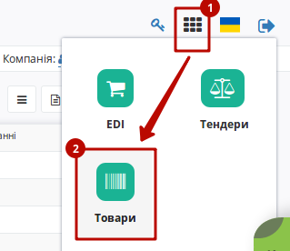
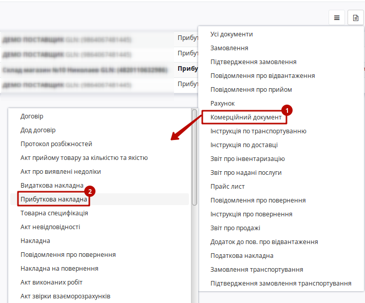
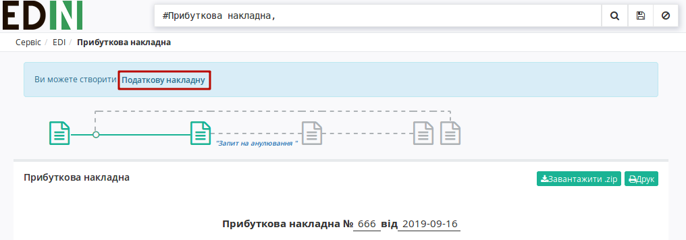
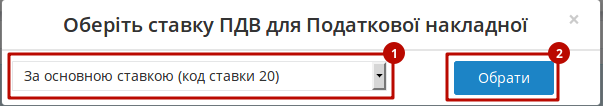
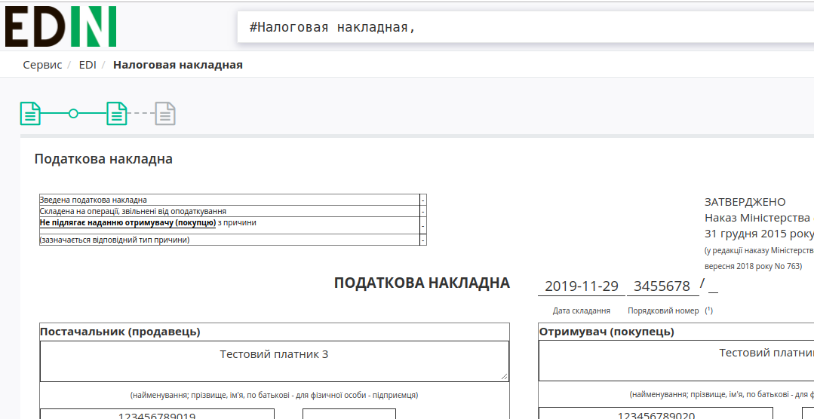
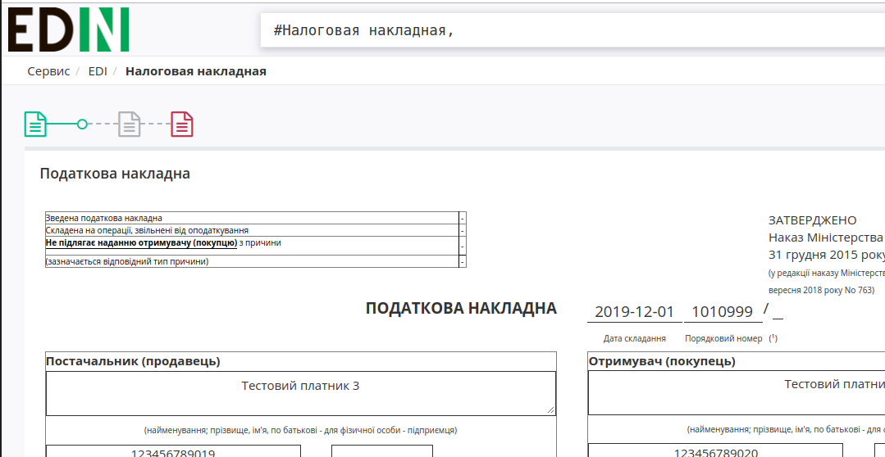

Формування Податкової Накладний на підставі Прибуткової накладної (COMDOC_007)
###############################################################################

.. role:: red

.. contents:: Зміст:
   :depth: 6

---------

1 Початкові налаштування
====================================

Для початку роботи з електронною податковою накладною необхідно:

1.1 Підготувати діючий електронний цифровий підпис особи (осіб), за допомогою якого буде здійснюватися підписання електронної податкової накладної (declar).

1.2 Якщо ключі не на зовнішніх носіях (диск, флеш-накопичувач), потрібно знати шлях до ключів в файловій системі.

1.3 Зайти на портал: https://edo-v2.edi-n.com/auth і ввести логін і пароль:

.. image:: pics_Formuvannya_Podatkovoyi_Nakladnyy_na_pidstavi_Prybutkovoyi_nakladnoyi/Formuvannya_Podatkovoyi_Nakladnyy_01.png
   :align: center

1.4 Перед початком роботи з податковою накладною необхідно одноразово надати інформацію про реквізити компанії - зверніться до технічної підтримки або до Вашого менеджера. 

**Необхідно вказати**:

- Код ЄДРПОУ
- Код ІПН
- Правильну назву компанії
- № свідоцтва платника ПДВ
- Вулицю і будинок (юр. адреса)
- Індекс (юр. адреса)
- Місто (юр. Адреса)
- Країну (вибирайте зі списку Україну)
- Область (вибирайте зі списку)
- ДПІ (вибирайте зі списку податкову, в яку подаєте звітність)
- Менеджер (можна вказати «-»)
- Бухгалтер (П.І.Б. головного бухгалтера)
- Директор (П.І.Б. директора)
- Посада (посада директора: генеральний, виконавчий, директор)
- Підписант (П.І.Б. та ІПН підписувача)
- Телефон
- Форма власності (юр. чи фіз. особа)

Надані Вами дані будуть відображатися в податковій з боку постачальника.

.. important:: **Увага!** Зверніть увагу, що реквізити надаються українською мовою і повинні відповідати інформації в реєстраційних документах компанії.

2 Формування Податкової накладної
====================================

Перед створенням Податкової накладної рекомендується перевірити товарний довідник, тому що інформація по позиціях підтягується саме з нього. Він знаходиться в правому верхньому кутку:

2.1 Перейдіть в пункт меню «**Вхідні**»:

.. image:: pics_Formuvannya_Podatkovoyi_Nakladnyy_na_pidstavi_Prybutkovoyi_nakladnoyi/Formuvannya_Podatkovoyi_Nakladnyy_03.png
   :align: center

2.2 Виберіть *підписаний і вже відправлений* «Комерційний документ» **Прибуткова накладна**, на підставі якого будете формувати і відправляти електронну **Податкову накладну**.

2.3 Далі в відритому «**Комерційному документі**» необхідно натиснути на кнопку **Податкова накладна**.

2.4 При створенні **Податкової накладної** потрібно обрати ставку ПДВ:

2.5 Всі необхідні поля для заповнення позначені червоними зірочками :red:`*`. Також важливо попозиційно вносити код УКТ ЗЕД. Після внесення всіх даних необхідно натиснути кнопку «**Зберегти**». Якщо частина необхідних реквізитів не заповнена, з'являться підказки, які поля потрібно заповнити.

.. image:: pics_Formuvannya_Podatkovoyi_Nakladnyy_na_pidstavi_Prybutkovoyi_nakladnoyi/Formuvannya_Podatkovoyi_Nakladnyy_07.png
   :align: center

2.6 Після збереження податкової накладної для нанесення підписів необхідно натиснути кнопку «**Підписати**».

2.7 Після натискання кнопки "**Відправити**" ЕПН відправляється на реєстрацію до Єдиного реєстру податкових накладних.

3 Отримання квитанції про реєстрацію
====================================

3.1 Після відправки податкової накладної необхідно дочекатися отримання Квитанції №1 з ЄРПН. 
Існує два статуси:

1) "**Зареєстровано в ЄРПН і відправлено покупцеві**":

2) "**Помилка при реєстрації в ЄРПН**":

3.2 Для прочитання квитанції необхідно увійти в папку «**Відправлені**», зайти у відповідний документ «**Податкова накладна**».

.. image:: pics_Formuvannya_Podatkovoyi_Nakladnyy_na_pidstavi_Prybutkovoyi_nakladnoyi/Formuvannya_Podatkovoyi_Nakladnyy_10.png
   :align: center

3.3 Натиснути кнопку «**Розшифрувати**» для відповідної квитанції.

.. important::
    Для зчитування квитанції потрібно використовувати ті ж ключі, що були використані при підписанні «**Податкової накладної**»

.. image:: pics_Formuvannya_Podatkovoyi_Nakladnyy_na_pidstavi_Prybutkovoyi_nakladnoyi/Formuvannya_Podatkovoyi_Nakladnyy_11.png
   :align: center

3.4 Після розшифровки текст квитанції стане доступний для читання. Її можна вивантажити в форматі **.rpl** (можливе завантаження в M.E.Doc), **.pdf**, а також роздрукувати.

.. image:: pics_Formuvannya_Podatkovoyi_Nakladnyy_na_pidstavi_Prybutkovoyi_nakladnoyi/Formuvannya_Podatkovoyi_Nakladnyy_12.png
   :align: center

.. include:: kontakti.rst
