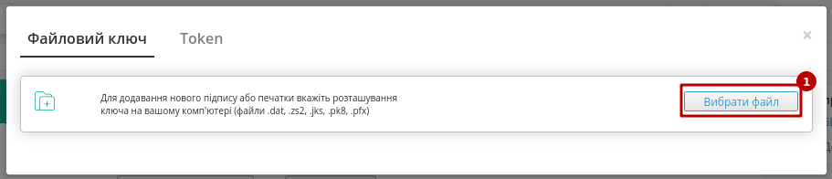

################################################################################################################################
Інструкція по роботі з "Накладною за кількістю" з мережею Фоззі за схемою "Match Invoice"
################################################################################################################################

.. сюда закину немного картинок для текста

.. |drop_pass| image:: signing/drop_pass.png

.. |del_key| image:: signing/del_key2.png

.. role:: red

.. contents:: Зміст:
   :depth: 2

---------

Вступ
===========================================================

Дана інструкція описує порядок формування та відправки "Накладної за кількістю" (DOCUMENTINVOICE) на платформі EDI Network. "Накладна за кількістю" (DOCUMENTINVOICE) є юридично значимим документом (ЮЗД) і може викоистовуватись при роботі з мережею Фоззі в схемі документообігу "Match Invoice".

1 Формування "Накладної за кількістю" (DOCUMENTINVOICE)
===========================================================

"Накладна за кількістю" (DOCUMENTINVOICE) формується на підставі "Повідомлення про відвантаження" (DESADV). Для цього потрібно перейти в розділ "Надіслані" та обрати потрібний документ. Для зручності можливо скористатись пошуком (за типом документа (приклад в зображенні), номером документа чи GLN):

.. image:: pics_Fozzy_DOCUMENTINVOICE_instruction/Fozzy_DOCUMENTINVOICE_instruction_001.png
   :align: center

У відкритому документі на формі-підказці виберіть зі списку **"Накладна за кількістю"**:

.. image:: pics_Fozzy_DOCUMENTINVOICE_instruction/Fozzy_DOCUMENTINVOICE_instruction_002.png
   :align: center

Після чого на підставі "Повідомлення про відвантаження" (DESADV) автоматично створюється "Накладна за кількістю" (DOCUMENTINVOICE). На формі створюваного документа значення більшості полів заповняться (пененесутся) з документа-підстави. Всі поля, позначені червоною зірочкою :red:`*` - **обов'язкові до заповнення**:

.. image:: pics_Fozzy_DOCUMENTINVOICE_instruction/Fozzy_DOCUMENTINVOICE_instruction_003.png
   :align: center

.. note::
   Якщо всі позиції в створеній "Накладній за кількістю" (DOCUMENTINVOICE) співпадають з позиціями в "Замовленні" (ORDERS), то в табличній частині відсутня кнопка "+Додати" (додавати можливо лише позиції вказані в "Замовленні"). Позиції, яких немає в "Замовленні" (були перенесені з "Повідомлення про відвантаження" (DESADV)) за вимогою мережі вважаються некоректиними і потребують видалення. Платформа повідомляє про помилку, некоректні позиції відмічені в таблиці помаранчевим кольором:

   .. image:: pics_Fozzy_DOCUMENTINVOICE_instruction/Fozzy_DOCUMENTINVOICE_instruction_008.png
      :align: center

.. tip::
    Значення поля "Накладна за кількістю №" рекомендовано замінити на `значення поля "Кількісна накладна №" <https://wiki.edin.ua/uk/latest/retail_2.0/Robota_s_Fozzy_EDI-N_2.0.html#hint-for-D-I>`_ пов'язаної раніше відправленої "Інструкції по транспортуванню" IFTMIN (звісно, якщо це поле було зазначено).

Детальніше зі структурою `"Накладної за кількістю" (DOCUMENTINVOICE) <https://wiki.edin.ua/uk/latest/XML/Fozzy_XML-structure.html#documentinvoice>`_ можете ознайомитись на сторінці з xml-специфікаціями.

В табличній частині створеного документа знаходяться всі товарні позиції (перенесені з документа-підстави "Повідомлення про відвантаження" (DESADV)). Дані позицій можливо відредагувати та **"Змінити"** (вікно відкривається по кліку на штрихкод товару):

.. image:: pics_Fozzy_DOCUMENTINVOICE_instruction/Fozzy_DOCUMENTINVOICE_instruction_004.png
   :align: center

Також можливо **"Видалити"** товарні позиції з табличної частини документа:

.. image:: pics_Fozzy_DOCUMENTINVOICE_instruction/Fozzy_DOCUMENTINVOICE_instruction_005.png
   :align: center

Після внесення всіх необхідних змін в документ потрібно натиснути кнопку **"Зберегти"** (1), потім **"Підписати"** (2):

.. image:: pics_Fozzy_DOCUMENTINVOICE_instruction/Fozzy_DOCUMENTINVOICE_instruction_006.png
   :align: center

.. _sign:

1.1 Підписання та відправка "Накладної за кількістю" (DOCUMENTINVOICE)
----------------------------------------------------------------------------

Після ініціалізації бібліотеки підписання, система надасть можливість додати ключ для підписання. При :underline:`першому` підписанні у модальному вікні потрібно обрати файл чи токен (1), ввести пароль (2) та натиснути **"Зчитати"** (3) ключ для підписання:

.. image:: signing/file2n.png
   :align: center

При успішному додаванні ключа автоматично відобразиться особа, від імені якої буде здійснено підписання. У користувача може бути додано кілька ключів - для вибору потрібного для здійснення операції підписання потрібно проставити відмітку (4) лівою кнопкою миші і натиснути **"Підписати"** (5):

.. image:: signing/file3n.png
   :align: center

.. important::
   Якщо підписання цим ключем вже було здійснено або знайдена невідповідність даних ЄДРПОУ/ІПН (перевірка), то підписання блокується, а користувачу виводиться відповідне повідомлення:

.. image:: signing/wrong_key.png
   :align: center

Додатково в вікні підписання можливо натиснути **"Детальніше"** для того, щоб переглянути інформацію про підписанта; можливо видалити помилкові ключі (|del_key|).

При подальшій роботі з раніше доданим ключем/-ами потрібно вводити лише пароль для обраного ключа:

.. image:: signing/file4n.png
   :align: center

.. image:: signing/file5n.png
   :align: center

Після підписання "Накладної за кількістю" (DOCUMENTINVOICE) документ потрібно **"Відправити"**:

.. image:: pics_Fozzy_DOCUMENTINVOICE_instruction/Fozzy_DOCUMENTINVOICE_instruction_007.png
   :align: center

Відправлений документ автоматично потрапляє в папку **"Надіслані"** і буде знаходитись в ланцюжку документів разом із пов'язаними документами.

Мережа Фоззі зі своєї сторони переглядає та підписує документ, після чого документообіг "Накладною за кількістю" (DOCUMENTINVOICE) вважається завершеним.

-----------------------------

.. include:: kontakti.rst
