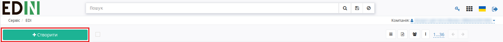
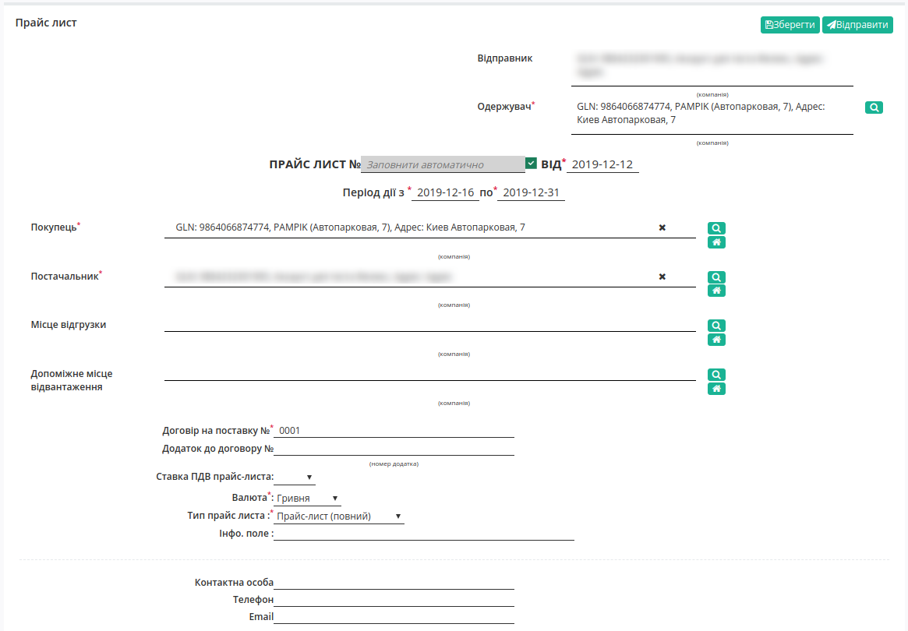
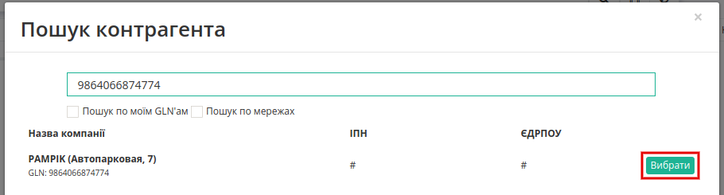
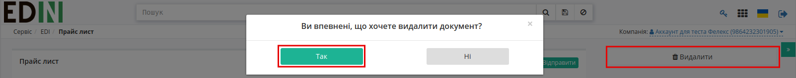
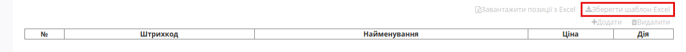
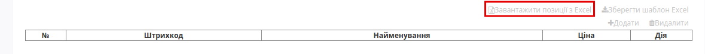
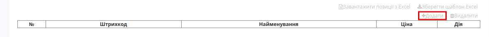
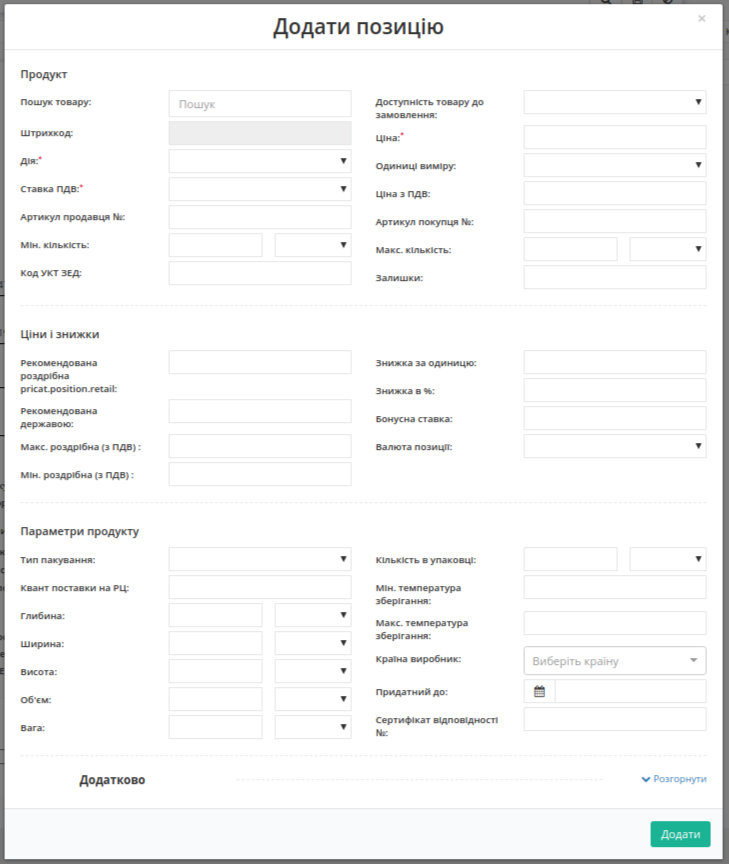

Інструкція по роботі з документом "Прайс-лист" для PAMPIK (Лелека Трейд) на web-платформі 
####################################################################################################################

.. role:: red

.. contents:: Зміст:
   :depth: 6

---------

**1 Формуваня документа "Прайс-лист"**
==============================================

Для входу на web платформу EDIN необхідно перейти за посиланням: https://edo-v2.edi-n.com/.

Для формування документу на платформі необхідно натиснути на кнопку «Створити»:

Після цього вибрати тип документа «Прайс-лист»:

.. image:: pics_PricatPampikInstruction_EDIN_2_0/PricatPampikInstruction_EDIN_2_0_02.png
   :align: center

Відкриється форма документа з обов’язковими для заповнення полями:

* Прайс-лист № — можна внести власний номер (при встановленій позначці номер присвоюється автоматично)
* Від (дата прайс-листа) — поточна дата
* Період дії з — дата початку дії цін
* Період дії по — дата закінчення дії цін
* Договір на поставку № — номер договору укладений з мережею
* Валюта — за замовчуванням «Гривня»
* Тип прайс-листа — Прайс-лист (повний), Доповнення прайс-листа

В полях «Одержувач», «Покупець» необхідно натиснути на кнопку «Пошук», після цього в модальном окні вказати GLN компанії 9864066874774 та натиснути на кнопку «Вибрати».

Всі інші поля не є обов’язковими для заповнення.

Після внесення всіх даних необхідно натиснути на кнопку «Зберегти». В правому верхньому куті буде відображено повідомлення:

.. image:: pics_PricatPampikInstruction_EDIN_2_0/PricatPampikInstruction_EDIN_2_0_05.png
   :align: center

За необхідністю збережений документ можно видалити. Для цього необхідно натиснути на кнопку «Видалити» та в модальном окні підтвердити дії, натиснувши на кнопку «Так».

**2 Додавання товарних позицій**
==================================

2.1 Додавання товарних позицій за допомогою Шаблону
--------------------------------------------------------------------

Для додавання товарних позицій є можливість скористатись шаблоном. Для цього в нижній частині сторінки необхідно натиснути «Зберегти шаблон Excel»:

На Ваш комп’ютер буде завантажено файл з назвою **pricat_products_sample.xls**. Відкривши його, необхідно внести інформацію по товару. Обов’язкові для заповнення поля відмічені зеленим кольором.

.. important:: Ні в якому разі не змінювати формат шаблону, видаляти або додавати нові стовпці. Також не допускається зміна формату комірок.

В полі «Действие» необхідно вказувати цифрове значення:

* Додавання — 2
* Видалення — 3
* Внесення змін — 4
* Подорожчання — 5
* Здешевлення — 6

В полі «Ед. измерения» необхідно вказати код одиниць виміру (перелік кодів можна подивитися в коментарі до комірки).

В полі «»Ставка НДС» необхідно вказати значення «0» або «7», або «20».

В полі «Валюта» необхідно вказати значення UAH, USD, EUR. В полі «Доступность», якщо «Так» вказувати «1», якщо «Ні» — «0».

Після збереження заповненої інформації завантажуємо файл на веб-портал, скориставшись кнопкою «Завантажити позиції з Excel»:

2.2 Додавання позицій з товарного довідника
--------------------------------------------------------------------

Також у користувачів є можливість додавати позиції до документу з заповненого раніше товарного довідника. Для цього необхідно натиснути на кнопку «Додати»:

Відкриється вікно заповнення інформації, в якому необхідно внести найменування продукції. У випадку наявності даної продукції в товарному довіднику інформація буде заповнена автоматично. Якщо в товарному довіднику інформація відсутня, користувачу необхідно заповнити обов’язкові поля, що позначені червоною зірочкою :red:`*`. Після цього необхідно натиснути на кнопку «Додати».  

**3 Збереження та відправка документу**
================================================

При вдалому завантаженні товарні позиції будуть відображені в прайс-листі. Після чого необхідно натиснути «Зберегти» та «Відправити». Після відправки документ буде відображений в папці «Вихідні» на веб-порталі.

.. include:: kontakti.rst