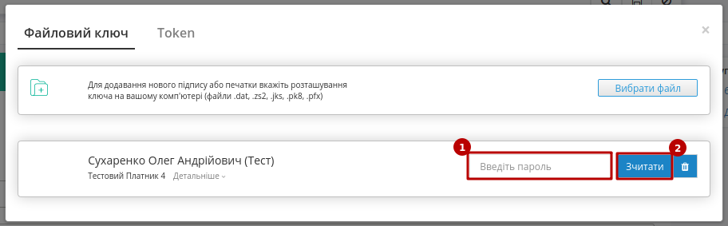

#############################################################################################################################################################################
Інструкція для клієнтів "Системи Трейд" та "ПУСК". Робота з "Актом виконаних робіт" (COMDOC_013) та "Актом звірки зведеним" (COMDOC_029)
#############################################################################################################################################################################

.. сюда закину немного картинок для текста

.. |drop_pass| image:: signing/drop_pass.png

.. |del_key| image:: signing/del_key2.png

.. role:: red

.. role:: green

.. role:: underline

.. contents:: Зміст:
   :depth: 2

---------

Вступ
==============================================================

Інструкція призначена клієнтам "Системи Трейд" та "Першої Української Сервісної Компанії" ("ПУСК"), що працюють з `"Актом виконаних робіт" (COMDOC_013) <https://wiki.edin.ua/uk/latest/XML/XML-structure.html#comdoc-013>`__ та `"Актом звірки зведеним" (COMDOC_029) <https://wiki.edin.ua/uk/latest/XML/XML-structure.html#comdoc-029>`__.

"Система Трейд" чи "Перша Українська Сервісна Компанія" ("ПУСК") в якості контагента формує та відправляє документи `"Акт виконаних робіт" (COMDOC_013) <https://wiki.edin.ua/uk/latest/XML/XML-structure.html#comdoc-013>`__ та `"Актом звірки зведеним" (COMDOC_029) <https://wiki.edin.ua/uk/latest/XML/XML-structure.html#comdoc-029>`__. Ці документи відображаються у **"Вхідних"**:

.. image:: pics_System_Pysk_work_with_COMDOC_013_COMDOC_029/System_Pysk_work_with_COMDOC_013_COMDOC_029_01.png
   :align: center

.. tip::
    Для зручності можливо скористатись фільтром документів у "Вхідних":

    .. image:: pics_System_Pysk_work_with_COMDOC_013_COMDOC_029/System_Pysk_work_with_COMDOC_013_COMDOC_029_02.png
       :align: center 

Робота з "Актом виконаних робіт" (COMDOC_013)
==============================================================

У папці "Вхідні" виберіть та перейдіть у небхідний документ:

.. image:: pics_System_Pysk_work_with_COMDOC_013_COMDOC_029/System_Pysk_work_with_COMDOC_013_COMDOC_029_03.png
   :align: center

Ви можете ознайомитись з відкритим документом та якщо згодні з його змістом натиснути кнопку **"Підписати та відправити"** або на формі-підказці натиснути **"Редагувати"**.

.. note::
    При **"Редагуванні"** доступно змінити лише номер та дату документу непідписаного документа:

    .. image:: pics_System_Pysk_work_with_COMDOC_013_COMDOC_029/System_Pysk_work_with_COMDOC_013_COMDOC_029_04.png
       :align: center
    
    Після внесених змін потрібно **"Зберегти"**, **"Підписати"** та **"Відправити"** документ.

Підписання та відправка документа
-----------------------------------------------------

Після ініціалізації бібліотеки підписання, система надасть можливість додати ключ для підписання. При :underline:`першому` підписанні у модальному вікні потрібно обрати файл чи токен (1), ввести пароль (2) та натиснути **"Считати"** (3) ключ для підписання:

.. image:: signing/file1n.png
   :align: center

.. image:: signing/file2n.png
   :align: center

При успішному додаванні ключа автоматично відобразиться особа, від імені якої буде здійснено підписання. У користувача може бути додано кілька ключів - для вибору потрібного для здійснення операції підписання потрібно проставити відмітку (4) лівою кнопкою миші і натиснути "Підписати" (5):

.. image:: signing/file3n.png
   :align: center

.. important::
   Якщо підписання цим ключем вже було здійснено або знайдена невідповідність даних ЄДРПОУ/ІПН (перевірка), то підписання блокується, а користувачу виводиться відповідне повідомлення:

.. image:: signing/wrong_key.png
   :align: center

Додатково в вікні підписання можливо натиснути **"Детальніше"** для того, щоб переглянути інформацію про підписанта, обрати за необхідності посаду, скинути пароль активного ключа (|drop_pass|) чи видалити помилкові (|del_key|).

При подальшій роботі з раніше доданим ключем/-ами потрібно вводити лише пароль для обраного ключа:

Після підписання інформація щодо підписанта відображається в блоці "Підписанти". Для відправки документа необхідно натинути на кнопку "Відправити". Після відправки документа контрагенту він відображається в журналі вихідних документів.

Робота з "Актом звірки зведеним" (COMDOC_029)
==============================================================

У папці "Вхідні" виберіть та перейдіть у небхідний документ:

.. image:: pics_System_Pysk_work_with_COMDOC_013_COMDOC_029/System_Pysk_work_with_COMDOC_013_COMDOC_029_05.png
   :align: center

Ви можете ознайомитись з відкритим документом та якщо згодні з його змістом натиснути кнопку **"Підписати і відправити у відповідь"**. Підписання відбувається аналогічно до підписання будь-якого іншого документа на платформі та вже описане в розділі `Підписання та відправка документа`_ .

---------------------------------

.. include:: kontakti.rst
