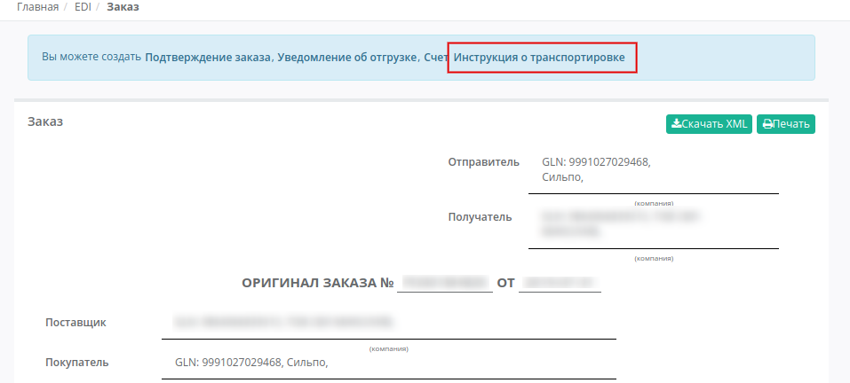
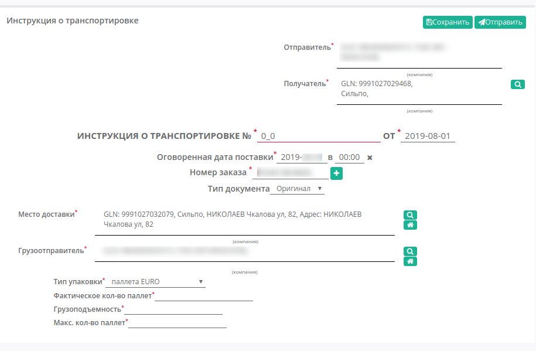
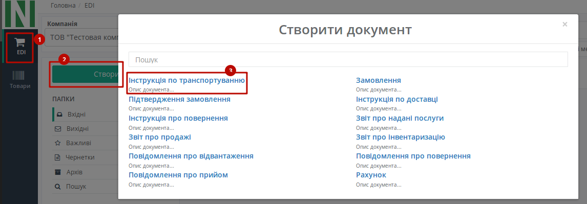
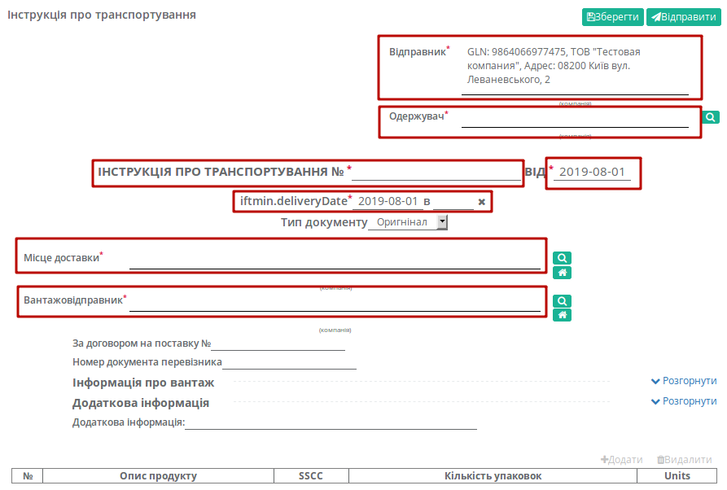

#############################################################################################################
Формування документа «Інструкція про транспортування» (IFTMIN) на платформі EDI Network 2.0
#############################################################################################################

.. role:: red

.. contents:: Зміст:
   :depth: 6

---------

Вступ
====================================

Дана інструкція описує порядок формування та відправки документа «**Інструкція про транспортування**» (IFTMIN). Інструкція з транспортування (IFTMIN) відправляється замовником оператору логістичних послуг. В даному документі вказуються остаточні деталі поставки.

Формування документа «Інструкція про транспортування» (IFTMIN) для торгової мережі Фоззі
============================================================================================

Створення документа відбувається на підставі «**Замовлення**». Щоб сформувати «**Інструкцію про транспортування** (**IFTMIN**)» на підставі **Замовлення** (ORDER), увійдіть в папку «**Вхідні**» і виберіть **замовлення**, за яким потрібно зробити інструкцію. Для пошуку достатньо ввести коректний номер документа в полі «Пошук». Документи також можливо шукати за **Відправником**, **Датою документа** і **Одержувачем**.

.. image:: pics_IFTMIN_na_EDI_Network_2.0/IFTMIN_na_EDI_Network_2_01.png
   :align: center

Для формування IFTMIN виберіть «Інструкція про транспортування» на формі-підказці, документ створиться автоматично.

Документ створений на основі **Замовлення** частково заповнюється автоматично (дані деяких полів пененосяться з документа підстави). Всі поля, позначені червоною зірочкою :red:`*** обов'язкові до заповнення **`.

Заповнення документа (IFTMIN) для торгової мережі Фоззі
-----------------------------------------------------------------

#. **Інструкція про транспортування №** документа повинен бути наступного формату **X_Y**, де:

- **Х - це порядковий номер машини, на поставку**
- **Y - це загальна кількість машин, на поставку**

Важливо, для кожної машини на поставку в один день повинен бути індивідуальний номер машини. Дві машини з однаковим номером машини будуть групуватися в одну.

Мінімальна к-ть 1, Максимальна - 99.
Х повинен бути менше або рівним Y. *Наприклад: 2_5*

2. **Від (Дата)** - фактична дата відправки поставки, за замовчуванням вказана поточна дата
#. **Оговорена дата поставки** - попередня дата відправки поставки, за замовчуванням вказана поточна дата
#. **Номер замовлення** - може підтягуватись автоматично із Замовлення
#. **Місце доставки** - заповнюється автоматично, або за допомогою кнопки "Пошук контрагента", або за допомогою кнопки "Вказати себе"
#. **Вантадовідправник** - заповнюється автоматично, або за допомогою кнопки "Пошук контрагента", або за допомогою кнопки "Вказати себе"
#. **Тип упаковки** - вибір з доступного переліку транспортних упаковок
#. **Фактична кількість палет** - кількість палет, що відвантажується в вантажний транспорт
#. **Вантажопідйомність** - маса вантажу, на перевезення якого розрахований транспортний засіб
#. **Максимальна кількість палет** - максимальна місткість палет (вантажний транспорт)

Нижче на сторінці створеного документа знаходиться необов'язкові для заповнення (якщо інше не зазначено в договорі) поля.

Нижче на сторінці створеного документа знаходиться перелік **товарних позицій**, які були замовлені, і їх кількість. Система автоматично підставить значення по позиціям з документа підстави.

Після внесения всіх данных в документі, натисніть кнопку «**Зберегти**», потім «**Відправити**».

.. image:: pics_IFTMIN_na_EDI_Network_2.0/IFTMIN_na_EDI_Network_2_05.png
   :align: center

Відправлений документ автоматично потрапляє в папку «**Вихідні**» і буде знаходиться в ланцюжку документів разом із **Замовленням**.

Формування документа «Інструкція про транспортування» (IFTMIN) "з нуля"
============================================================================================

Сформувати документ «**Інструкція про транспортування**» також можна в головному вікні, з будь-якого розділу перегляду документів. Для цього натисніть зелену кнопку «**Створити**» і у вікні **Створити документ** виберіть тип документа «**Інструкція про транспортування**». 
Створений таким чином документ «**Інструкція про транспортування**» (**IFTMIN**) дещо відрізняеться від документу, створеному на основі **Замовлення**, і в такому випадку всі поля необхідно заповнювати самостійно.

   
У вікні з'явиться **Форма** для заповнення необхідних реквізитів документа. Всі поля, позначені червоною зірочкою :red:`* - обов’язкові для заповнення`.

Заповнення документа (IFTMIN) "з нуля"
-----------------------------------------------------------------

#. **Інструкція про транспортування №** - номер документу
#. **Від (Дата)** - фактична дата відправки поставки, за замовчуванням вказана поточна дата
#. **Оговорена дата поставки** - попередня дата відправки поставки, за замовчуванням вказана поточна дата
#. **Місце доставки** - заповнюється автоматично, або за допомогою кнопки "Пошук контрагента", або за допомогою кнопки "Вказати себе"
#. **Вантадовідправник** - заповнюється автоматично, або за допомогою кнопки "Пошук контрагента", або за допомогою кнопки "Вказати себе"

Нижче на сторінці створеного документа знаходиться необов'язкові для заповнення (якщо інше не зазначено в договорі) "№ договору на поставку", "Номер документа перевізника", "Інформація про вантаж", "Додаткова інформація".

Нижче на сторінці створеного документа знаходиться перелік **товарних позицій**, які були замовлені, і їх кількість. Система автоматично підставить значення по позиціям з документа підстави.

Блоки **Інформація про вантаж** та **Додаткова інформація** заповнювати необов'язково, в них відображається додаткова інформація, яку ви можете відкрити або приховати натиснувши на Розгорнути / Згорнути.

.. image:: pics_IFTMIN_na_EDI_Network_2.0/IFTMIN_na_EDI_Network_2_06.png
   :align: center

Після внесения всіх данных в документі, натисніть кнопку «**Зберегти**», потім «**Відправити**».

.. image:: pics_IFTMIN_na_EDI_Network_2.0/IFTMIN_na_EDI_Network_2_05.png
   :align: center

Відправлений документ автоматично потрапляє в папку «**Вихідні**» і буде знаходиться в ланцюжку документів разом із **Замовленням** і **Підтвердженням замовлення**.

.. include:: kontakti.rst

