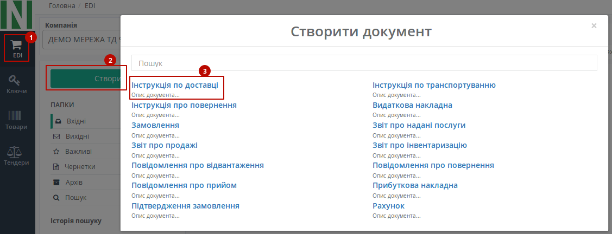
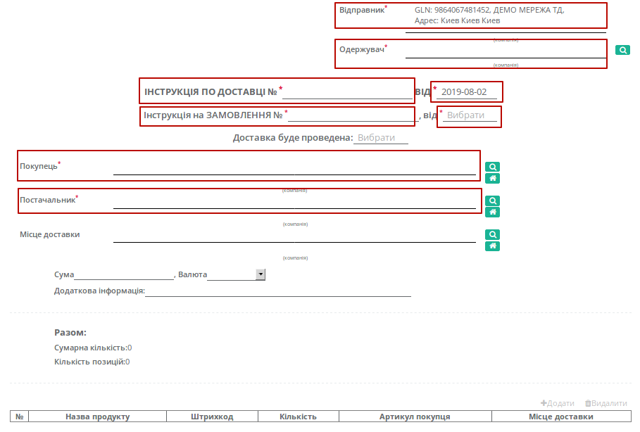

################################################################################################################################
Формування та відправка документа «Інструкція по доставці» (INSDES) на платформі EDI Network 2.0
################################################################################################################################

.. role:: red

.. contents:: Зміст:
   :depth: 6

---------

Вступ
====================================

Дана інструкція описує порядок формування та відправки документа «**Інструкція по доставці**» (INSDES) на платформі EDI Network 2.0.
«Інструкція по доставці» (INSDES) відправляється мережею постачальнику з указанням того, яку продукцію і яку кількість торних позицій необхідно доставити у вказаний термін. В результаті постачальник ще до отримання **Замовлення** має точну інформацію про постачання.

Формування Інструкції по доставці (INSDES) торговою мережею
=================================================================

Формування і відправка документа здійснюється інтегровано на стороні торгової мережі (на підставі **Замовлення**), а з web можливо створити документ тільки "з нуля".

Всі поля, позначені червоною зірочкою :red:`* - обов'язкові до заповнення`.

#. **Відправник** - дані відправника (мережі), компанія
#. **Одержувач** - дані одержувача (постачальника), компанія
#. **Інструкція по доставці №** - номер інструкції
#. **Від** - дата Інструкції по доставці
#. **Інструкція на замовлення** - номер замовлення
#. **Від** - дата Замовлення
#. **Покупець** - заповнюється за допомогою кнопки "Пошук контрагента", або за допомогою кнопки "Вказати себе"
#. **Постачальник** - заповнюється за допомогою кнопки "Пошук контрагента", або за допомогою кнопки "Вказати себе"

Нижче на сторінці створеного документа знаходяться поля, необов'язкові до заповнення: "Місце доставки", розрахована загальна сума по позиціям, додаткова інформація, блок **Разом** розраховується автоматично.

Після внесення всіх даних в документі, натисніть кнопку «**Зберегти**», потім «**Надіслати**».

.. image:: pics_INSDES_na_EDI_Network_2.0/INSDES_na_EDI_Network_2_03.png
   :align: center

Відправлений документ автоматично потрапляє в папку «**Вихідні**» і буде знаходитись в ланцюжку документів разом із **Замовленням**.

.. include:: kontakti.rst
