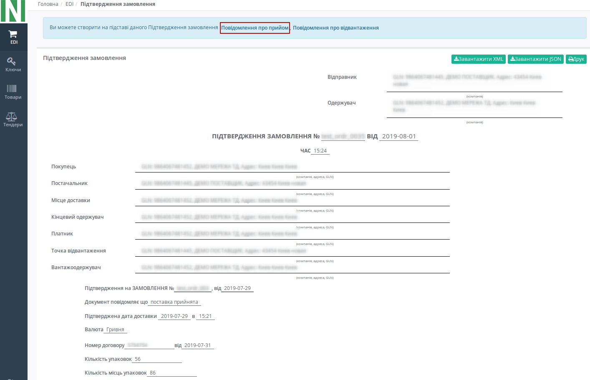
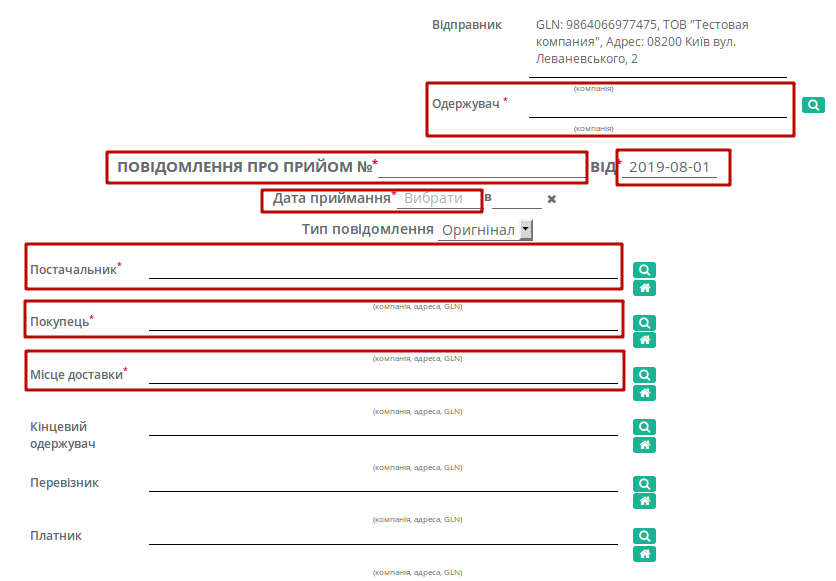
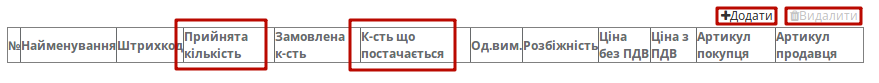
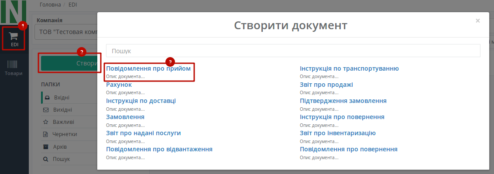
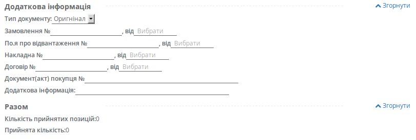

################################################################################################################################
Формування та відправка документа «Повідомлення про прийом» (RECADV) на платформі EDI Network 2.0
################################################################################################################################

.. role:: red

.. contents:: Зміст:
   :depth: 6

---------

Вступ
====================================

Дана інструкція описує порядок формування та відправки документа «**Повідомлення про прийом**» (RECADV) на платформі EDI Network 2.0.
Повідомлення про прийом (RECADV) використовується для оповіщення постачальників про прийом товарів. Даний документ інформує про кількість отриманих товарних позицій і може вказувати на розбіжності між фактично отриманим товаром і зазначеним у документації. В результаті роздрібна мережа ще до приходу машини на рампу має точну інформацію про постачання і дана інформація вже завантажена в облікову систему мережі.

Формування Повідомлення про прийом (RECADV)
===========================================================

Формування документа можливо як на підставі «**Підтвердження замовлення**», так і на підставі «**Повідомлення про відвантаження**».

Розглянемо формування «**Повідомлення про прийом**» на підставі «**Підтвердження замовлення**».

Перейдіть в розділ «**Вихідні**», виберіть необхідний тип документа «**Підтвердження замовлення**». Для зручності можливо скористатись пошуком (досить ввести коректний номер документа в поле «Пошук», або частину номера GLN). Система автоматично виконає пошук даного номера за **GLN**, за **Відправником**, за **Одержувачем** і **Даті документа**.

.. image:: pics_RECADV_na_EDI_Network_2.0/RECADV_na_EDI_Network_2_01.png
   :align: center

У відкритому документі, на формі-підказці, котра дозволяє створити документ на основі **Підтвердження замовлення**, виберіть зі списку «**Повідомлення про прийом**».

Документ створений на основі **Повідомлення про відвантаження** або **Підтвердження замовлення** частково заповнюється автоматично (дані деяких полів пененесутся з документа підстави). Всі поля, позначені червоною зірочкою :red:`*** обов'язкові до заповнення **`.

#. **Одержувач** - дані одержувача (мережі), компанія
#. **Повідомлення про прийом №** - номер замовлення
#. **від** - дата Повідомлення про прийом, за замовчуванням вказана поточна дата
#. **Дата приймання** - дата і час приймання
#. **Постачальник** - заповнюється автоматично, або за допомогою кнопки "Пошук контрагента", або за допомогою кнопки "Вказати себе"
#. **Покупець** - заповнюється автоматично, або за допомогою кнопки "Пошук контрагента", або за допомогою кнопки "Вказати себе"
#. **Місце доставки** - заповнюється автоматично, або за допомогою кнопки "Пошук контрагента", або за допомогою кнопки "Вказати себе"

Нижче на сторінці створеного документа знаходиться додаткова інформація по прийманню, а також підсумок за кількістю і за сумою з / без ПДВ за позиціями:
Блок **Додаткова інформація** необов'язковий для заповнення, блок **Разом** розраховується автоматично. 

Можливо вносити зміни в кількість отриманих позицій, кількість товару, що поставляється, (колонки «**Прийнята кількість**», «**Кількість, що постачається**»).

.. important:: **Увага!** Кількість товарних позицій, що поставляється не може перевищувати кількість зазначену в замовленні!

Якщо якась із позицій відсутня чи не буде прийнята, її необхідно відмітити галочкою і **Видалити**. Можливо також додати іншу позицію з Товарного довідника, заповнивши форму Додати позицію під кнопкою **Додати**.

Після внесення всіх даних в документі, натисніть кнопку «**Зберегти**», потім «**Надіслати**».

.. image:: pics_RECADV_na_EDI_Network_2.0/RECADV_na_EDI_Network_2_05.png
   :align: center

Відправлений документ автоматично потрапляє в папку «**Вихідні**» і буде знаходитись в ланцюжку документів разом із **Повідомлення про відвантаження** і **Підтвердженням замовлення**.

Сформувати документ «**Повідомлення про прийом**» також можна в головному вікні, з будь-якого розділу перегляду документів. Для цього натисніть зелену кнопку «**Створити**» і у вікні **Створити документ** виберіть тип документа «**Повідомлення про прийом**». 

Створений таким чином документ «**Повідомлення про прийом**» (**RECADV**) є аналогічним до документу, створеному на основі **Підтвердження замовлення**, однак всі поля в такому віпадку необхідно заповнювати самостійно.
У новому документі, всі поля позначені червоною зірочкою :red:`* є обов'язковими до заповнення`.

Блок **Додаткова інформація** заповнювати необов'язково, в ньому відображається додаткова інформація, ви можете відкрити або приховати цей блок натиснувши на Розгорнути / Згорнути.

 
Після внесення всіх даних в документі, натисніть кнопку «**Зберегти**», потім «**Надіслати**».
Відправлений документ автоматично потрапляє в папку «**Вихідні**» і буде знаходиться в ланцюжку документів разом із **Повідомлення про відвантаження** і **Підтвердженням замовлення**.

.. include:: kontakti.rst
