Формування Товарного довідника
############################################

.. role:: red

.. contents:: Зміст:
   :depth: 2

---------

**Вступ**
====================================

Дана інструкція описує порядок заповнення **"Товарного Довідника"**, а також обов'язкових для заповнення полів для додавання позицій.

.. _filling:

**1 Наповнення Товарного довідника**
==================================================

Заповнити Товарний Довідник на Web-платформі можливо:

 - Додаванням кожної позиції окремо (вручну, вводячи дані на платформі)
 - За допомогою .XLS шаблону

.. _hand-filling:

**1.1 Внесення даних нової товарної позиції (ручне заповнення форми)**
--------------------------------------------------------------------------------------------------

Після успішної `авторизації <https://wiki.edin.ua/uk/latest/general_2_0/User_registration.html#auth>`__ перейти до товарного довідника можливо через основне меню, де у вкладці **"Особистий кабінет"** EDIN потрібно обрати **"Товари"**:

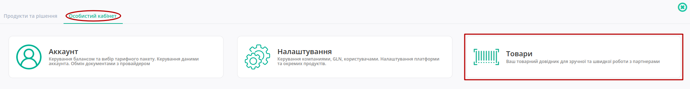

або в два кліки з іконки користувача:

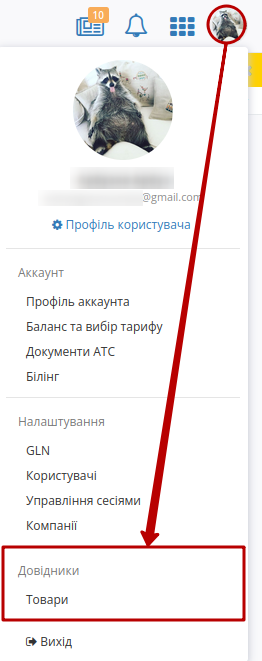

Відкриється розділ довідника з товарами:

.. image:: pics_formirovanie_Tovarnogo_dovidnyka/formirovanie_Tovarnogo_dovidnyka_02.png
   :align: center

.. note::
   Якщо  вас декілька акаунтів під однією компанією, перевірте чи вибрано правильний акаунт! У різних акаунтів відображаються різні товари.

Для того щоб додати товарної позиції, натисніть на кнопку **«+Додати товар»**. Після чого у Вас відкриється форма додавання товарної позиції:

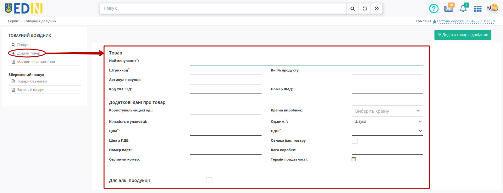

Всі обов'язкові до заповнення поля (позначені червоною зірочкою :red:`*`):

1. Найменування :red:`*` - вкажіть найменування товарної позиції;
2. Штрихкод :red:`*` - вкажіть штрихкод позиції;
3. Ціна :red:`*` - вкажіть ціну без ПДВ;
4. Од.вим. :red:`*` - оберіть зі списку одиницю виміру;
5. ПДВ :red:`*` - оберіть зі списку ставку ПДВ.

.. note::
   Зверніть увагу, що для коректного автоматичного заповнення деяких документів, наприклад, `"Товарної накладної" (DOCUMENTINVOICE) <https://wiki.edin.ua/uk/latest/XML/XML-structure.html#documentinvoice>`__, необхідно заповнити *Код УКТ ЗЕД*.

Для Алкогольної продукції є можливість вказати додаткові дані:

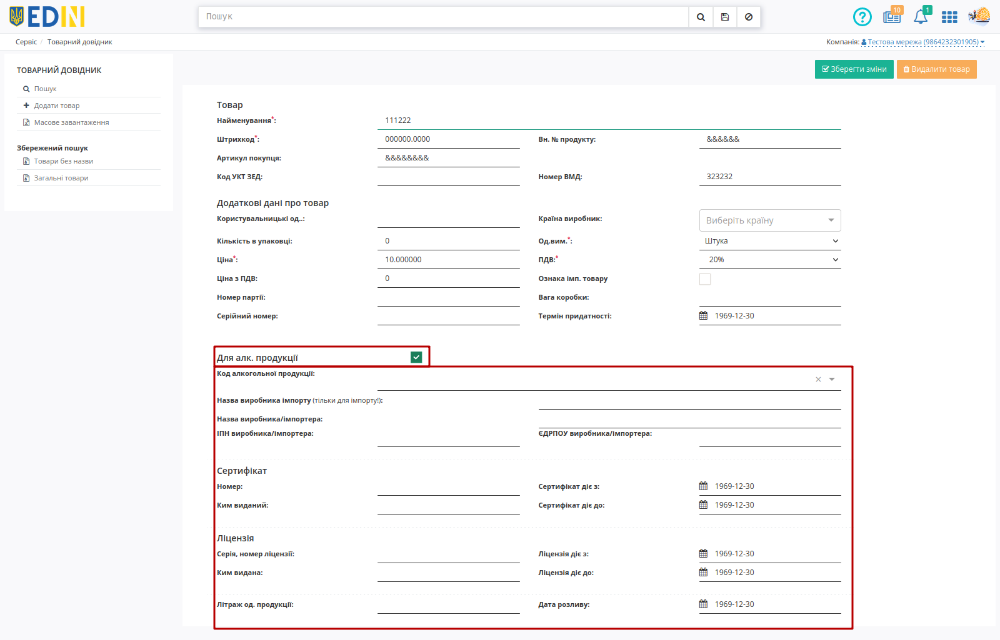

Після заповнення обов'язкових полів натисніть на кнопку **«Додати товар в довідник»**:

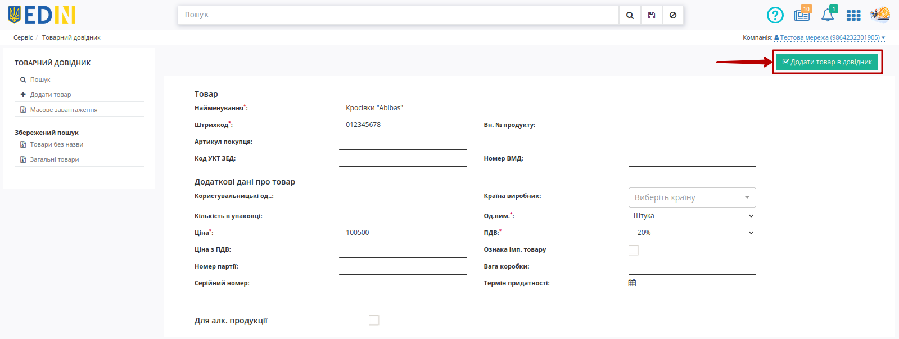

Позиція буде збережена і буде відображатись, як "Загальний товар". Після збереження можливо переглянути товар, натиснувши на штрихкод та у формі перегляду **Внести зміни** (редагувати інформацію) або **"Видалити товар"**:

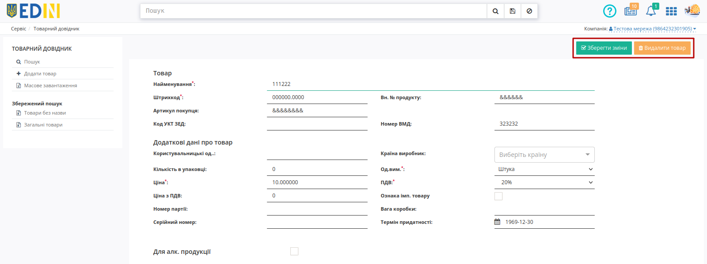

Також можливо масово відмітити та **"Видалити"** обрані позиції з журналу товарів:

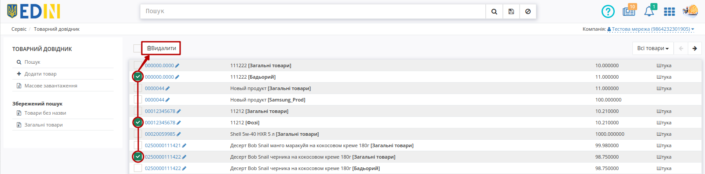

.. _xls-filling:

**1.2 Заповнення Товарного довідника за допомогою .XLS шаблону**
--------------------------------------------------------------------------------------------------

Розділ **«Масове завантаження»** дозволяє масово заванажити товари за допомогою шаблону Excel. Розділ містить **Інструкцію** з правилами коректного заповнення шаблону. Для початку потрібно **«Зберегти шаблон Excel»** (1) та після його заповнення **«Завантажити позиції з Excel»** (2):

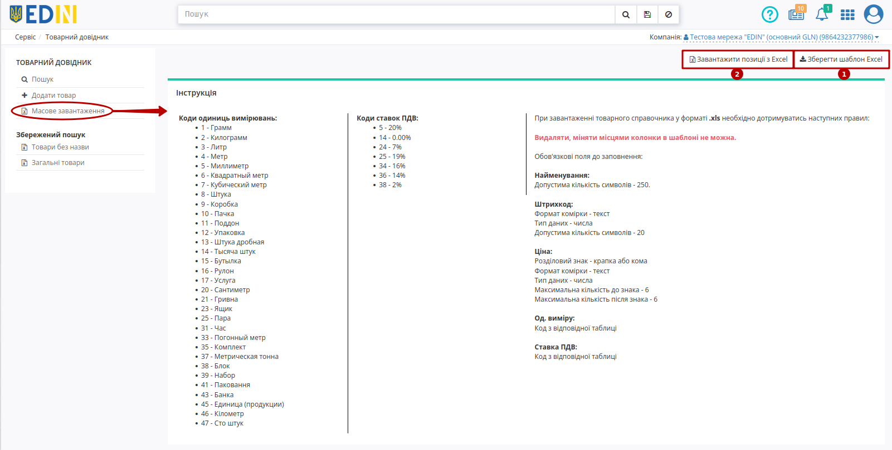

.. important::
   Зверніть увагу! Видаляти, міняти місцями колонки в шаблоні не можна. Колонки виділенні зеленим кольором - **обов'язкові до заповнення**.

Якщо якусь з колонок заповнено некоректно, позиція зафарбується помаранчевим кольором та з'явиться повідомлення про помилку, у якій буде вказано, який саме стовбець заповнено неправильно: 

.. image:: pics_formirovanie_Tovarnogo_dovidnyka/formirovanie_Tovarnogo_dovidnyka_08.png
   :align: center

.. hint::
   Навіть якщо деякі товари заповнені неправильно, Ви все одно можете додати товари (ті, що не мають помилок) у довідник.

Якщо всі дані заповнено вірно, перед вами відобразиться список доданих товарів. Відмітьте чекером усі товари, які Ви хочете додати в свій довідник. Товари можуть бути "загальними" чи відноситись до вказаної Мережі. Перед тим, як **"Створити"** обрані товарні позиції за потреби потрібно вказати приналежність до Мережі (впливає на пошук та додавання товарів в документах на web-платформі при роботі з Мережами):

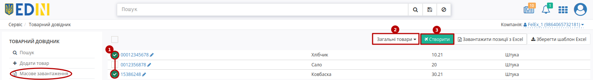

.. hint::
   Приналежність до Мережі чи Загальних товарів визначається лише при **"Створенні"** товару, однак можливо **"Скопіювати"** вже доданий "Загальний товар", вказавши приналежність до Мережі. Детальніше в наступномц розділі.

.. _belong-to:

**2 Задати приналежність до Мережі (скопіювати "Загальні товари")**
=================================================================================

Для того аби задати приналежність загальних товарів до Мережі (пошук та додавання товарів з довідника при роботі з Мережами) потрібно:

1. Скористатись фільтром **"Загальні товари"** в "Збереженому пошуку";
2. Обрати чекером товари, які Ви бажаєте назначити на Мережу;
3. Обрати Мережу зі списку;
4. **"Копіювати"** товари з прив'язкою до Мережі. 

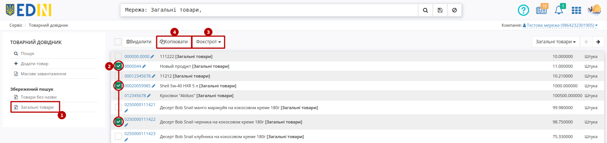

.. _search:

**3 Пошук**
====================================

Додані в довідник товари мають свій набір Характеристик (штрихкод, назву, чи артикул) та приналежність до "Загальних товарів" чи "Мережі". За цими параметрами легко та зручно відібрати чи знайти вже додані товари у Вашому довіднику:

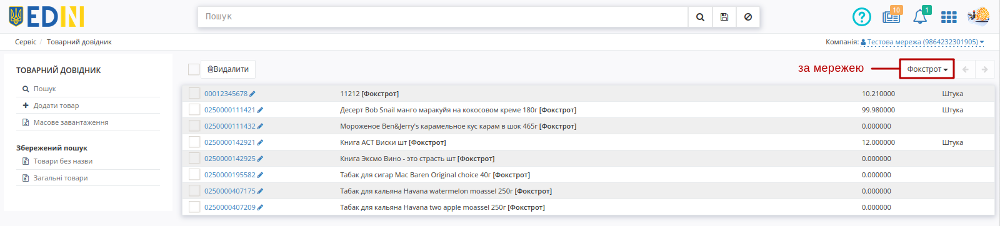

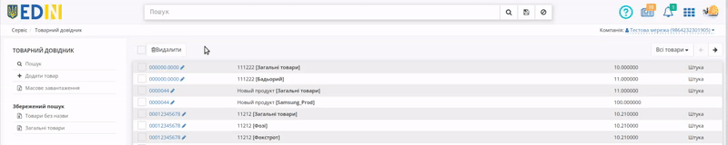

З загальними принципами роботи пошукового рядка Ви можите ознайомитись за `посиланням <https://wiki.edin.ua/uk/latest/general_2_0/rabota_s_platformoj_EDIN_2.0.html#doc-search>`__.

----------------------------
   
.. include:: /_constant/kontakti.rst
