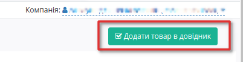
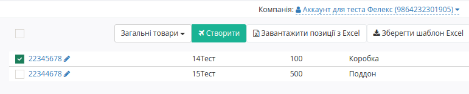

Формування Товарного довідника
############################################

.. role:: red

.. contents:: Зміст:
   :depth: 2

---------

Вступ
====================================

Дана інструкція описує порядок заповнення «**Товарного Довідника**», а також обов'язкових для заповнення полів для додавання позицій.

Заповнити Товарний Довідник на Web-платформі можна декількома способами:

 - Вручну на платформі
 - Через шаблон .XLS 

Нижче будуть наведені приклади усіх способів.

Заповнення Товарного довідника вручну
======================================

Після успішної авторизації відкриється основне меню, де у вкладці **"Особистий кабінет"** EDIN потрібно обрати **"Товари"**:

.. image:: pics_formirovanie_Tovarnogo_dovidnyka/formirovanie_Tovarnogo_dovidnyka_11.png
   :align: center

Відкриється розділ довідника з товарами.

.. note:: Якщо  вас декілька акаунтів під однією компанією, перевірте чи вибрано правильний акаунт! У різних акаунтів відображаються різні товари.

.. image:: pics_formirovanie_Tovarnogo_dovidnyka/formirovanie_Tovarnogo_dovidnyka_02.png
   :align: center

Для того щоб додати товарної позиції, натисніть на кнопку **«+ Додати товар»**.
Після натискання у вас відкриється форма додавання товарної позиції.

.. image:: pics_formirovanie_Tovarnogo_dovidnyka/formirovanie_Tovarnogo_dovidnyka_03.png
   :align: center

Ниже перечислені обов'язкові для заповнення поля:

1. Найменування * - вкажіть найменування товарної позиції
2. Штрихкод * - вкажіть штрихкод позиції
3. Ціна * - вкажіть ціну без ПДВ
4. Од.вим.* - зі списку виберіть одиницю
5. ПДВ * вкажіть ставку ПДВ

.. note:: Зверніть увагу, що для коректного заповнення деяких документів, наприклад Товарної накладної, необхідно заповнити *Код УКТ ЗЕД*.

Після заповнення обов'язкових полів натисніть на кнопку **«Додати товар в довідник»**. 

Позиція буде збережена і відображатимется в загальному списку довідника.

Після збереження можливо внести зміни, додати інформацію, або видалити товар.

Якщо ви хочете внести зміни пізніше, або редагувати іншу позицію, натисніть на "олівець" або на штрихкод поруч з назвою товару.

Заповнення Товарного довідника через шаблон .XLS 
================================================

Для масового завантаження товарів, скористайтеся функцією завантаження шаблону Excel.

Серед доступних сервісів виберіть **«Товари»** та натисніть на кнопку **«Масове завантаження»**.

.. image:: pics_formirovanie_Tovarnogo_dovidnyka/formirovanie_Tovarnogo_dovidnyka_05.png
   :align: center

Після натискання у вас відкриється форма з кнопками для скачування та завантажування шаблону Excel, а також підказки по  коректному заповненню шаблону.

.. image:: pics_formirovanie_Tovarnogo_dovidnyka/formirovanie_Tovarnogo_dovidnyka_06.png
   :align: center

Натисніть на кнопку **«Зберегти шаблон Excel»** - скачування шаблону почнеться автоматично.

.. image:: pics_formirovanie_Tovarnogo_dovidnyka/formirovanie_Tovarnogo_dovidnyka_07.png
   :align: center

.. important::
    Зверніть увагу! Видаляти, міняти місцями колонки в шаблоні не можна.

Відкрийте та заповніть файл Excel. Колонки виділенні зеленим кольором - **обов'язкові для заповнення**. Обов'язкові дані такі ж як і при ручному додаванні товару. 
Після заповнення шаблону, збережіть його!

Для масового завантаження товарів на платформу натисніть на кнопку **«Завантажити позиції з Excel»**. 

Якщо якусь з колонок заповнено некоректно, позиція зафарбується помаранчевим кольором, та з'явиться повідомлення про помилку, у якій буде вказано який саме стовбець заповнено неправильно. 

 Навіть якщо деякі товари додані неправильно, ви все одно можете додати товари без помилок у довідник.

.. image:: pics_formirovanie_Tovarnogo_dovidnyka/formirovanie_Tovarnogo_dovidnyka_08.png
   :align: center

Якщо всі дані заповнено вірно, перед вами відобразиться список доданих товарів. Відмітьте чекером усі товари які ви хочете додати. 

Далі з ними можливі дії - віднести їх до певної мережі чи залишити у статусі Загальні товари. Після натисніть на кнопку **«Створити»** - після цього товари відобразяться у загальному списку.

Пошук
====================================
Можливі 2 варіанти пошуку товару.

.. image:: pics_formirovanie_Tovarnogo_dovidnyka/formirovanie_Tovarnogo_dovidnyka_10.png
   :align: center

1. Для пошуку товарної позиції введіть у поле пошуку штрихкод, назву, чи артикул та виберіть фільтр "Характеристики";
2. Відфільтруйте усі позиціїї за мережею, вибравши у полі пошуку фільтр "Мережа" або почніть вводити назву мережі у поле пошуку.

.. include:: kontakti.rst
