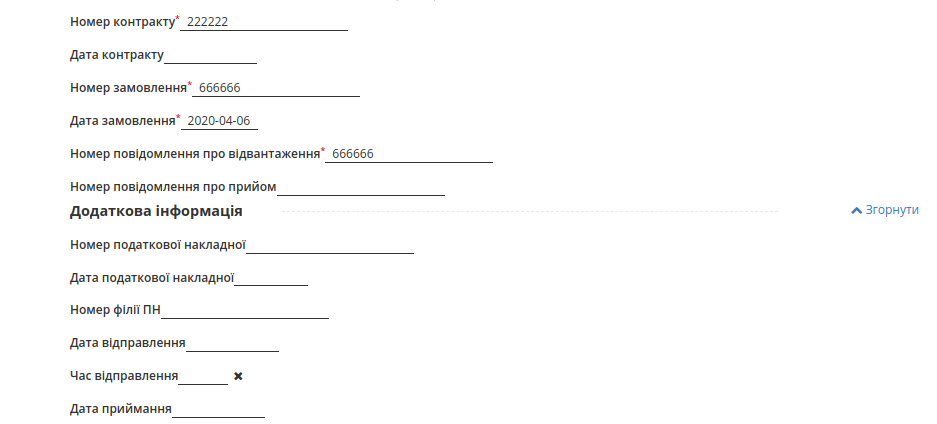
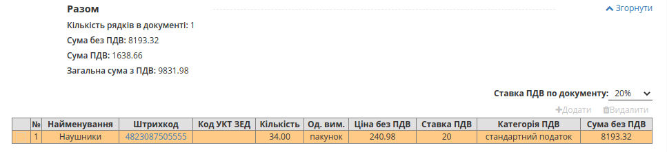

Формування Товарної накладної для Леруа Мерлен
###############################################################################

.. role:: red

.. contents:: Зміст:
   :depth: 6

---------

Вступ
====================================

Дана інструкція описує порядок формування Товарної накладної на web-платформі EDIN 2.0.

.. important::
    **Увага!**  Для коректного формування документів **ТН** необхідно заповнити Товарний довідник. Ви можете подивитися `Інструкцію щодо заповнення довідника <https://wiki.edi-n.com/uk/latest/general/!!!!!!!.html>`_.

.. note:: **Увага!** Завершеним ланцюжком документообігу з мережею, є відправлена Товарна накладна, з коректним статусом, плюс створена на підставі Товарної накладної і зареєстрована Податкова накладна.

Перед початком роботи з Товарною накладною необхідно заповнити всі реквізити компанії.

Методи створення Товарної накладної
----------------------------------------------------

Створити Товарну накладну можливо трьома способами:

1. Через меню «Створити» вибрати Товарну накладну
2. На підставі Замовлення (ORDER)
3. На підставі Повідомлення про відвантаження (DESADV)

Документ **Товарна накладна** для мережі Леруа Мерлен рекомендується формувати на підставі **Повідомлення про відвантаження** (DESADV); нижче наведено приклад формування **Товарної накладної** в таким способом. 

   Повідомлення про відвантаження (DESADV) відправляє постачальник у відповідь на Замовлення (ORDER). При цьому постачальник може змінити кількість замовлених товарних позицій, що поставляються, дату і час поставки, додаткові відомості.

Для формування документа **Товарна накладна** необхідно перейти в каталог “**Надіслані**”.

Для зручності, відфільтруйте документи, виберіть потрібну мережу - «**Леруа Мерлен**» і вкажіть тип документа «**Повідомлення про відвантаження**».

.. image:: pics_Tovarna_nakladna_Leroy_Merlin/formirovanie_Tovarnoj_nakladnoj_Leroy_Merlin_01.png
   :align: center

У відкритому документі, на формі-підказці, котра дозволяє створити документ на основі Повідомлення про відвантаження, виберіть зі списку «**Товарна накладна**».

.. image:: pics_Tovarna_nakladna_Leroy_Merlin/formirovanie_Tovarnoj_nakladnoj_Leroy_Merlin_02.png
   :align: center

Заповнення документа Товарна накладна
----------------------------------------------------

Документ Товарна накладна створиться автоматично. Дані деяких полів пененесутся з документа основи. Необхідно заповнити обов'язкові дані, позначені червоною зірочкою :red:`*`, в кожному з блоків.

.. image:: pics_Tovarna_nakladna_Leroy_Merlin/formirovanie_Tovarnoj_nakladnoj_Leroy_Merlin_03.png
   :align: center

Перевірте правильність данних -  № та дату Товарної накладної, GLN контрагентів, номер замовлення та номер повідомлення про відвантаження на основі яких створено документ, чи додайте необов'язкову, додаткову інформацію:

Нижче на сторінці створеного документа знаходиться блок з інформацією по позиціях.  

Система автоматично заповнює значення за позиціями з раніше відправленого документа «Повідомлення про відвантаження», на основі якого був створений документ.
Вкажіть правильну **Ставку ПДВ по документу** для правильного розрахунку у блоці **Разом**.

При перевірці внесених даних за товарними позиціями необхідно впевнитись, що обов'язково заповнене поле **код УКТ ЗЕД**. 
У разі, якщо поле не заповнено або заповнено некоректно, при збереженні документа буде виведено повідомлення:

 Будь ласка, заповнiть повнiстю обов'язкову iнформацiю по всiм позицiям!

Код УКТ ЗЕД не може бути менше 4 символів.

Щоб додати код **УКТ ЗЕД** натисніть на штрихкод товару. Відкриється вікно з даними позиції:

.. image:: pics_Tovarna_nakladna_Leroy_Merlin/formirovanie_Tovarnoj_nakladnoj_Leroy_Merlin_03_2.png
   :align: center

Для того, щоб поле з кодом **УКТ ЗЕД** за товарними позиціями при формуванні документа Товарна Накладна заповнювалось автоматично, необхідно перевірити коректність заповнення даних в Товарному довіднику. Для цього перейдіть у сервіс **Товари** та знайдіть позицію за штрихкодом.

.. image:: pics_Tovarna_nakladna_Leroy_Merlin/formirovanie_Tovarnoj_nakladnoj_Leroy_Merlin_03_3.png
   :align: center
   
Після заповнення усіх обовязкових полів, будь ласка, збережіть документ!

Підписання документа Товарна Накладна
----------------------------------------------------

Після збереження документа, його необхідно підписати Електронно-Цифровим підписом (ЕЦП). Для ініціалізації підписання документу натисніть "**Підписати**".

.. image:: pics_Tovarna_nakladna_Leroy_Merlin/formirovanie_Tovarnoj_nakladnoj_Leroy_Merlin_09.png
   :align: center

Після ініціалізації бібліотеки підписання, система надасть можливість додати ключ для підписання. При першому підписанні необхідно додати файловий ключ. Для цього у модальному вікні потрібно обрати файл (1) і ввести пароль (2):

.. image:: pics_Tovarna_nakladna_Leroy_Merlin/pics_Іnstrukcіya_dlya_postachalnika_signing_5.png
   :align: center

Після чого натиснути кнопку **"Додати"**:

.. image:: pics_Tovarna_nakladna_Leroy_Merlin/pics_Іnstrukcіya_dlya_postachalnika_signing_6.png
   :align: center

При успішному додаванні ключа автоматично відобразиться вибрана особа, від імені якої буде здійснено підписання (кнопка **"Підписати"**):

.. image:: pics_Tovarna_nakladna_Leroy_Merlin/pics_Іnstrukcіya_dlya_postachalnika_signing_7.png
   :align: center

При подальшій роботі з раніше доданим ключем/-ами потрібно вводити лише пароль для обраного ключа:

.. image:: pics_Tovarna_nakladna_Leroy_Merlin/pics_Іnstrukcіya_dlya_postachalnika_signing_8.png
   :align: center

Після успішного підписання, натисніть кнопку **Надіслати**. Відправлений документ додається в папку «Надіслані».
Після відправки у документі відобразиться статус-квитанція "Товарна накладна" зеленим кольором, натиснувши на яку можна переглянути Дані про підписантів.

.. image:: pics_Tovarna_nakladna_Leroy_Merlin/formirovanie_Tovarnoj_nakladnoj_Leroy_Merlin_07.png
   :align: center

.. image:: pics_Tovarna_nakladna_Leroy_Merlin/formirovanie_Tovarnoj_nakladnoj_Leroy_Merlin_08.png
   :align: center

Сірим кольором відображається очікувана квитанція "Підтвердження товарної накладної", натиснувши на яку побачимо що документ ще не підписаний. 
Після підписання документа мережею, друга квитанція "Підтвердження товарної накладної" також стане зеленою, і в ній відобразяться Дані про підписантів.

Види файлів електронно-цифрового підпису
----------------------------------------------------

Якщо Ви використовуєте ключі від **АЦСК "Україна"**, файли підписів секретних ключів мають розширення **.ZS2** і наступні значення в іменах файлів:

* Директор «DS»
* Бухгалтер «BS»
* Співробітник «SS»
* Печатка «S»
* Шифрування «C»
* Універсальний ключ печатки і шифрування «U»

.. image:: pics_formirovanie_Tovarnoj_nakladnoj/formirovanie_Tovarnoj_nakladnoj_12.png
   :align: center

Якщо Ви використовуєте ключі від **АЦСК “ПриватБанк”**, файли підписів секрентних ключів мають розширення **.jks**:

.. image:: pics_formirovanie_Tovarnoj_nakladnoj/formirovanie_Tovarnoj_nakladnoj_13.png
   :align: center

Якщо Ви використовуєте ключі від будь-яких інших **АЦСК**, файли підписів секрентних ключів мають найменування **Key-6.dat**:

.. image:: pics_formirovanie_Tovarnoj_nakladnoj/formirovanie_Tovarnoj_nakladnoj_14.png
   :align: center

Після вибору секретних ключів, введіть паролі під кожним з них, а потім натисніть кнопку “**Зчитати ключі**”

.. image:: pics_formirovanie_Tovarnoj_nakladnoj/formirovanie_Tovarnoj_nakladnoj_15.png
   :align: center

При коректному зчитуванні ключів, в блоці “**ЕЦП**” з’явиться інформація про власників ключів. Після перевірки інформації натисніть кнопку “**Підписати**”.

.. image:: pics_formirovanie_Tovarnoj_nakladnoj/formirovanie_Tovarnoj_nakladnoj_16.png
   :align: center

Після підписання натисніть на кнопку “**Відправити**”.

Статуси по Товарній накладній
----------------------------------------------------

Після відправки відповідних документів, торговельна мережа обробляє їх і надає їм статуси. Статуси відображаються в розділі "**Відправлені**", навпроти кожного документа.

.. image:: pics_formirovanie_Tovarnoj_nakladnoj/formirovanie_Tovarnoj_nakladnoj_17.png
   :align: center

- «**Документ переданий партнеру**» - товарна накладна коректна.
- «**Документ переданий на ящик партнера**» - товарна накладна коректна.
- «**Правильний канал не знайдено. Немає з'єднання з партнером**» - в товарній накладній зазначений некоректний GLN одержувача і покупця.
- «**Помилка конвертації на вихідний формат**» - є помилка у формі заповнення товарної накладної. Деякі поля були не заповнені або заповнені некоректно.

У разі виникнення подібної помилки прохання звертатися за адресою ел. пошти support@edi-n.com

Приклад коректного статусу:

.. image:: pics_formirovanie_Tovarnoj_nakladnoj/formirovanie_Tovarnoj_nakladnoj_18.png
   :align: center

Приклад некоректного статусу:

.. image:: pics_formirovanie_Tovarnoj_nakladnoj/formirovanie_Tovarnoj_nakladnoj_19.png
   :align: center

Відправлену Товарну накладну можливо скачати у таких форматах: .pdf .xls .xml .zip .p7s

.. include:: kontakti.rst
