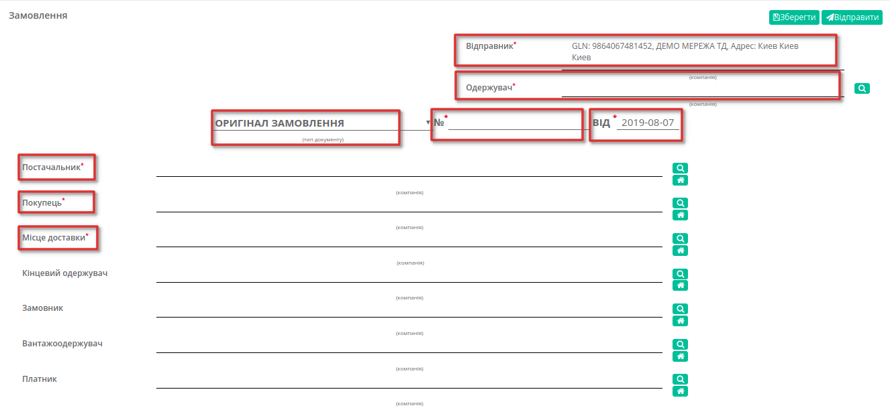
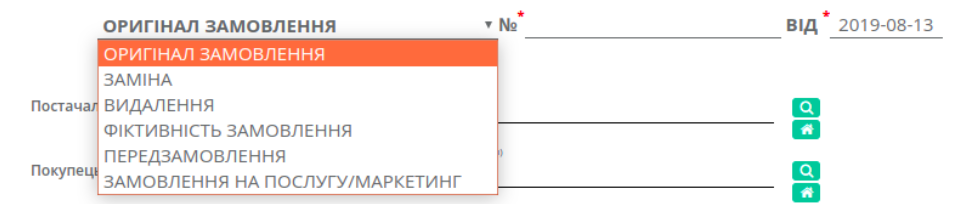
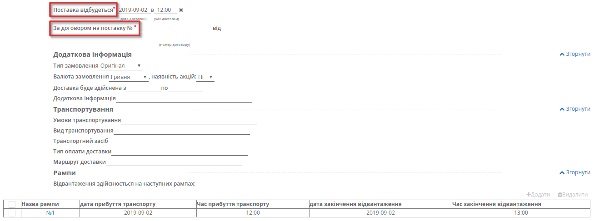
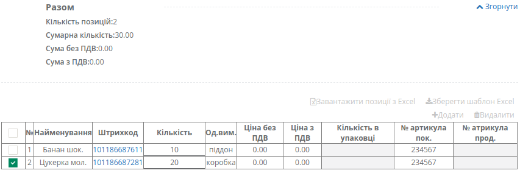
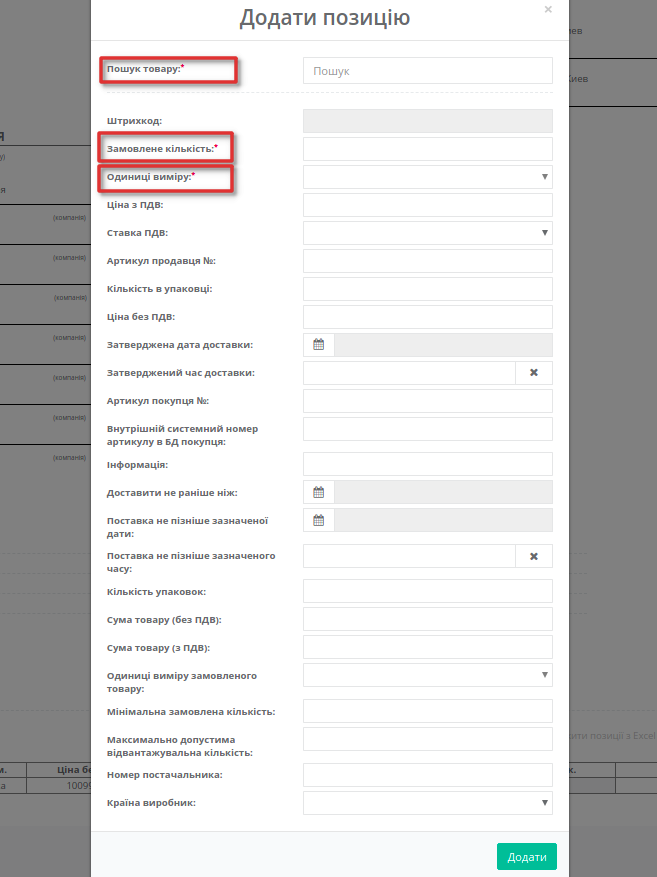
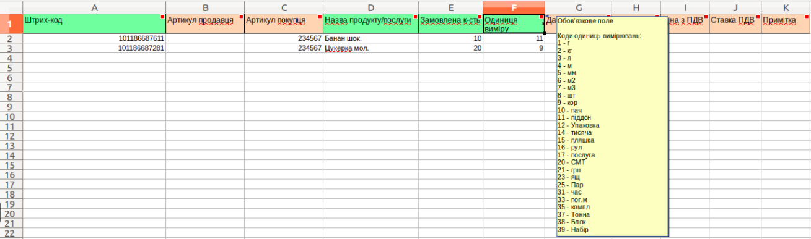
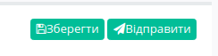
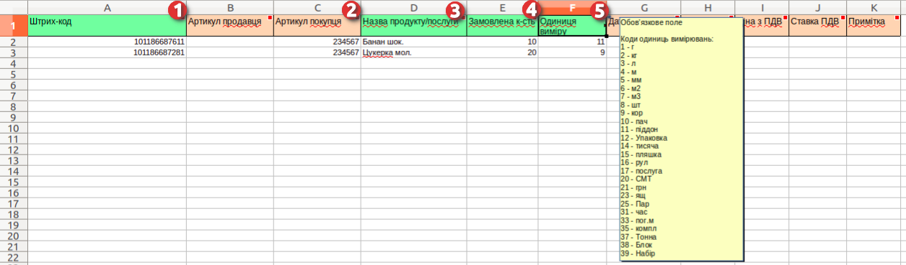
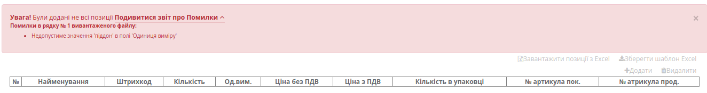

########################################################################################################################
Формування та відправка документа «Замовлення» (ORDER) на платформі EDI Network 2.0
########################################################################################################################

.. role:: red

.. contents:: Зміст:
   :depth: 3

---------

Вступ
====================================
Дана інструкція описує порядок формування та відправки документа «**Замовлення**» (**ORDER**).
Замовлення (ORDER) на поставку покупець відправляє постачальнику, вказуючи найменування та штрих-код продукту, його опис, замовлену кількість, ціну та іншу необхідну інформацію.
Постачальник на підставі отриманого замовлення формує документ ORDRSP (Підтвердження замовлення), в якому підтверджує або не підтверджує поставку тієї чи іншої позиції продукції.

Формування ORDER
==================================================================

Щоб сформувати  **Замовлення** (**ORDER**), увійдіть в розділ «**EDI**» і натисніть на кнопку **Створити**. У вікні що зявилося виберіть необхідний тип документиа, а саме - "Замовлення".

.. image:: pics_formirovanie_ORDERS_na_EDI_Network_2.0/ORDERS_na_EDI_Network_2.0_001.png
   :align: center

Документ створиться автоматично. У новому документі, всі поля позначені червоною зірочкою :red:`*** є обов'язковими до заповнення**`.

#. **Відправник** - дані відправника документу (мережі), не підлягають редагуванню
#. **Одержувач** - дані одержувача (постачальника), для пошуку контрагента натисніть на лупу
#. **Тип документа** - поле для вибору типу: *Оригінал замовлення*, *Заміна*, *Видалення*, *Фіктивність замовлення*, *Передзамовлення*, *Замовлення на послугу/маркетинг*;
#. **№** - номер замовлення
#. **від** - дата підтвердження, за замовчуванням вказана поточна дата
#. **Постачальник** - заповнюється за допомогою кнопки "Пошук контрагента", або за допомогою кнопки "Вказати себе"
#. **Покупець** - заповнюється за допомогою кнопки "Пошук контрагента", або за допомогою кнопки "Вказати себе"
#. **Місце доставки** - заповнюється за допомогою кнопки "Пошук контрагента", або за допомогою кнопки "Вказати себе"

За допомогою кнопки «**Пошук контрагента**» (лупа) або ж за допомогою кнопки «**Вказати себе**» (будинок) можливо вказатичи змінити дані Покупця або Постачальника. Для пошуку введіть назву компанії, GLN або ІПН.

Поле «**Тип документа**» можна змінити натиснувши на назву типу, і замість Замовлення, вибрати Заміна або Видалення замовлення.

Також обов'язково необхідно вазати дату та час доставки у полі **Поставка відбудеться** та номер договору на поставку.

Блоки **Доп інфо**, **Транспортування**, **Рампи** необов'язкові для заповнення, це поля для вказання додоткової інформації по замовленню, як то валюта та наявність акції, чи умови транспортування с вказанням рампи та точного часу відвантаження.
За необхідності ці блоки можна розгорнути, потім, для зручності, їх можна згорнути знову. 

Блок **Разом** розраховується автоматично після заповнення позицій.

У блоці **Позиції** відображається таблиця-перелік замовлених **товарних позицій** і основна інформація по позиціях. Позиції можна заповнити вручну або завантажити із файлу Excel.

**Товарні позиції** заповнюються з товарного довідника, їх можна додати вручну, заповнивши обов'язкові поля у формі **Додати позицію** під кнопкою **Додати**.

При додаванні позиціїі з товарного довідника, можливий пошук позицій за штрихкодом. Обов'язкові поля поміченні червоною зірочкою ***** - без цих полів позиція не додасться!

Завантажити позиції списком можливо за допомогою .XLS файлу Excel. Для цього натисніть на **Зберегти шаблон Excel**, відкрийте автоматично скачаний файл та заповніть таблицю.

Зеленим помічені стовбці обов'язкові для заповнення, червоним - опціональні. При наведенні на назву стовбця висвітиться підказка по заповненню полів.

Після внесення всіх позицій в документ, збережіть файл, поверніться до замовлення та натисніть **Завантажити позиції з Excel**. У вікні виберіть заповнений файл з вашого ПК, усі позиції з файлу додадуться автоматично. 
При необхідності змінити чи доповнити дані по позиціям, змініть данні у файлі .XLS та завантажке на платформу повторно. Позиції оновляться відповідно до файлу.

.. important:: У разі неправильного заповнення .XLS файлу Excel, при завантаженні висвітиться повідомлення про помилку, з указанням рядка який необхідно відкоригувати. При додаванні позиції, яка вже була додана, також зявиться попередження з указанням штрихкоду позиції.

Після внесення всіх даних в документі, натисніть кнопку «**Зберегти**», а потім «**Відправити**».

Відправлений документ автоматично потрапляє в папку «**Вихідні**».
Перейшовши у відправлене замовлення, Ви можете замінити дане Замовлення - *Новим*, або залишити комментар, який відобразиться відразу під замовленням, або роздрукувати Замовлення.

Формування та відправка документа «Замовлення» (ORDER) для ВІТМАРК-УКРАЇНА
============================================================================

Для формування замовлення для виробника ВІТМАРК-УКРАЇНА, створіть докумень аналогіччно - натисніть на кнопку **Створити** та виберіть **Замовлення** (**ORDER**). Документ створиться автоматично. У новому документі, всі поля позначені червоною зірочкою :red:`***** є обов'язковими до заповнення**`.

При заповненні даних Одержувача, вкажіть **GLN 9864232321439 ВІТМАРК-УКРАЇНА**.

Після заповнення обовязкових полів, заповніть табличну частину інформацією по позиціям, завантаживши позиції списком. 
Для цього натисніть на **Зберегти шаблон Excel**, відкрийте автоматично скачаний .XLS файл Excel та заповніть таблицю.

Стовбці помічені зеленим обов'язкові для заповнення, червоним - опціональні. Для ВІТМАРК-УКРАЇНА також обовязковим є стовбець *Артикул Покупця* (незважаючи на те що він виділений червоним!).

При наведенні на назву стовбця висвітиться підказка по заповненню полів.

Після внесення всіх позицій в документ, збережіть файл, поверніться до замовлення та натисніть **Завантажити позиції з Excel**. У вікні виберіть заповнений файл з вашого ПК, усі позиції з файлу додадуться автоматично та з'явиться повідомлення "*Усі позиції додано успішно!*". 

У разі неправильного заповнення .XLS файлу Excel, при завантаженні висвітиться повідомлення про помилку з уточненням:

При необхідності змінити чи доповнити дані по позиціям, змініть дані у файлі .XLS та завантажте на платформу повторно. Позиції оновляться відповідно до файлу.

Після внесення всіх даних в документі, натисніть кнопку «**Зберегти**», а потім «**Відправити**».

.. include:: kontakti.rst
