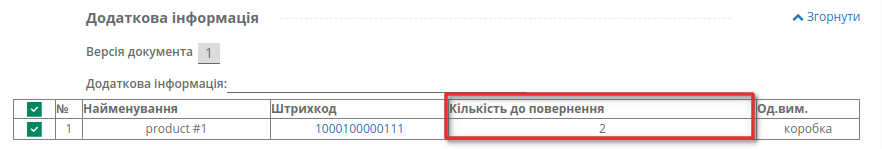

###########################################################################
Формування документа Інструкція про повернення (RETINS)
###########################################################################

.. role:: red

.. contents:: Зміст:
   :depth: 3

---------

Вступ
====================================

Документ **Інструкція про повернення** (RETINS) відправляється Постачальником у відповідь на **Повідомлення про повернення** (RETANN) від мережі, і використовується для підтвердження або редагування дати та часу прибуття постачальника.
Документ не потребує підпису.

Формування документа Інструкція про повернення (RETINS)
==============================================================

Для формування документа, у папці "Вхідні" виберіть небхідний документ від мережі. Для полегшення пошуку, достатньо ввести номер документа в полі «Пошук». Документи також можливо шукати за Відправником, Датою документа і Одержувачем. 
За допомогою фільтру "Усі документи" відфільтруйте необхідний тип документу, у данному випадку - "Повідомлення про повернення". Перейдіть у документ.

.. image:: pics_formirovanie_RETINS_na_EDI_Network_2.0/pics_formirovanie_RETINS_na_EDI_Network_2.0_002.png
   :align: center

У документі, що відкрився, виберіть **Інструкція про повернення** на формі-підказці, новий документ створиться автоматично.

.. image:: pics_formirovanie_RETINS_na_EDI_Network_2.0/pics_formirovanie_RETINS_na_EDI_Network_2.0_003.png
   :align: center

Деякі поля у створеному документі вже будуть заповнені із документу-основи, без можливості редагування.

Деякі дані можливо редагувати. :red:`Обов'язкові поля, позначені червоною зірочкою *`, мають бути заповнені!

.. image:: pics_formirovanie_RETINS_na_EDI_Network_2.0/pics_formirovanie_RETINS_na_EDI_Network_2.0_004.png
   :align: center

#. **№** - номер документу
#. **Постачальник** - заповнюється за допомогою кнопки "Пошук контрагента", або за допомогою кнопки "Вказати себе"
#. **Покупець** - заповнюється за допомогою кнопки "Пошук контрагента", або за допомогою кнопки "Вказати себе"
#. **Місце доставки** - заповнюється за допомогою кнопки "Пошук контрагента", або за допомогою кнопки "Вказати себе"
#. **Дата повернення** - дата та час повернення товарів, переноситься із Повідомлення про повернення
#. **Дія** - поле для вибору типу дії, може бути *Змінено*, *Прийнято*, *Відмовлено*; 

Якщо ви хочете змінити дату та/або час поверення товарів, вкажіть потрібні значення у полі **Дата повернення** та змініть **Дію** на "*Змінено*".

Нище блок, де вказана додаткова інформація, як-то версія документу, та інформація по позиціям. Щоб переглянути додаткову інформацію, натисніть на **Розгорнути**. 

У табличній частині вказано порядковий № позиції, її Найменування, Штрихкод, Кількість до повернення та Одиниці виміру.

В Інструкції про повернення можливо змінити тільки кількість товару, що повертаться, та переглянути дані позиції детальніше натиснувши на штрихкод.

Після внесення всіх даних в документ, натисніть кнопку «**Зберегти**», а потім «**Відправити**».

.. image:: pics_formirovanie_RETINS_na_EDI_Network_2.0/pics_formirovanie_RETINS_na_EDI_Network_2.0_006.png
   :align: center

.. include:: kontakti.rst
