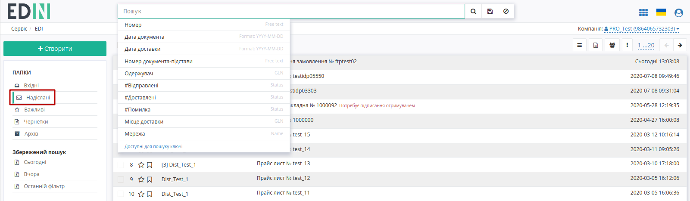
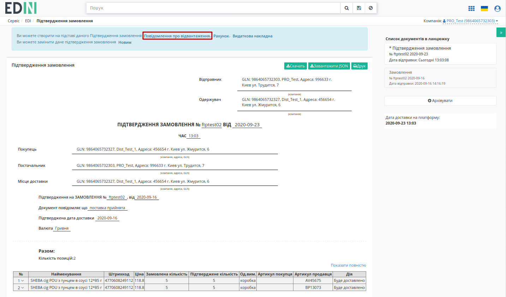
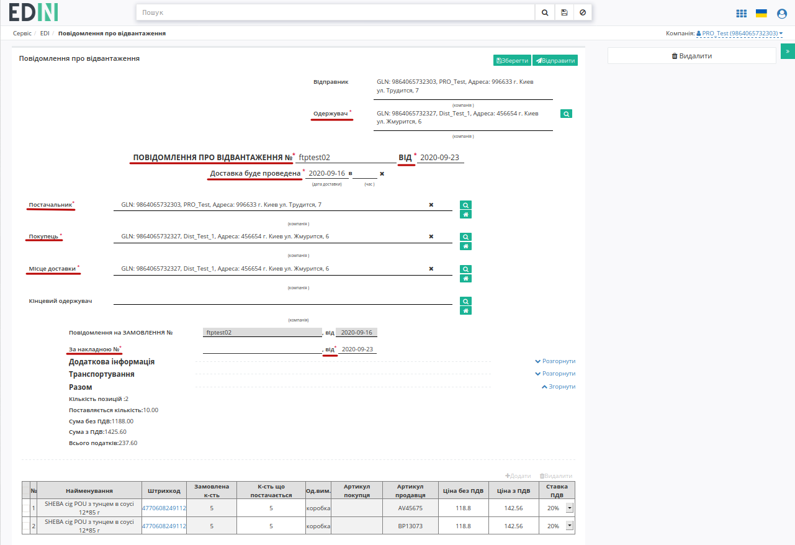
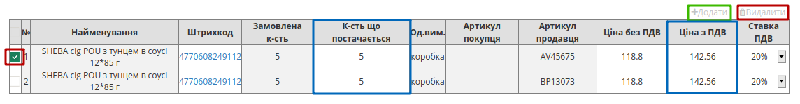
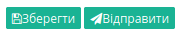
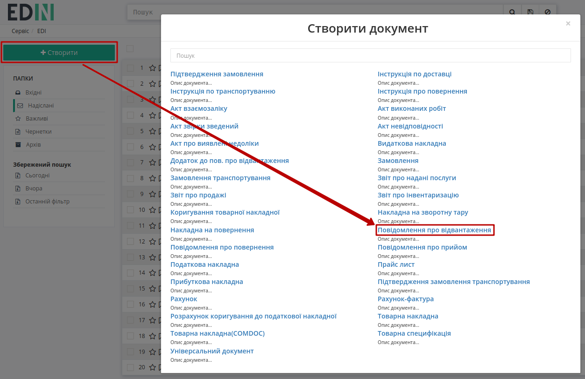
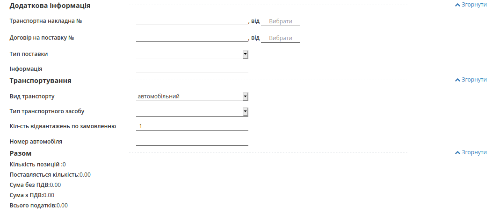

################################################################################################################################
Створення "Повідомлення про відвантаження" (DESADV) на базі інших електронних документів
################################################################################################################################

.. картинки в текст

.. |лупа| image:: /_constant/icons/magnifying_glass.png

.. |будинок| image:: /_constant/icons/house.png

.. role:: red

.. contents:: Зміст:
   :depth: 2

---------

Вступ
====================================

Дана інструкція описує порядок формування та відправки документа "Повідомлення про відвантаження" (DESADV) на платформі EDI Network. Даний документ є аналогом товарно-транспортної накладної. В результаті документообігу Контрагент (зазвичай роздрібна мережа) ще до приходу машини на рампу має точну інформацію про постачання і дана інформація одразу може бути завантажена в облікову систему Контрагента. Формування "Повідомлення про відвантаження" (DESADV) можливо здійснити, як на підставі "Замовлення" (ORDER), так і на підставі "Підтвердження замовлення" (ORDRSP).

1 Створення "Повідомлення про відвантаження" (DESADV) на підставі вхідного "Замовлення" (ORDER)
=================================================================================================================

.. початок блоку для Desadv_from_Order

Щоб сформувати "Повідомлення про відвантаження" (DESADV) на підставі "Замовлення" (ORDER) Вам потрібно в меню сервісу **"EDI+ЮЗД"** увійти в папку "Вхідні" і обрати "Замовлення" (ORDER), за яким потрібно зробити підтвердження (для зручності можливо скористатись `пошуком <https://wiki.edin.ua/uk/latest/general_2_0/rabota_s_platformoj_EDIN_2.0.html#doc-search>`__):

.. image:: /retail_2.0/pics_DESADV_na_EDI_Network_2.0/DESADV_na_EDI_Network_001.png
   :align: center
   
Потрібно відкрити вхідне "Замовлення" (ORDER) лівою кнопкою миші та створити "Повідомлення про відвантаження" (DESADV) в блоці `ланцюжка документів <https://wiki.edin.ua/uk/latest/_constant/chain/chain.html>`__ за допомогою кнопки **"Створити документ"**:

.. image:: /retail_2.0/pics_DESADV_na_EDI_Network_2.0/DESADV_na_EDI_Network_002.png
   :align: center

У відкритій формі "Повідомлення про відвантаження" (DESADV) значна частина полів заповнюються автоматично з пов'язаного "Замовлення" (обов'язкові до заповнення поля позначені червоною зірочкою :red:`*`):

.. image:: /retail_2.0/pics_DESADV_na_EDI_Network_2.0/DESADV_na_EDI_Network_003.png
   :align: center

Дані **Відправника** - це Ваші дані, що заповнюються автоматично і не підлягають редагуванню. Заповнити дані **Одержувача** можливо за допомогою кнопки **"Пошук контрагента"** (|лупа|).

.. hint::
   За допомогою кнопки **"Пошук контрагента"** (|лупа|) або ж за допомогою кнопки **"Вказати себе"** (|будинок|) можливо вказати чи змінити дані Покупця або Постачальника. Для пошуку введіть назву компанії, GLN або ІПН:

   .. image:: /retail_2.0/pics_formirovanie_ORDERS_na_EDI_Network_2.0/ORDERS_na_EDI_Network_2.0_024.png
      :align: center

Поля **Номер**, **Дата** документа, Дата/час проведення доставки заповнюються автоматично, але доступні до редагування за потреби. Дані **Постачальник**, **Покупець**, **Місце доставки**, **Кінцевий одержувач** також заповнюються автоматично - їх можливо редагувати за допомогою кнопок "Пошук контрагента" (|лупа|) чи "Вказати себе" (|будинок|);

Автоматично вказується номер та дата "Замовлення" (ORDER), на базі якого був створений даний документ.

**За накладної №** - номер накладної, повинен повністю збігатися з номером оригіналу паперової накладної

.. important:: **Увага!** Номер накладної повинен повністю збігатися з номером оригіналу паперової накладної.

Блоки **Додаткова інформація** та **Транспортування** є необов'язковим до заповнення і "згорнуті" за замовчуванням. Блок **Разом** розраховується автоматично за табличними даними.

**Товарні позиції** переносяться з "Замовлення". Можливо коригувати значення **Кількість, що постачається**, **Ціна без ПДВ**, **Ціна з ПДВ** (підраховується автоматично), **Ставка ПДВ** та **Підтверджена кількість** товару прямо в таблиці чи **"Змінити"** "Дані позиції" в розширеній формі після натискання на штрих-код позиції:

.. image:: /retail_2.0/pics_DESADV_na_EDI_Network_2.0/DESADV_na_EDI_Network_004.png
   :align: center

:red:`Всі зміни за позиціями потребують узгодження з Вашим Контрагентом!`

.. important:: **Увага!** У разі створення **кількох** видаткових накладних на замовлення, необхідно на кожну накладну формувати **Повідомлення про відвантаження**. При цьому, поле «**За накладною №**» в документах повинно відрізнятися.

Якщо якась із позицій відсутня і поставлятися не буде, її необхідно відзначити галочкою і **"Видалити"**:

.. image:: /retail_2.0/pics_DESADV_na_EDI_Network_2.0/DESADV_na_EDI_Network_005.png
   :align: center

Можливо також **"+Додати"** іншу позицію з вашого `"Товарного довідника" <https://wiki.edin.ua/uk/latest/retail_2.0/formirovanie_Tovarnogo_dovidnyka.html>`__, заповнивши форму (обов'язкові до заповнення поля позначені червоною зірочкою :red:`*`):

.. image:: /retail_2.0/pics_DESADV_na_EDI_Network_2.0/DESADV_na_EDI_Network_006.png
   :align: center

Після внесення всіх даних потрібно **"Зберегти"** (1) документ, після чого його можливо **"Відправити"** (2):

.. image:: /retail_2.0/pics_DESADV_na_EDI_Network_2.0/DESADV_na_EDI_Network_007.png
   :align: center

Після збереження документ можливо знайти в папці **"Чернетки"**. Відправлений документ автоматично потрапляє в папку **"Надіслані"** і буде знаходиться в ланцюжку документів разом із "Замовленням":

.. image:: /retail_2.0/pics_DESADV_na_EDI_Network_2.0/DESADV_na_EDI_Network_008.png
   :align: center

.. кінець блоку для Desadv_from_Order

2 Створення "Повідомлення про відвантаження" (DESADV) на підставі надісланого "Підтвердження замовлення" (ORDRSP)
====================================================================================================================

Перейдіть в розділ «**Надіслані**», виберіть необхідний тип документа «**Підтвердження замовлення**». Для зручності можливо скористатись пошуком (досить ввести коректний номер документа в поле «Пошук», або частину номера GLN). Система автоматично виконає пошук даного номера за GLN, за Відправником, за Одержувачем і Даті документа.

У відкритому документі, на формі-підказці, котра дозволяє створити документ на основі **Підтвердження замовлення**, виберіть зі списку «**Повідомлення про відвантаження**».

Документ створений на основі **Замовлення** або **Підтвердження замовлення** створиться автоматично. Дані деяких полів пененесутся з документа підстави. Всі поля, позначені червоною зірочкою :red:`*` - **обов'язкові до заповнення**.

#. **Одержувач** - дані одержувача (мережі), компанія
#. **ПОВІДОМЛЕННЯ ПРО ВІДВАНТАЖЕННЯ №** - номер замовлення
#. **від** - дата повідомлення про відвантаження, за замовчуванням вказана поточна дата
#. **Доставка буде проведена** - дата і час доставки
#. **Постачальник** - заповнюється автоматично, або за допомогою кнопки "Пошук контрагента", або за допомогою кнопки "Вказати себе"
#. **Покупець** - заповнюється автоматично, або за допомогою кнопки "Пошук контрагента", або за допомогою кнопки "Вказати себе"
#. **Місце доставки** - заповнюється автоматично, або за допомогою кнопки "Пошук контрагента", або за допомогою кнопки "Вказати себе"
#. **За накладної №** - номер накладної, повинен повністю збігатися з номером оригіналу паперової накладної

Нижче на сторінці створеного документа знаходиться номер накладної, додаткова інформація по транспортуванню, а також підсумок за кількістю і за сумою з / без ПДВ за позиціями:
Блоки "Доп інфо", "Транспортування" необов'язкові для заповнення, блок **Всього** розраховується автоматично.

.. important:: **Увага!** Номер накладної повинен повністю збігатися з номером оригіналу паперової накладної.

Також повинні збігатись перелік товарних позицій (які були замовлені), їх кількість, що поставляється. Система автоматично заповнює значення за позиціями з раніше відправленого документа «**Підтвердження замовлення**», на основі якого був створений документ **DESADV**. Можливо вносити зміни в кількість і ціну позицій.

:red:`Всі зміни за позиціями тільки після узгодження з мережею!`

.. important:: **Увага!** У разі створення **кількох** видаткових накладних на замовлення, необхідно на кожну накладну формувати **Повідомлення про відвантаження**. При цьому, поле «**За накладною №**» в документах повинно відрізнятися.

У разі, якщо вам необхідно змінити кількість товару, що поставляється, в колонці «**Кількість, що поставляється**», змініть кількість.

.. important:: **Увага!** Кількість товарних позицій, що поставляється не може перевищувати кількість зазначену в замовленні!

Якщо якась із позицій відсутня і поставлятися не буде, її необхідно відмітити галочкою і **Видалити**. Можливо також додати іншу позицію з Товарного довідника, заповнивши форму Додати позицію під кнопкою **Додати**.

Якщо змінилася ціна, внесіть зміни в колонку «**Ціна з ПДВ**».
Всі зміни відобразяться в блоці **Всього**:

- **Кількість позицій**
- **Кількість, що поставляється**
- **Сума без ПДВ**
- **Сума з ПДВ**
- **Всього податків**

Після внесення всіх даних в документі, натисніть кнопку «**Зберегти**», потім «**Надіслати**»

   
Відправлений документ автоматично потрапляє в папку «**Вихідні**» і буде знаходитись в ланцюжку документів разом із **Замовленням** і **Підтвердженням замовлення**.

Сформувати документ «**Повідомлення про відвантаження**» також можна в головному вікні, з будь-якого розділу перегляду документів. Для цього натисніть зелену кнопку «**Створити**» і у вікні **Створити документ** виберіть тип документа «**Повідомлення про відвантаження**». 

Створений таким чином документ «**Повідомлення про відвантаження**» (**DESADV**) є аналогічним до документу, створеному на основі **Замовлення**, однак всі поля в такому віпадку необхідно заповнювати самостійно.
У новому документі, всі поля позначені червоною зірочкою :red:`*` **є обов'язковими до заповнення**.

Блок **Додаткова інформація** та **Транспортування** заповнювати не обов'язково (відкриваються / приховуються блоки кнопками "Розгорнути" / "Згорнути" відповідно).

 
Після внесення всіх даних в документі, натисніть кнопку «**Зберегти**», потім «**Надіслати**».
Відправлений документ автоматично потрапляє в папку «**Вихідні**» і буде знаходиться в ланцюжку документів разом із замовленням і підтвердженням замовлення.

-----------------------------

.. початок блоку для DESADV_TTN

Якщо у користувача (Постачальника) є доступ до сервісу `"ЕТТН" <https://wiki.edin.ua/uk/latest/ETTN_2_0/Work_with_ETTN.html>`__, то за допомогою вже відправленого "Повідомлення про відвантаження" (DESADV) можливо створити та відправити в Мережу документ "ТТН":

.. image:: /retail_2.0/pics_DESADV_na_EDI_Network_2.0/DESADV_na_EDI_Network_08n.png
   :align: center

.. note::
   Якщо у Вас до цього не була створена компанія, то Ви отримаєте сповіщення "Необхідно створити компанію" та система автоматично відкриє сторінку створення нової компанії в **"Особистому кабінеті"** платформи (**Налаштування / Компанії**) - детальніше в `інструкції <https://wiki.edin.ua/uk/latest/Personal_Cabinet/PCInstruction.html#company>`__.

.. attention::
   Для формування ТТН поля **Номер** і **Дата** "Замовлення" (ORDER), **Номер** і **Дата** "Повідомлення про відвантаження" (DESADV) є обовʼязковими до заповнення (в ТТН -> блок "Додаткові дані" -> Тип). Для формування **нової** ТТН: відповідні поля **Номер** і **Дата** документів "Замовлення" (ORDER) і "Повідомлення про відвантаження" (DESADV) повинні відрізнятись між собою згідно налаштувань Вантажоодержувача.

При цьому деякі поля створюваного документа автоматично заповнюються полями з документа підстави ("Повідомлення про відвантаження" (DESADV)):

.. image:: /retail_2.0/pics_DESADV_na_EDI_Network_2.0/DESADV_na_EDI_Network_09n.gif
   :align: center

Кількість створених ТТН на підставі одного DESADV необмежено. Детальніше про `створення ТТН <https://wiki.edin.ua/uk/latest/ETTN_2_0/Creation_signing_ending_rejection_ETTN_shipper.html>`__ за посиланням.

.. important::
   Вимоги для використання функціоналу створення ЕТТН на підставі "Повідомлення про відвантаження" (DESADV):

   * для акаунта відправника DESADV підв'язана компанія-вантажовідправник, в якій заповнені місто та адреса;
   * поточний користувач підв'язаний під знайдену компанію-вантажовідправника;
   * для GLN-ів з DESADV заповнено ЄДРПОУ (varEdrpouCode) / ИНН (varInnCode);
   * в знайденій компанії-вантажоотримувача заповнені місто та адреса;
   * GLN з DESADV відноситься до адреси знайденої компанії-вантажоотримувача;
   * в знайденій адресі компанії-вантажоодержувача заповнені місто, вулиця, код КОАТУУ (заповнюється автоматично при наявності адреси компанії).

.. кінець блоку для DESADV_TTN

------------------------------------------------

.. include:: /_constant/kontakti.rst

