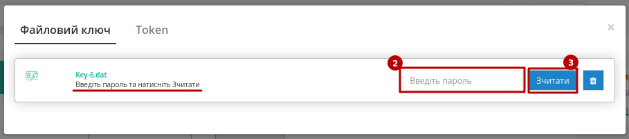
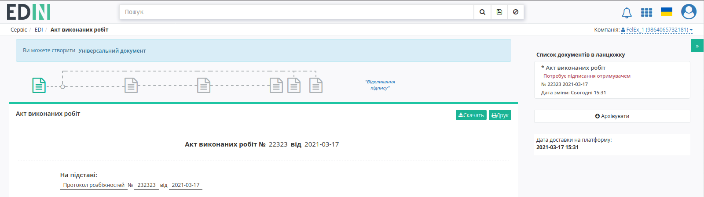

###########################################################################
Формування Комерційного документа "Видаткова накладна" (COMDOC_006)
###########################################################################

.. сюда закину немного картинок для текста

.. |drop_pass| image:: signing/drop_pass.png

.. |del_key| image:: signing/del_key2.png

.. role:: red

.. contents:: Зміст:
   :depth: 2

---------

Вступ

Дана інструкція описує порядок формування, підписання та відправки Комерційного документа «Видаткова накладна». Накладна фіксує факт отримання чи передачі товарів або послуг.

Формування Видаткової накладної можливо на основі вхідного «Замовлення»(ORDER), або вихідного «Підтвердження замовлення»(ORDRSP) чи «Повідомлення про відвантаження» (DESADV).

.. important:: **Увага!** Для коректного формування документа **Видаткова накладна (COMDOC_006)**, необхідно заповнити Товарний довідник.
Ви можете переглянути `Інструкцію щодо заповнення довідника <https://wiki.edin.ua/uk/latest/general_2_0/rabota_s_platformoj_EDIN_2.0.html#id10>`_.

Створити видаткову накладну можливо трьома способами:

1. На підставі "Замовлення" (ORDERS)
2. На підставі "Повідомлення про відвантаження" (DESADV)
3. На підставі "Повідомлення про прийом" (RECADV)
4. На підставі "Підтвердження замовлення" (ORDRSP)

**Рекомендується формувати документ "Видаткова накладна" (COMDOC_006) на підставі "Повідомлення про відвантаження" (DESADV).**

Перед початком роботи з **"Видатковою накладною"** необхідно заповнити всі реквізити, які будуть відображатися в документі з боку постачальника.

.. important::
   **Увага!** Зверніть увагу, що реквізити заповнюються українською мовою і повинні відповідати інформації в реєстраційних документах компанії.

**1 Формування документа "Видаткова накладна" (COMDOC_006) у відповідь на вхідне "Замовлення" (ORDERS)**
================================================================================================================

Нижче наведено приклад формування Витратною накладної на підставі отриманого документа Замовлення (ORDERS).
У папці "Вхідні" виберіть небхідний документ від мережі. Для полегшення пошуку, достатньо ввести номер документа в полі «Пошук». Документи також можливо шукати за Відправником, Датою документа і Одержувачем. 
За допомогою фільтру "Усі документи" відфільтруйте необхідний тип документу, у данному випадку - "Замовлення". Перейдіть у документ.

.. image:: pics_Vydatkova_comdoc_na_EDI_Network_2.0/Vydatkova_comdoc_na_EDI_Network_2.0_014.png
   :align: center

У замовленні, що відкрилося, виберіть Видаткова накладна на формі-підказці, документ створиться автоматично.

.. image:: pics_Vydatkova_comdoc_na_EDI_Network_2.0/Vydatkova_comdoc_na_EDI_Network_2.0_002.png
   :align: center

У відкритому ЮЗД документі, необхідно заповнити :red:`обов'язкові дані, позначені червоною зірочкою *`, в кожному з блоків.

Перший блок містить інформацію про Номер комерційного документа, дату його складання і деталі документу-основи та договору на поставку.

.. image:: pics_Vydatkova_comdoc_na_EDI_Network_2.0/Vydatkova_comdoc_na_EDI_Network_2.0_003.png
   :align: center

Другий блок містить інформацію про документ-підставу: необхідно обрати тип документа який свідчить про співпрацю, із випадаючого списку(додаткова угода, акт, накладна); його номер та дату складання.

.. image:: pics_Vydatkova_comdoc_na_EDI_Network_2.0/Vydatkova_comdoc_na_EDI_Network_2.0_004.png
   :align: center

Третій блок містить інформацію про одержувача та відправника Комерційного документа, дані заповнюються автоматично з документа підстави.

Інформація переноситься з документу основи. Можливо редагувати дані, натиснувши на кнопку "Редагувати", чи змінити ролі контрагентів. При редагуваанні, поля відмічені червоною зіречкою повинні бути заповненні!

.. image:: pics_Vydatkova_comdoc_na_EDI_Network_2.0/Vydatkova_comdoc_na_EDI_Network_2.0_005.png
   :align: center

Також можливо **Додати нового контрагента**, наприклад, вказати платника або перевізника:

.. image:: pics_Vydatkova_comdoc_na_EDI_Network_2.0/Vydatkova_comdoc_na_EDI_Network_2.0_006.png
   :align: center

При додаванні контрагента, спочатку виберіть роль контрагента із випадаючого списку (1), а за тим натисніть на зелену кнопку "**+**" (2). Потім здійсніть пошук контрагента (3) по назві компаніі, GLN, ІПН або за назвою мережі (при виборі відповідного чекера).
Можливі ролі:

#. Відправник
#. Замовник
#. Виконавець
#. Платник
#. Постачальник
#. Вантажовідправник

Параметри доставки та Коментарі

Наступний блок містить інформацію про товарні позиції, які поставляються. Результат - інформація по кількості товарів та загальній суммі з та без ПДВ:

.. image:: pics_Vydatkova_comdoc_na_EDI_Network_2.0/Vydatkova_comdoc_na_EDI_Network_2.0_007.png
   :align: center

Таблична частина з переліком позицій заповнюються автоматично з документу основи (ORDERS або DESADV):

**Даний блок містить такі колонки:**

* **№** - номер позиції у списку, заповнюється автоматично
* **Найменування** – дані заповнюються автоматично з документа підстави
* **Штрихкод** - дані заповнюються автоматично з документа підстави
* **Базова ціна** - дані заповнюються автоматично з документа підстави
* **ПДВ за од. продукції** - дані заповнюються автоматично з документа підстави
* **Ціна** - дані заповнюються автоматично з документа підстави
* **Кількість** - дані заповнюються автоматично з документа підстави
* **Од. Вим.** - дані заповнюються автоматично з товарного довідника
* **Артикул покупця** - дані заповнюються автоматично з документа підстави
* **Артикул продавця**- дані заповнюються автоматично з товарного довідника
* **Код УКТЗЕД** - дані заповнюються автоматично з товарного довідника
* **Сумма без ПДВ** - дані заповнюються автоматично з документа підстави
* **Сумма з ПДВ** - дані заповнюються автоматично з документа підстави

За допомогою кнопки **Додати**, можливо додати позицію з товарного довідника. Після внесення всіх даних в документ, переконайтеся в їх коректності та натисніть кнопку **Зберегти** та **Підписати**.

.. image:: pics_Vydatkova_comdoc_na_EDI_Network_2.0/Vydatkova_comdoc_na_EDI_Network_2.0_008.png
   :align: center

**2 Формування документа "Видаткова накладна" (COMDOC_006) на підставі відправленого документа "Повідомлення про відвантаження" (DESADV)**
============================================================================================================================================================

Для формування Видаткової накладної на основі **"Повідомлення про відвантаження"** (DESADV) перейдіть у папку Вихідні та виберіть необхідний документ DESADV.
На формі-підказці натисніть на "Видаткова накладна" - новий документ відкриється автоматично.

.. image:: pics_Vydatkova_comdoc_na_EDI_Network_2.0/Vydatkova_comdoc_na_EDI_Network_2.0_013.png
   :align: center

Усі поля у документі відповідають полям документа, що створюється на основі **Замовлення**, чи по кнопці **Створити**. Дані полів та інформація по позиціям перенесеться з документу-основи.
Перевірте заповнені поля, за необхідності - дозаповніть, потім натисніть **Зберегти** та **Підписати**.

**3 Підписання документа Видаткова Накладна**
====================================================

Після ініціалізації бібліотеки підписання, система надасть можливість додати ключ для підписання. При :underline:`першому` підписанні у модальному вікні потрібно обрати файл чи токен (1), ввести пароль (2) та натиснути **"Считати"** (3) ключ для підписання:

.. image:: signing/file1n.png
   :align: center

При успішному додаванні ключа автоматично відобразиться особа, від імені якої буде здійснено підписання. У користувача може бути додано кілька ключів - для вибору потрібного для здійснення операції підписання потрібно проставити відмітку (4) лівою кнопкою миші і натиснути "Підписати" (5):

.. image:: signing/file3n.png
   :align: center

.. important::
   Якщо підписання цим ключем вже було здійснено або знайдена невідповідність даних ЄДРПОУ/ІПН (перевірка), то підписання блокується, а користувачу виводиться відповідне повідомлення:

.. image:: signing/wrong_key.png
   :align: center

Додатково в вікні підписання можливо натиснути **"Детальніше"** для того, щоб переглянути інформацію про підписанта, обрати за необхідності посаду, скинути пароль активного ключа (|drop_pass|) чи видалити помилкові (|del_key|).

При подальшій роботі з раніше доданим ключем/-ами потрібно вводити лише пароль для обраного ключа:

.. image:: signing/file4n.png
   :align: center

Після підписання інформація щодо підписанта відображається в блоці "Підписанти". Для відправки документа необхідно натинути на кнопку "Відправити". Після відправки документа контрагенту він відображається в журналі вихідних документів.

**3.1 Види файлів електронно-цифрового підпису**
------------------------------------------------------

Якщо Ви використовуєте ключі від **АЦСК "Україна"**, файли підписів секретних ключів мають розширення **.ZS2** і наступні значення в іменах файлів:

* Директор «DS»
* Бухгалтер «BS»
* Співробітник «SS»
* Печатка «S»
* Шифрування «C»
* Універсальний ключ печатки і шифрування «U»

Якщо Ви використовуєте ключі від **АЦСК “ПриватБанк”**, файли підписів секрентних ключів мають розширення **.jks**:

Якщо Ви використовуєте ключі від будь-яких інших **АЦСК**, файли підписів секрентних ключів мають найменування **Key-6.dat**:

Після вибору секретних ключів, введіть паролі під кожним з них, а потім натисніть кнопку “**Зчитати ключі**”

При коректному зчитуванні ключів, в блоці “**ЕЦП**” з’явиться інформація про власників ключів. Після перевірки інформації натисніть кнопку “**Підписати**”.

Після підписання натисніть на кнопку “**Відправити**”.

**4 Статуси відправлених документів (Інформаційні повідомлення)**
=================================================================

Після відправки документів, торговельна мережа обробляє їх і присвоює їм статуси.
Статуси відображаються в розділі "Вихідні", навпроти кожного документа.

.. image:: pics_Vydatkova_comdoc_na_EDI_Network_2.0/Vydatkova_comdoc_na_EDI_Network_2.0_011.png
   :align: center

Якщо документ коректний, навпроти нього, буде зображений статус у вигляді знака *інфо*.

Якщо в документі були допущені помилки, навпроти нього буде зображений статус у вигляді знака *оклику*.

Детальну інформацію про статус документа, можна дізнатися, клікнувши на іконку, після чого, з'явиться інформаційне повідомлення з текстом статусу.

Також повідомлення буде відображатися всередині документу - під статусом документу, над номером документу.

   
.. important:: **Зверніть увагу!** Змінилося відображення статусів Комерційного документу у ланцюжку. Усі дії та статуси тепер відображаються на початку, над номером та назвою документу. Ланцюжок документів відображається справа.

Отримавши статус, що у документі були допущені помилки, необхідно виправити помилки, зазначені в повідомленні і відправити документ повторно.

**5 Відкликання підпису**
=================================================================

Відправлені комерційні документи (COMDOC) можуть бути відкликані ("Відкликання підпису"). Відкликання використовується при помилковій відправці документа. Відкликати комерційний документ (COMDOC) може лише Відправник за умови, що Отримувач ще не підписав документ (COMDOC). Функціонал доступний для інтегрованих користувачів (`API <https://wiki.edin.ua/uk/latest/integration_2_0/APIv2/APIv2_list.html>`_) та з web. "Відкликання підпису" на web-платформі активується відповідною кнопкою:

.. image:: pics_comdoc_revoke/comdoc_revoke_001.png
   :align: center

Для того аби здіснити "Відкликання підпису" обов'язково потрібно вказати причину відкликання та підтвердити дію підписом ("Підписати"):

.. image:: pics_comdoc_revoke/comdoc_revoke_002.png
   :align: center

Після чого документ змінює свій статус на "Підпис відкликано". 

.. image:: pics_comdoc_revoke/comdoc_revoke_003.png
   :align: center

Документообіг завершено.

------------------------------------------------

.. include:: kontakti.rst

