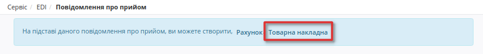

Формування Товарної і Податкової накладної для мережі «МЕТРО»
########################################################################
.. role:: red

---------

.. contents:: Зміст:
   :depth: 2

---------

Вступ
************************************
Дана інструкція описує порядок формування Товарної накладної для мережі «МЕТРО Кеш енд Кері Україна» на web-платформі EDIN 2.0.

.. important::
    **Увага!**  Для коректного формування документу **ТН** необхідно заповнити Товарний довідник. Ви можете подивитися `Інструкцію щодо заповнення довідника <https://wiki.edi-n.com/uk/latest/retail_2.0/formirovanie_Tovarnogo_dovidnyka.html>`_.

Перед початком роботи з Товарною накладною необхідно заповнити всі реквізити компанії. Перевірте реквізити у "Налаштуваннях", якщо потрібно внести зміни до аккаунту, зверніться до вашого менеджера АТС.

Методи створення Товарної накладної
----------------------------------------------------
Створити Товарну накладну можливо декількома способами:

1. Через меню «Створити» вибрати Товарну накладну
2. На підставі «Замовлення» (ORDER)
3. На підставі «Повідомлення про прийом» (RECADV)

1. Створення через меню **Створити**  вибравши **Товарна накладна**:

.. image:: pics_formuvannia_TN_i_PN_Metro/formuvannia_TN_i_PN_Metro_1.png
   :align: center

2. Створення на підставі **«Замовлення»**. Для цього вибираємо вкладку Вхідні, ставимо фільтри «Замовлення» (1) та вибираємо мережу «Метро» (2):

.. image:: pics_formuvannia_TN_i_PN_Metro/formuvannia_TN_i_PN_Metro_2.png
   :align: center

Переходимо в потрібний нам документ та на формі-підказці, котра дозволяє створити документ на основі Замовлення, виберіть зі списку «Товарна накладна»:

.. image:: pics_formuvannia_TN_i_PN_Metro/formuvannia_TN_i_PN_Metro_3.png
   :align: center

3. Створення на підставі **«Повідомлення про прийом»**. Для цього вибираємо вкладку Вхідні, ставимо фільтри «Повідомлення про прийом» (1) та вибираємо мережу «Метро» (2) і переходимо в потрібний нам документ:

.. image:: pics_formuvannia_TN_i_PN_Metro/formuvannia_TN_i_PN_Metro_4.png
   :align: center
 
На формі-підказці, котра дозволяє створити документ на основі Повідомлення про прийом, виберіть зі списку «Товарна накладна»:

Заповнення документа Товарна накладна
----------------------------------------------------
Документ Товарна накладна створиться автоматично. Дані деяких полів пененесутся з документа основи (якшо ви створювали документ способом 2 або 3). Необхідно заповнити обов'язкові дані, позначені червоною зірочкою :red:`*`, в кожному з блоків.

.. image:: pics_formuvannia_TN_i_PN_Metro/formuvannia_TN_i_PN_Metro_6.png
   :align: center

Перевірте правильність даних -  № та дату Товарної накладної, GLN контрагентів, номер замовлення та номер повідомлення про прийом» на основі яких створено документ, чи додайте необов'язкову, додаткову інформацію:

Нижче на сторінці створеного документа знаходиться блок з інформацією по позиціях.  

.. image:: pics_formuvannia_TN_i_PN_Metro/formuvannia_TN_i_PN_Metro_7.png
   :align: center

Система автоматично заповнює значення за позиціями з раніше відправленого документа, на основі якого був створений документ.

При перевірці внесених даних за товарними позиціями необхідно впевнитись, що обов'язково заповнене поле **код УКТ ЗЕД**. 
У разі, якщо поле не заповнено або заповнено некоректно, при збереженні документа буде виведено повідомлення:

 Будь ласка, заповнiть повнiстю обов'язкову iнформацiю по всiм позицiям!

Код УКТ ЗЕД не може бути менше 4 символів.

Щоб додати код **УКТ ЗЕД** натисніть на штрихкод товару. Відкриється вікно з даними позиції:

.. image:: pics_Tovarna_nakladna_Leroy_Merlin/formirovanie_Tovarnoj_nakladnoj_Leroy_Merlin_03_2.png
   :align: center

Для того, щоб поле з кодом **УКТ ЗЕД** за товарними позиціями при формуванні документа Товарна Накладна заповнювалось автоматично, необхідно перевірити коректність заповнення даних в Товарному довіднику. Для цього перейдіть у сервіс **Товари** та знайдіть позицію за штрихкодом.

.. image:: pics_Tovarna_nakladna_Leroy_Merlin/formirovanie_Tovarnoj_nakladnoj_Leroy_Merlin_03_3.png
   :align: center
   
Після заповнення усіх обовязкових полів, будь ласка, збережіть документ натисканням на кнопку **Зберегти**!

Підписання документа Товарна Накладна
----------------------------------------------------

Після збереження документа, його необхідно підписати Електронно-Цифровим підписом (ЕЦП). Для ініціалізації підписання документу натисніть "**Підписати**".

.. image:: pics_Tovarna_nakladna_Leroy_Merlin/formirovanie_Tovarnoj_nakladnoj_Leroy_Merlin_09.png
   :align: center

Після ініціалізації бібліотеки підписання, система надасть можливість додати ключ для підписання. При першому підписанні необхідно додати файловий ключ. Для цього у модальному вікні потрібно обрати файл (1) і ввести пароль (2):

.. image:: pics_Tovarna_nakladna_Leroy_Merlin/pics_Іnstrukcіya_dlya_postachalnika_signing_5.png
   :align: center

Після чого натиснути кнопку **"Додати"**:

.. image:: pics_Tovarna_nakladna_Leroy_Merlin/pics_Іnstrukcіya_dlya_postachalnika_signing_6.png
   :align: center

При успішному додаванні ключа автоматично відобразиться вибрана особа, від імені якої буде здійснено підписання (кнопка **"Підписати"**):

.. image:: pics_Tovarna_nakladna_Leroy_Merlin/pics_Іnstrukcіya_dlya_postachalnika_signing_7.png
   :align: center

При подальшій роботі з раніше доданим ключем/-ами потрібно вводити лише пароль для обраного ключа:

.. image:: pics_Tovarna_nakladna_Leroy_Merlin/pics_Іnstrukcіya_dlya_postachalnika_signing_8.png
   :align: center

Після успішного підписання, натисніть кнопку **Відправити**. Відправлений документ додається в папку «Надіслані».
Після відправки у документі з'явиться візуалізація підпису "Товарна накладна" зеленим кольором, натиснувши на яку можна переглянути Дані про підписантів.

.. image:: pics_Tovarna_nakladna_Leroy_Merlin/formirovanie_Tovarnoj_nakladnoj_Leroy_Merlin_07.png
   :align: center

.. image:: pics_Tovarna_nakladna_Leroy_Merlin/formirovanie_Tovarnoj_nakladnoj_Leroy_Merlin_08.png
   :align: center

Сірим кольором відображається очікувана візуалізація підпису "Підтвердження товарної накладної", натиснувши на яку побачимо що документ ще не підписаний. 
Після підписання документа мережею, друга візуалізація підпису "Підтвердження товарної накладної" також стане зеленою, і в ній відобразяться Дані про підписантів.

Відправлену Товарну накладну можливо скачати у таких форматах: .pdf .xls .xml .zip .p7s

Заповнення документа Податкова накладна
----------------------------------------------------
Після підписання та відправки ви зможете створити Податкову накладну.
Виберіть вашу Товарну накладну та на формі-підказці, котра дозволяє створити документ, виберіть зі списку «Податкова накладна»:

.. image:: pics_formuvannia_TN_i_PN_Metro/formuvannia_TN_i_PN_Metro_x1.png
   :align: center

Виберіть ставку ПДВ у вікні що з'явилося. Вкажіть правильну **Ставку ПДВ по документу** для правильного розрахунку у блоці **Б**:

.. image:: pics_formuvannia_TN_i_PN_Metro/formuvannia_TN_i_PN_Metro_x2.png
   :align: center

Дані деяких полів пененесутся з документа основи. Необхідно заповнити обов'язкові дані, позначені червоною зірочкою :red:`*`, в кожному з блоків.
Заповнюємо поля податкової накладної, звіряємося і натискаємо кнопку Зберегти.

Після зміни статусу в Товарної накладної на **"Підтверджено з двох сторін"**, ми можемо підписувати і відправляти Податкову накладну.

На одну «Товарну накладну» можливо створити одну «Податкову накладну»!

.. image:: pics_formuvannia_TN_i_PN_Metro/formuvannia_TN_i_PN_Metro_x3.png
   :align: center

У податковій накладній натискаємо **Підписати** - процес підписання аналогічний `підписанню документа Товарна Накладна <https://wiki.edi-n.com/uk/latest/retail_2.0/formuvannia__Tovarnoi_i_Podatkovoi_nakladnoi_Metro.html#id9>`_.

Статуси відправленого документа Податкова накладна
----------------------------------------------------
Після успішного підписання, натисніть кнопку **Відправити**. Відправлений документ додається в папку «Надіслані».
Після відправки у документі з'явиться візуалізація підпису "Податкова накладна" зеленим кольором, натиснувши на яку можна переглянути Дані про підписантів.

«Похибка при реєстраціï» - Помилка при реєстрації в ЄРПН. Є можливість прочитати квітацію, зайшовши в сам документ.

«Успiшна вiдповiдь вiд податковоï» - успішна реєстрація податкової.

.. include:: kontakti.rst