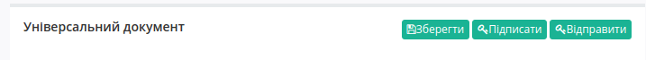

Формування Універсального документа Condra
###############################################################################

.. role:: red

.. contents:: Зміст:
   :depth: 6

---------

Вступ
====================================

Дана інструкція описує порядок формування Універсального документа - Condra на web-платформі EDIN 2.0.

    Перед початком роботи з документом необхідно заповнити всі реквізити компанії.

Створити документ Condra можливо декількома способами:

1. Через меню «Створити» вибрати Універсальний документ
2. На підставі іншого Універсального документа (Condra)
3. На підставі документа Акт виконаних робіт (COMDOC_013)
4. На підставі документа Акт накладних послуг (COMDOC_018)

Ми розглянемо саме приклад формування **Універсального документа** через меню «Створити».

Заповнення Універсального документа
====================================

Натисніть на кнопку «Створити» - виберіть **Універсальний документ**. Документ створиться автоматично. Необхідно заповнити обов'язкові дані, позначені червоною зірочкою :red:`*`, в кожному з блоків.

.. image:: pics_formuvannia_Condra/formuvannia_Condra_01.png
   :align: center

- Відправник* - GLN компанії відправника
- Одержувач* - GLN компанії отримувача документа (не  можна вказувати отримувачем себе)
- Універсальний документ №*
- Від* - дата документу

Для зручності комунікації, вкажіть Тип документа, вибравши його зі списку.

Після заповнення полів, додайте документ через кнопку **«Оберіть файл»**. Відкриється вікно додавання файлу с вашого ПК.

.. note:: **Увага!**Додати можливо будь-який *1* файл розміром **до 5 МБ**! 

.. image:: pics_formuvannia_Condra/formuvannia_Condra_03.png
   :align: center

Після вибору й завантаження файлу, біля кнопки відобразиться назва файлу у вигляді посилання, по якому ви можете повторно скачати файл для перегляду.

Після завантаження файлу та заповнення усіх необхідних полів збережіть документ.

Підписання Універсального документа
====================================

Після збереження документа, його необхідно підписати Електронно-Цифровим підписом (ЕЦП). Для ініціалізації підписання документу натисніть "**Підписати**".

Після ініціалізації бібліотеки підписання, система надасть можливість додати ключ для підписання. При першому підписанні необхідно додати файловий ключ. Для цього у модальному вікні потрібно обрати файл (1) і ввести пароль (2):

.. image:: pics_Tovarna_nakladna_Leroy_Merlin/pics_Іnstrukcіya_dlya_postachalnika_signing_5.png
   :align: center

Після чого натиснути кнопку **"Додати"**:

.. image:: pics_Tovarna_nakladna_Leroy_Merlin/pics_Іnstrukcіya_dlya_postachalnika_signing_6.png
   :align: center

При успішному додаванні ключа автоматично відобразиться вибрана особа, від імені якої буде здійснено підписання (кнопка **"Підписати"**):

.. image:: pics_Tovarna_nakladna_Leroy_Merlin/pics_Іnstrukcіya_dlya_postachalnika_signing_7.png
   :align: center

При подальшій роботі з раніше доданим ключем/-ами потрібно вводити лише пароль для обраного ключа:

.. image:: pics_Tovarna_nakladna_Leroy_Merlin/pics_Іnstrukcіya_dlya_postachalnika_signing_8.png
   :align: center

Після успішного підписання, натисніть кнопку **Відправити**. Відправлений документ додається в папку «Надіслані».

Після відправки у документі з'явиться візуалізація підпису "Універсальний документ" зеленим кольором, натиснувши на яку можна переглянути Дані про підписантів.

.. image:: pics_formuvannia_Condra/formuvannia_Condra_02.png
   :align: center

Сірим кольором відображається очікувана візуалізація підпису "Підтвердження" або ж "Відмова", натиснувши на яку побачимо що документ ще не підписаний. 
Після підписання документа контрагентом, друга візуалізація підпису також стане зеленою, і в ній відобразяться Дані про підписантів.

Відправлений документ можливо скачати у виглядв архіву (у форматі .zip) в якому знаходяться підписи (у форматі .p7s) та документ. 

.. include:: kontakti.rst