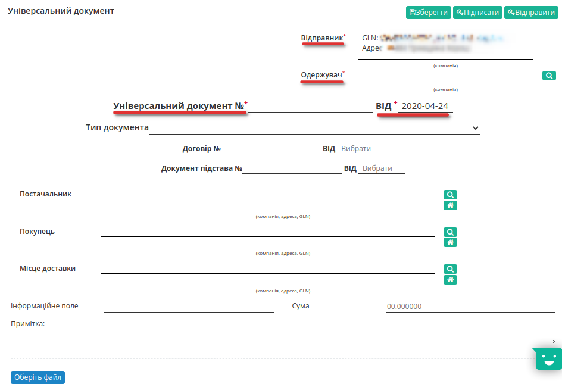
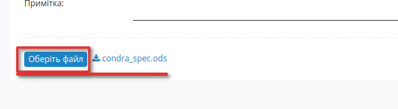
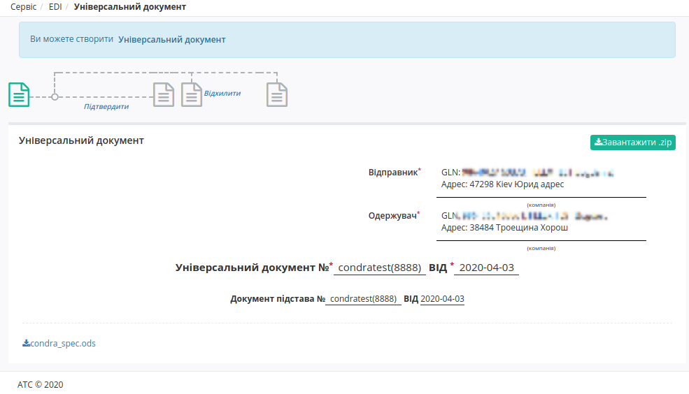
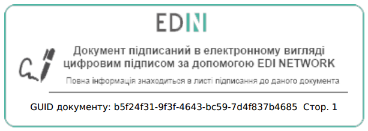
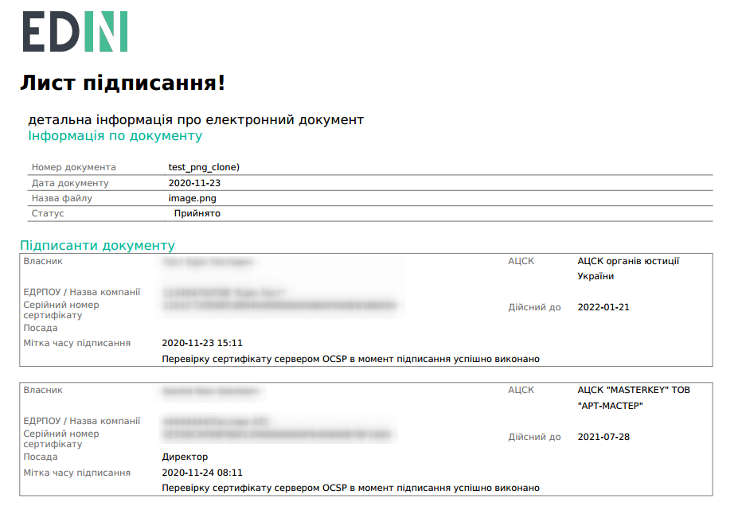

Формування Універсального документа Condra
###############################################################################

.. сюда закину немного картинок для текста

.. |del_key| image:: signing/del_key2.png

.. role:: red

.. contents:: Зміст:
   :depth: 2

---------

Вступ
====================================

Дана інструкція описує порядок формування Універсального документа - Condra на web-платформі EDIN 2.0.

    Перед початком роботи з документом необхідно заповнити всі реквізити компанії.

Створити документ Condra можливо декількома способами:

1. Через меню «Створити» вибрати Універсальний документ
2. На підставі іншого Універсального документа (Condra)
3. На підставі документа Акт виконаних робіт (COMDOC_013)
4. На підставі документа Акт накладних послуг (COMDOC_018)

Ми розглянемо саме приклад формування **Універсального документа** через меню «Створити».

Заповнення Універсального документа
====================================

Натисніть на кнопку «Створити» - виберіть **Універсальний документ**. Документ створиться автоматично. Необхідно заповнити обов'язкові дані, позначені червоною зірочкою :red:`*`, в кожному з блоків.

- Відправник* - GLN компанії відправника
- Одержувач* - GLN компанії отримувача документа (не  можна вказувати отримувачем себе)
- Універсальний документ №*
- Від* - дата документу

Для зручності комунікації, вкажіть Тип документа, вибравши його зі списку.

Після заповнення полів, додайте документ через кнопку **«Оберіть файл»**. Відкриється вікно додавання файлу с вашого ПК.

.. note:: **Увага!** Додати можливо будь-який *1* файл розміром **до 5 МБ**! 

Після вибору й завантаження файлу, біля кнопки відобразиться назва файлу у вигляді посилання, по якому ви можете повторно скачати файл для перегляду.

Після завантаження файлу та заповнення усіх необхідних полів збережіть документ (кнопка **"Зберегти"** ).

Підписання Універсального документа
====================================

Після збереження документа, його необхідно затвердити Електронно-Цифровим підписом (ЕЦП) - натиснути **"Підписати"**. Після ініціалізації бібліотеки підписання, система надасть можливість додати ключ для підписання. При :underline:`першому` підписанні у модальному вікні потрібно обрати файл чи токен (1), ввести пароль (2) та натиснути **"Зчитати"** (3) ключ для підписання:

.. image:: signing/file1n.png
   :align: center

.. image:: signing/file2n.png
   :align: center

При успішному додаванні ключа автоматично відобразиться особа, від імені якої буде здійснено підписання. У користувача може бути додано кілька ключів - для вибору потрібного для здійснення операції підписання потрібно проставити відмітку (4) лівою кнопкою миші і натиснути **"Підписати"** (5):

.. image:: signing/file3n.png
   :align: center

.. important::
   Якщо підписання цим ключем вже було здійснено або знайдена невідповідність даних ЄДРПОУ/ІПН (перевірка), то підписання блокується, а користувачу виводиться відповідне повідомлення:

.. image:: signing/wrong_key.png
   :align: center

Додатково в вікні підписання можливо натиснути **"Детальніше"** для того, щоб переглянути інформацію про підписанта; можливо видалити помилкові ключі (|del_key|).

При подальшій роботі з раніше доданим ключем/-ами потрібно вводити лише пароль для обраного ключа:

.. image:: signing/file4n.png
   :align: center

.. image:: signing/file5n.png
   :align: center

Після успішного підписання, натисніть кнопку **Відправити**. Відправлений документ додається в папку «Надіслані».

Після відправки у документі з'явиться візуалізація підпису "Універсальний документ" зеленим кольором, натиснувши на яку можна переглянути Дані про підписантів.

Сірим кольором відображається очікувана візуалізація підпису "Підтвердження" або ж "Відмова", натиснувши на яку побачимо що документ ще не підписаний. 
Після підписання документа контрагентом, друга візуалізація підпису також стане зеленою, і в ній відобразяться Дані про підписантів.

Відправлений документ можливо **"Завантажити"** у вигляді zip-архіву (містить: підписаний файл (p7s); мета дані документа (xml); друкований макет з візуалізацією підпису в вигляді водяного знаку та листом підписання (pdf)) чи лише друкованого макета (pdf).

.. note::
   Візуалізація підписання виконується лише для документів в форматах: PDF, JPG (JPEG), PNG, BMP.

-------------------------------------

.. include:: kontakti.rst