Формування "Універсального документа" (CONDRA)
###############################################################################

.. сюда закину немного картинок для текста

.. |прокрутка1| image:: pics_formuvannia_Condra/formuvannia_Condra_026.png

.. |прокрутка2| image:: pics_formuvannia_Condra/formuvannia_Condra_027.png

.. |trash| image:: pics_formuvannia_Condra/formuvannia_Condra_025.png

.. |download| image:: /_constant/icons/download.png

.. |trash_w_blue| image:: /_constant/icons/trash_w_blue.png

.. |print_blue| image:: /_constant/icons/print_blue.png

.. role:: red

.. contents:: Зміст:
   :depth: 2

---------

Вступ
====================================

Дана інструкція описує порядок формування "Універсального документа" (CONDRA) на web-платформі "EDI Network".

.. hint::
   Перед початком роботи з документом необхідно заповнити всі реквізити компанії в `Особистому кабінеті <https://wiki.edin.ua/uk/latest/Personal_Cabinet/PCInstruction.html#company>`__.

1 Формування та заповнення "Універсального документа" (CONDRA)
==========================================================================================

Створити "Універсальний документ" (CONDRA) можливо:

1. На підставі "Акта виконаних робіт" (COMDOC_013) / "Акта накладних послуг" (COMDOC_018) / іншого "Універсального документа" (CONDRA);
2. За допомогою кнопки **"Створити"**.

Розглянемо приклад формування "Універсального документа" (CONDRA) За допомогою кнопки **"Створити"**:

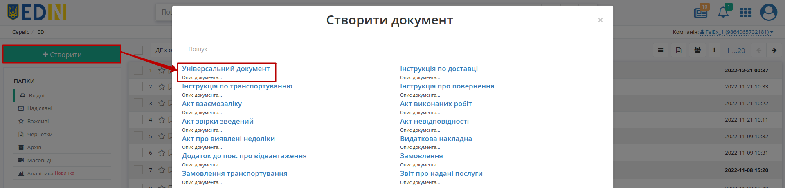

Після натискання на кнопку потрібно обрати зі списку **Універсальний документ** (для зручності можливо скористатись рядком пошуку). Після чого відкриється форма документа (обов'язкові до заповнення поля позначені червоною зірочкою :red:`*`):

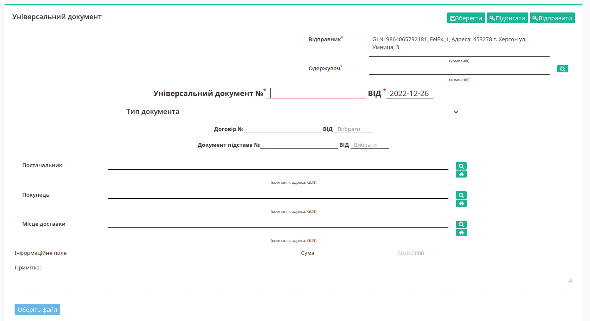

- Відправник* - GLN компанії відправника (заповнюється автоматично);
- Одержувач* - GLN компанії отримувача документа (не можна вказувати отримувачем себе);
- Універсальний документ №* - номер документа
- Від* - дата документа

Для зручності комунікації, вкажіть Тип документа, вибравши його зі списку:

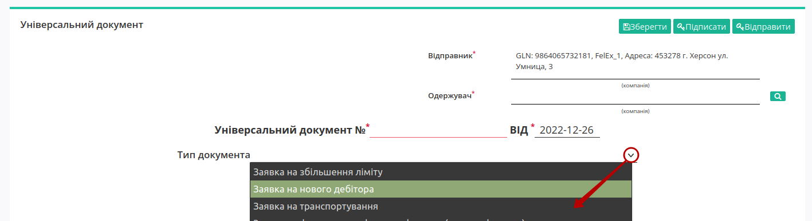

Після того, як поля будуть заповнені, потрібно **"Зберегти"** документ для створення чернетки:

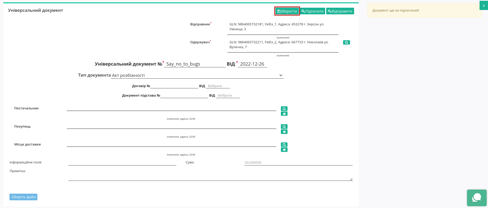

До збереженого документа можливо додати файли-вкладення через кнопку **"Оберіть файл"** та обрати файл з локального сховища:

.. початок блоку для CONDRA_standart

.. image:: /retail_2.0/pics_formuvannia_Condra/formuvannia_Condra_005.png
   :align: center

.. note::
   Один документ може містити не більше 10 файлів в наступних форматах: PDF/JPG/JPEG/PNG/BMP/DOC/DOCX/XLS/XLSX/PPT/PPTX/CSV/TXT/XML/P7S (попередній перегляд не доступний лише для CSV та P7S) з розміром файлу не більше 5 Мб.

Після додавання файлів в правому верньому куті файла указується його порядковий номер з загальної кількості доданих файлів (номер/заг.кількість). При додаванні більше 3 файлів частина файлів прихована за стрілками прокручування (|прокрутка2| |прокрутка1|). На етапі редагування за потреби можливо завантажити файл, клікнувши на нього мишкою чи видалити за допомогою кнопки |trash| :

.. image:: /retail_2.0/pics_formuvannia_Condra/formuvannia_Condra_006.gif
   :align: center

Для доданих файлів доступний попередній перегляд їх вмісту:

.. image:: /retail_2.0/pics_formuvannia_Condra/formuvannia_Condra_028.gif
   :align: center

При перегляді доданого файлу можливо масштабувати попередній перегляд файлу (1), використовувати пагінацію сторінок файлу (2), роздрукувати (3) |print_blue| (кнопка активна лише для файлів в форматі PDF/JPG/JPEG/PNG/BMP), завантажити (4) |download| чи видалити (5) |trash_w_blue| файл.

.. image:: /Vilnyi/pics_Work_with_Vilnyi/Work_with_Vilnyi_51.png
   :align: center

.. кінець блоку для CONDRA_standart

Перед відправкою документ обов'язково потрібно підписати.

.. _sign:

2 Підписання "Універсального документа" (CONDRA)
==============================================================

Після збереження документа, його необхідно затвердити Електронно-Цифровим підписом (ЕЦП) - натиснути **"Підписати"**:

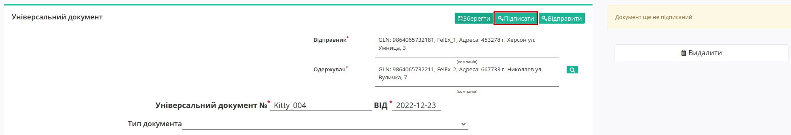

.. include:: /_constant/atb_check/atb_check.rst
   :start-after: .. початок блоку для ATB_check
   :end-before: .. кінець блоку для ATB_check

.. tabs::

   .. tab:: Файловий ключ

      .. include:: /_constant/signing/signing.rst
         :start-after: .. початок блоку для Signing
         :end-before: .. кінець блоку для Signing

   .. tab:: Token

      .. include:: /_constant/token_signing/token_signing.rst
         :start-after: .. початок блоку для TokenSign
         :end-before: .. кінець блоку для TokenSign

   .. tab:: Гряда

      .. include:: /_constant/gryada_signing/gryada_signing.rst
         :start-after: .. початок блоку для GryadaSign
         :end-before: .. кінець блоку для GryadaSign

   .. tab:: Cloud

      .. include:: /_constant/cloud_signing/cloud_signing.rst
         :start-after: .. початок блоку для CloudSign
         :end-before: .. кінець блоку для CloudSign

Після успішного підписання, документ можливо **"Відправити"**:

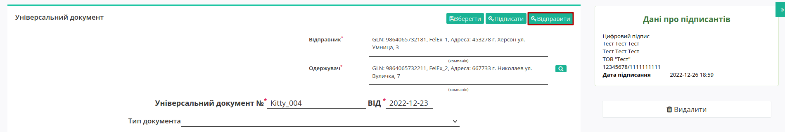

Відправлений документ автоматично відображається в папці "Надіслані":

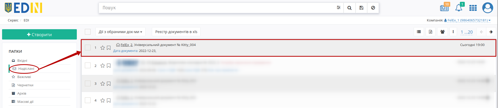

При переході в документ з Даними про підписантів можливо ознайомитись, натиснувши на зелену іконку документа:

.. image:: pics_formuvannia_Condra/formuvannia_Condra_010.png
   :align: center

Сірим кольором відображаються стани, які відправлений документ може прийняти при **"Підтвердженні"** або ж **"Відмові"** Отримувачем.

Відправлений документ можливо **"Завантажити .zip"** у вигляді zip-архіву (містить: мета дані "Універсального документа" (.xml) та файли-вкладення (оригінали або контейнери тіл підпису (.p7s) + листи підписання кожного вкладення (.pdf), якщо вкладення з підписами)).

.. note::
   Для файлів в форматах PDF, JPG (JPEG), PNG, BMP додатково формується візуалізація підписання: 

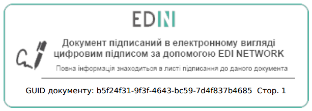

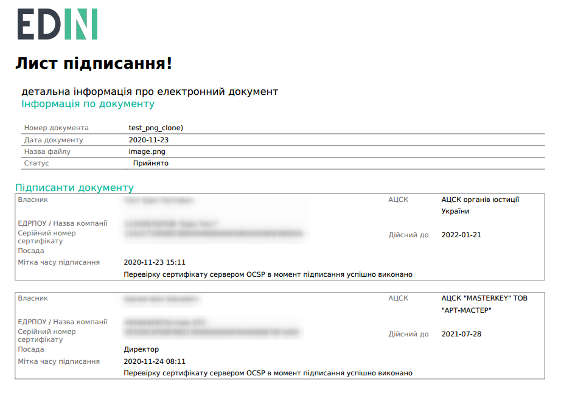

.. _withdraw:

3 Дії Відправника. Відкликання "Універсального документа" (CONDRA) 
========================================================================

.. important::
   Відкликати можливо лише **надісланий** документ, за яким ще не відбувалось **Підтвердження** / **Відхилення** / **Відкликання**!

За потреби Відправник "Універсального документа" (CONDRA) може його **"Відкликати"**:

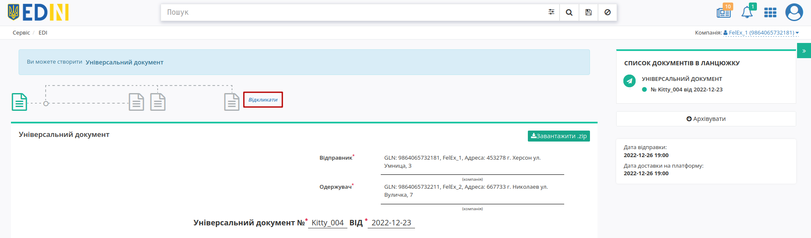

Дія відкликання потребує підтвердження:

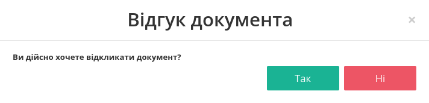

Документ змінює свій статус, в документі відображається візуалізація зміни стану червоною іконкою:

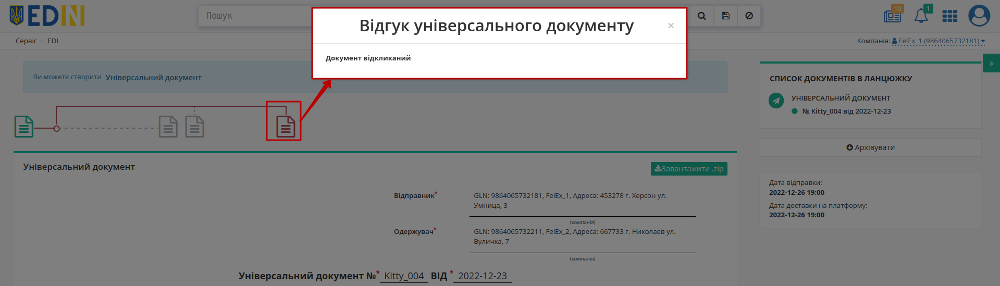

В журналі документів "Універсальні документи" (CONDRA), що мають завершений статус відмічені іконкою |status|, по кліку на яку відкривається інформаційне popup вікно:

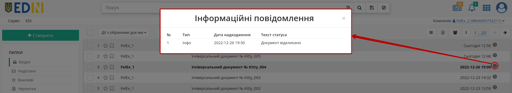

.. _confirm:

4 Дії Отримувача. Підтвердження "Універсального документа" (CONDRA) 
========================================================================

.. important::
   Підтвердити можливо лише **вхідний** документ, за яким ще не відбувалось **Підтвердження** / **Відхилення** / **Відкликання**!

Якщо Отримувач "Універсального документа" (CONDRA) приймає документ, то може його **"Підтвердити"**:

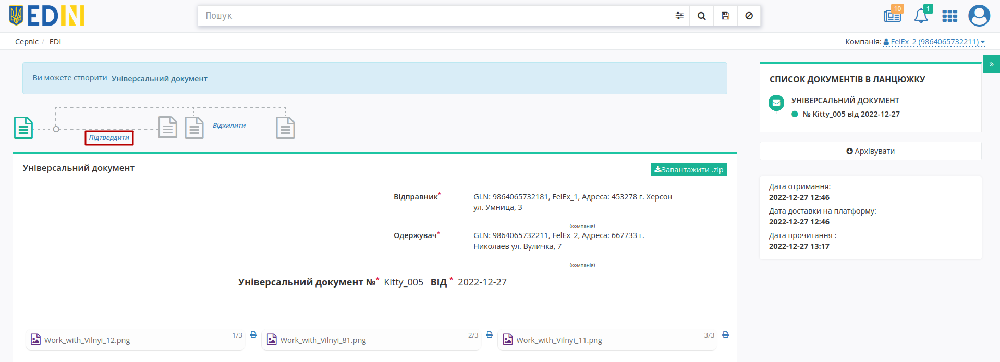

При підтвердженні Отримувач повинен `підписати <https://wiki.edin.ua/uk/latest/Personal_Cabinet/PCInstruction.html#company>`__ документ зі своєї сторони (процес аналогічний підписанню Відправника та описаний вище).

Після підписання документ змінює свій статус, в документі відображається візуалізація зміни стану зеленою іконкою:

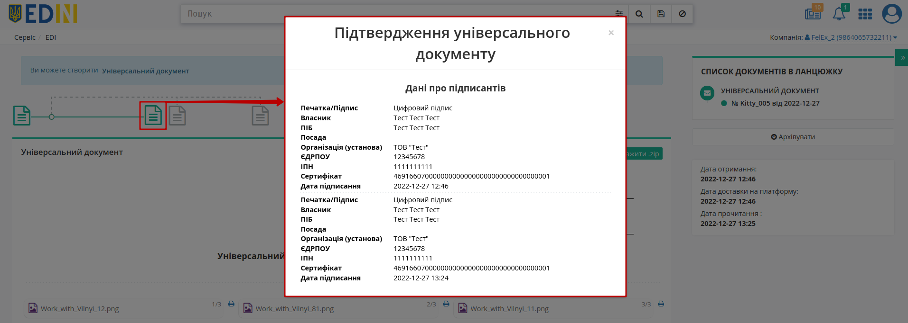

В журналі документів "Універсальні документи" (CONDRA), що мають завершений статус відмічені іконкою |status|, по кліку на яку відкривається інформаційне popup вікно:

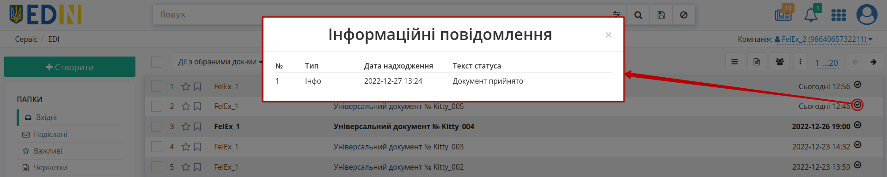

.. _reject:

5 Дії Отримувача. Відхилення "Універсального документа" (CONDRA) 
========================================================================

.. important::
   Відхилити можливо лише **вхідний** документ, за яким ще не відбувалось **Підтвердження** / **Відхилення** / **Відкликання**!

Якщо Отримувач "Універсального документа" (CONDRA) не бажає приймати документ, то може його **"Відхилити"**:

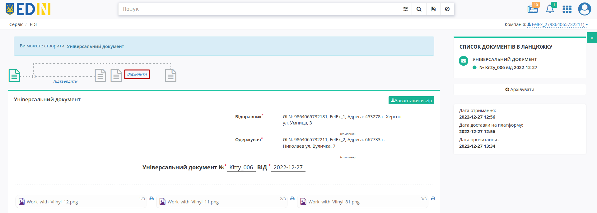

При відхиленні обов'язково потрібно вказати текст відмови (підписувати не потрібно):

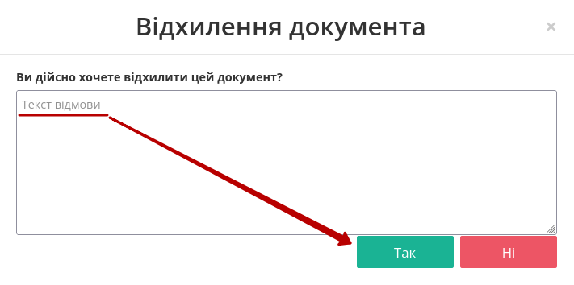

Після відхилення документ змінює свій статус, в документі відображається візуалізація зміни стану червоною іконкою:

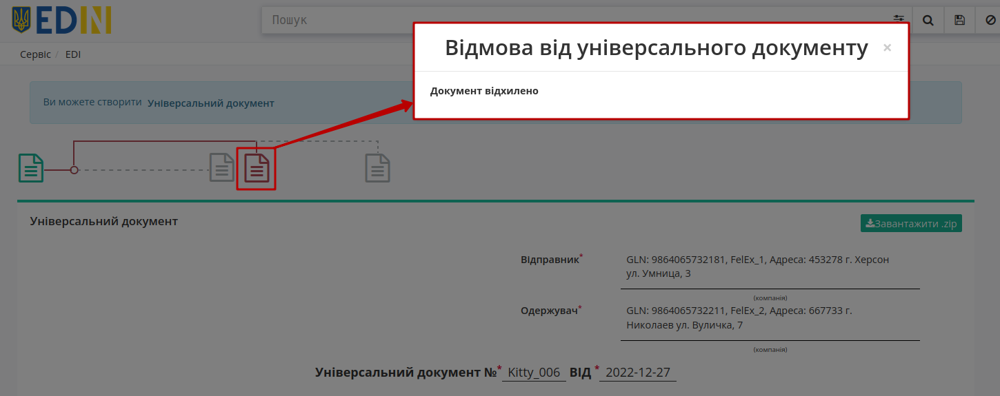

В журналі документів "Універсальні документи" (CONDRA), що мають завершений статус відмічені іконкою |status|, по кліку на яку відкривається інформаційне popup вікно:

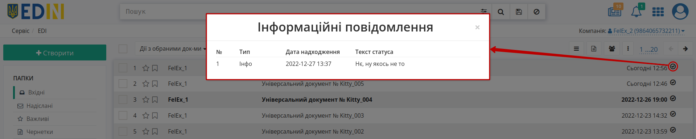

----------------------------
   
.. include:: /_constant/kontakti.rst